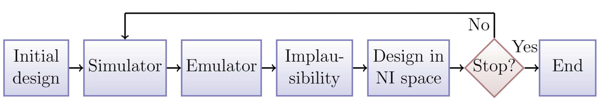
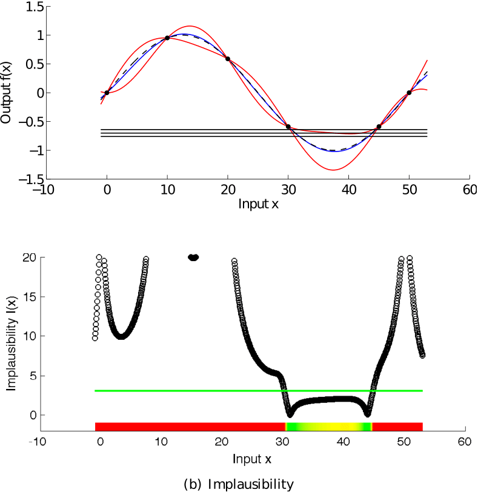

--- 
title: "Case Study -1: An introduction to the Emulatorr package"
author: "Danny Scarponi"
site: bookdown::bookdown_site
output:
    bookdown::pdf_book:
        includes:
            in_header: header.tex
    bookdown::gitbook:
        config:
            sharing: null
        css: 'style.css'
        highlight: tango
        includes:
            in_header: _toggle.html
        keep_md: TRUE
linkcolor: blue
documentclass: book
link-citations: yes
description: "An easy guide to the main functionalities of the Emulatorr package"
---

```{r, child = "_setup.Rmd", include = F, purl = F, cache = TRUE}
```

```{r setup, include = FALSE}
knitr::opts_chunk$set(
  collapse = TRUE,
  comment = "#>",
  fig.width = 12,
  fig.height = 8,
  cache = TRUE
)
set.seed(123456)
## getOutputs takes a data.frame of parameter sets 'points' and a list of times 'times' and runs the model under consideration at each parameter set. It then creates a data.frame with a row for each element in 'points' and where columns contain the number of infectious people and the ensemble variability at each time in 'times'. 
getOutputs <- function(points, times, ev = TRUE) {
  out_df <- data.frame()
  for (i in 1:length(points[,1])) {
    model <- mparse(compartments = compartments, transitions = transitions, u0 = u0, tspan = 1:max(times), gdata = points[i,])
    res <- run(model)
    traj <- trajectory(res)
    trajI <- tidyr::spread(traj[,c('node','time','I')], node, I)
    Iattimes <- trajI[seq_along(trajI[,1])%in%times,]
    aggs <- data.frame(cbind(Iattimes$time, apply(Iattimes[,-1], 1, mean), apply(Iattimes[,-1], 1, function(x) sd(x)/sqrt(nreps)+0.03*(max(x)-min(x))))) %>% setNames(c('time', 'mu', 'sd'))
    if (ev)
      shaped <- c(aggs$mu, aggs$sd) %>% setNames(c(paste0('I', aggs$time, sep = ""), paste0('EV', aggs$time, sep = "")))
    else
      shaped <- c(aggs$mu) %>% setNames(paste0('I', aggs$time, sep = ""))
    if (i == 1) {
      out_df <- t(data.frame(shaped))
      rownames(out_df) <- NULL
    }
    else
      out_df <- rbind(out_df, shaped)
  }
  rownames(out_df) <- NULL
  return(out_df)
}
```

``` {r echo = FALSE, message = FALSE}
library(emulatorr)
library(purrr)
library(SimInf)
library(lhs)
library(knitr)
```

# Introduction

This tutorial is an introduction to the main functionality of the [emulatorr](https://github.com/Tandethsquire/emulatorr) package, using a synthetic example of an epidemiological model. We start by briefly highlighting what history matching with emulation is and how it works.

Computer models, otherwise known as simulators, have been widely used in almost all fields in science and technology. 
A computer model is a way of representing the  fundamental dynamics of a system. Due to the complexity of the interactions within a system, computer models frequently contain large numbers of parameters. 

Before using a model (e.g. for prediction or planning) it is fundamental to explore plausible values for its parameters, calibrating the model to the observed data. This poses a significant problem, considering that it may take several minutes or even hours for the evaluation of a single scenario of a complex model. This difficulty is compounded for stochastic models, when tens to thousands of realisations can be required for each scenario.  As a consequence, comprehensive analysis of the entire input space, requiring vast numbers of model evaluations, is often unfeasible. Emulation, combined with history matching, allows us to overcome this issue.

## History Matching

History matching concerns the problem of identifying those parameter sets that would give rise to acceptable matches between the model outputs and the observed data. This part of the input space is referred to as non-implausible, while its complement is known as implausible. History matching proceeds as a series of iterations, or waves, where implausible parameter sets are identified and discarded. Each wave focuses the search for implausible space in the space that was characterized as non-implausible in all previous waves: thus the non-implausible space shrinks with each iteration. To decide whether a parameter set $x$ is implausible we introduce the implausibility measure, which evaluates the difference between the emulator and computer model results, weighted by how uncertain we are at $x$. If such measure is too high, the parameter set is discarded in the next wave of the process. 

Note that history matching as just described still relies on the evaluation of the model at a large number of parameter sets, which is often unfeasible. Here is where emulators play a crucial role.

## Emulators   

A long established method for handling computationally expensive models is to first construct an emulator: a fast statistical approximation of the model that can be used as a surrogate. In other words, we can think of an emulator as a way of representing our 
<span class="abbr" title="In Bayesian statistics, probability expresses a degree of belief in an event. Such belief can be based either on prior knowledge or on personal beliefs about the event. Note that this approach differs from the frequentist interpretation, that defines the probability of an event as the limit of its relative frequence in many trials."><abbr title="In Bayesian statistics, probability expresses a degree of belief in an event. Such belief can be based either on prior knowledge or on personal beliefs about the event. Note that this approach differs from the frequentist interpretation, that defines the probability of an event as the limit of its relative frequence in many trials.">beliefs</abbr></span> about the behaviour of a complex model. 

First of all the model is run at a manageable number of parameter sets, to provide training data to build the emulator. Then prior beliefs about the structure of the emulator are set to reflect our prior knowledge. Once this is done, the training data can be exploited to adjust our prior beliefs and obtain a more accurate representation of the model. The trained emulator  will then provide an expected value of the model output at any parameter set $x$, along with a corresponding uncertainty estimate reflecting our beliefs about the uncertainty in the approximation. 

Emulators have two advantages. First, they are computationally efficient - typically orders of magnitude faster than the computer models they approximate. Second, they allow for the uncertainty in their approximations to be taken into account. These two properties mean that emulators can be used to make inferences as a surrogate for the model itself. In particular, when going through the history matching process, it is possible to evaluate the implausibility measure at any given parameter set by comparing the observed data to the emulator output, rather than the model output. This speeds up the process and allows for a comprehensive exploration of the input space.

## History matching and emulation in a nutshell
Figure \@ref(fig:fig3)  shows a typical history matching workflow. 

``` {r, fig3, echo = FALSE, out.width = "90%", fig.cap='History matching and emulation flowchart'}

```

The various steps of the process can be summarised as follows.

1) A number of parameter sets (design points) are selected. 
2) The model (simulator) is run at the design points.
3) Emulators are built using the training data provided by the previous step. Note that here we choose to construct separate emulators, one for the mean of each model output, but other approaches are possible.
3) Emulators are evaluated at a large number of parameter sets. The implausibility of each of these is then assessed.
4) Parameter sets classified as non-implausible provide the design points for the next wave of the process. From here, we go back to step 2).

This circular process continues till one of the stopping criteria (see end of section \@ref(stoprule)) applies.  

Section \@ref(intro) of this tutorial treats step 1 and 2, section \@ref(buildemul) goes through step 3, section \@ref(diagn) explains step 4 and section \@ref(newpoints) describes step 5.

## A simple example of history matching and emulation
To show how history matching and emulation work, we present an example with a one-dimensional emulator.

The model we consider is the deterministic function
$f (x)=\sin (0.04\pi x)$. The value of $f(x)$ is considered unknown at all parameters, apart from $x=\{0,10,20,30,45,50\}$, where the
model is run. These six known points are represented by the black dots in the top graph of
figure \@ref(fig:fig1)  and are used to train the emulator. The blue line is the emulator’s posterior mean, and the red
lines represent its posterior uncertainty. The three horizontal
lines represent the observed data $(z=-0.7)$ and the $95\%$ confidence interval $(\pm 0.06)$ that we use to history match the model.

``` {r, fig1, echo = FALSE, out.width = "70%", fig.cap='First wave of history matching'}

```

The next step involves choosing an implausibility measure. Such measure weighs the difference between $z$ and
the value suggested by the emulator at a given point, taking into consideration all the uncertainties that are present in the system.
The bottom graph of figure \@ref(fig:fig1) shows the implausibility for the emulator and observed
data. The horizontal green line is an implausibility
cut-off, which determines whether an input $x$ is implausible or not.
The implausibility plot shows that a match between the model’s
output and the observed data is unlikely to be found for values of
x smaller than 30 and larger than 45.

With the emulator and the implausibility measure at our
disposal, we can now sample the non-implausible space to obtain a new set of points that will be used to run the model in the next wave of the history matching process.
Note that at each wave the emulator is only
constructed over a smaller region of input space compared to the
previous wave: this means that there is a higher density of
model runs in the new reduced input space, which leads
to improvements  in the precision of the emulator. 

Figure \@ref(fig:fig2) shows the second wave of history matching for our simple sin model. The model was run for the
non-implausible value of $x=36$ and this point was included in the
training data. Note how the emulator’s posterior variance has
decreased in the region of interest. Consequently, the non-implausible
region has shrunk dramatically, indicating that a
match can only be found for $30.5 <x <32.5$ and $42.5 < x < 44.5,$
where indeed the function $f (x)$ takes values between $-0.8$ and 
$-0.63$. It is worth highlighting the importance of the location of the extra point (here $x=36$). In general, we choose points that improve the emulators the most. Note that these points are not necessarily the ones giving the best match to the observed data.

``` {r, fig2, echo = FALSE, out.width = "70%", fig.cap='Second wave of history matching'}
knitr::include_graphics('sinwave2.png')
```

Based on the level of accuracy required, one can either stop here or perform more iterations of the process.

# Introduction to the model {#intro}

The model in question is a stochastic <span class="abbr" title="A model consisting of four compartments 

- $S$: Susceptible individuals,
- $E$: Exposed individuals (i.e. people that are infected but not infectious yet), 
- $I$: Infectious individuals,  
- $R$: Recovered individuals, 

and four possible transitions

- $S \rightarrow E$, when a susceptible individual becomes infected, 
- $E \rightarrow I$, when an infected individual becomes infectious,
- $I \rightarrow R$, when an infectious individual recovers,
- $R \rightarrow S$, when a recovered individual becomes susceptible again.

SEIRS models are used to study those infectious diseases that do not confer permanent immunity."><abbr title="A model consisting of four compartments 

- S: Susceptible individuals,
- E: Exposed individuals (i.e. people that are infected but not infectious yet), 
- I: Infectious individuals,  
- R: Recovered individuals, 

and four possible transitions

- S to E, when a susceptible individual becomes infected, 
- E to I, when an infected individual becomes infectious,
- I to R, when an infectious individual recovers,
- R to S, when a recovered individual becomes susceptible again.

SEIRS models are suitable to study those infectious diseases that have an incubation period and do not confer permanent immunity.">
SEIRS</abbr></span>
model, with four parameters: rate of transmission between each infectious person and each susceptible person $\beta_M$; transition rate from exposed to infectious $\gamma_M$; recovery rate from infectious to recovered $\delta_M$; and a 'reinfection' rate from recovered to susceptible $\mu_M$.

``` {r, echo = FALSE, fig.cap='SEIRS Diagram'}
knitr::include_graphics('SEIRSdiagram.png')
```

Expressed in terms of differential equations, the transitions are
\begin{align}
\frac{dS}{dt} &= -\frac{\beta_M S I}{N} + \mu_M R \\
\frac{dE}{dt} &= -\gamma_M E + \frac{\beta_M I}{N} \\
\frac{dI}{dt} &= -\delta_M I + \gamma_M E \\
\frac{dR}{dt} &= -\mu_M R + \delta_M I
\end{align}
where $N$ represents the total population, $N=S+E+I+R$. For simplicity, we consider a closed population, so that $N$ is constant.

To generate runs from this model, we use [SimInf](https://cran.r-project.org/web/packages/SimInf/index.html), a package that provides a framework to conduct data-driven epidemiological modelling in realistic large scale disease spread simulations. This requires us to define the transitions, the compartments, and the initial population. If
we want multiple repetitions for each choice of parameters, we create a data.frame with identical rows, each of which has the same initial population. Here we will choose $50$ repetitions per choice of parameters and consider an initial population of $1000$ of who $50$ are infected. Note that if we were to start 
with one infectious individual, there would a be a significant probability that some runs of the model would not show an epidemic (since it could happen that the only infectious person recovers before infecting other people). Choosing a relatively high number of initial infectious people helps us circumvent any problems that would come from bimodality and keep the tutorial simple. Bimodality will be dealt in the more advanced case studies. 

``` {r, echo= -c(1)}
## Defines the compartments of the model, the transitions between them, the number of repetitions per parameter set and the initial value of each compartment.

compartments <- c("S","E","I","R")
transitions <- c(
  "S -> beta*I*S/(S+I+E+R) -> E",
  "E -> gamma*E -> I",
  "I -> delta*I -> R",
  "R -> mu*R -> S"
)
nreps <- 50
u0 <- data.frame(
  S = rep(950, nreps),
  E = rep(0, nreps),
  I = rep(50, nreps),
  R = rep(0, nreps)
)
```

We select parameter values and parse the model using the function `mparse`, which takes transitions, compartments, initial values of each compartment, parameter values and the time span to simulate a trajectory. We then run the model and plot the trajectories of interest.

``` {r, echo=-c(1,5)}
## Selects parameter values of interest, parses the model through the function mparse and runs it. 
params <- c(beta = 0.5, gamma = 0.5, delta = 0.1, mu = 0.1)
model <- mparse(transitions = transitions, compartments = compartments, u0 = u0, gdata = params, tspan = 1:60)
result = run(model)
## Plots the trajectories of exposed, infectious and recovered people.
plot(result, compartments = c("E","I","R"), col=c("#07AF3F", "#FAAE48","#48E2FA"))
```

Note that the emulatorr package is code-agnostic. Although we chose SimInf for this case study, the user of emulatorr is completely free to select the package (and programming language) that most suits them to obtain simulations of their computer model.

In order to extract the relevant information from the data provided by the SimInf run, a helper function `getOutputs` has been included in this document. It takes a data.frame of parameter sets, and a list of times, and returns a data.frame of the results. We then create a data.frame `outputs` by binding the parameter values and the results obtained.

``` {r, echo=-c(1,4)}
## Creates a data.frame 'points' with all combinations of the given parameters. Each of the four parameter has two values, so 'points' will contain 2^4 combinations.
points <- expand.grid(list(beta = c(0.4, 0.6),
                           gamma = c(0.4, 0.6),
                           delta = c(0.05, 0.15),
                           mu = c(0.05, 0.15)
))
results <- getOutputs(points, seq(10,30,by=5))
## 'outputs' is 'results' binded with 'points', so that it is clear to which combination of parameters each row corresponds to.
outputs <- data.frame(cbind(points, results))
head(outputs)
```

Each row of `outputs` corresponds to a parameter set and contains information regarding the number of infectious individuals $I$ for that set. Each row of column $I10$ (resp. $I15, I20, I25, I30$) contains the mean value of $I$ at time $10$ (resp. $15, 20, 25, 30$) for the $50$ runs of the relative parameter set. Similarly, columns $EV10, EV15, EV20, EV25, EV30$ provide a measure of the 
<span class="abbr" title="Running a stochastic model at a given set of parameters produces different results each time. We refer to this form of uncertainty as Ensemble Variability"><abbr title="Running a stochastic model at a given set of parameters produces different results each time. We refer to this form of uncertainty as Ensemble Variability.">
ensemble variability</abbr></span>
for each parameter set, at each desidered time: this is defined here as the standard deviation of the $50$ runs, plus $3\%$ of the range of the runs. The trained emulators outputs will be estimates of the means, while the ensemble variability will be used to quantify the uncertainty of such estimates.

Before we tackle the emulation, we need a set of `wave0` data. For this, we define a set of ranges for the parameters, and generate parameter sets using a [Latin Hypercube](https://en.wikipedia.org/wiki/Latin_hypercube_sampling) design. We will run the model over $80$ parameter sets; $40$ of these will be used for training while the other $40$ will form the validation set for the emulators.

``` {r, echo=-c(1,3)}
## 'ranges' contains the ranges for each of the possible parameters 
ranges <- list(
  beta = c(0.2, 0.8),
  gamma = c(0.2, 1),
  delta = c(0.1, 0.5),
  mu = c(0.1, 0.5)
)
## The maximinLHS function creates 80 combinations of points in [0,1]^4. These are then recentered and rescaled to fit into the ranges given for each parameter.
pts <- 2*(maximinLHS(80, 4)-1/2)
r_centers <- map_dbl(ranges, ~(.[2]+.[1])/2)
r_scales <- map_dbl(ranges, ~(.[2]-.[1])/2)
pts <- data.frame(t(apply(pts, 1, function(x) x*r_scales + r_centers)))
head(pts)
```

Note that the first time we create `pts`, we get $80$ parameter sets where each parameter value is distributed on $[-1,1]$. This is not exactly what we need, since each parameter has a different range. We therefore define `r_centers` (resp. `r_scales`) which contains the midpoint (resp. the size) of the range of each parameter. Using these two pieces of information, we re-center and re-scale `pts`. 

We obtain the model runs for the parameter sets in `pts` through the `getOutputs` function. We bind the parameter sets in `pts` to the model runs and save everything in the data.frame `wave0`. 

```{r, echo=-1}
## 'getOutput' is run at 'pts' and for the times 10, 15, 20, 25, 30. The results are then binded to 'pts' to obtain 'wave0'
wave0 <- data.frame(cbind(pts,getOutputs(pts, seq(10,30,by=5)))) %>% 
setNames(c(names(ranges), paste0("I",seq(10,30,by=5)),paste0('EV',seq(10,30,by=5))))
head(wave0)
```

Finally, we split `wave0` into two parts: a training set, on which we will train the emulators, and a validation set, which will be used to do diagnostics of the emulators. 

``` {r, echo=-1}
##'wave0' is split into training set, on which the emulators will be trianed, and a validation set, that will be used to evaluate the performance of the emulators.
samples <- sample(nrow(wave0), 40)
train0 <- wave0[samples,1:9]
valid0 <- wave0[!seq_along(wave0[,1])%in%samples,1:9]
```

# Perfoming a full wave of emulation and history matching

In this section we show a simple and direct way of performing a full wave of emulation and history matching (the first wave). This is done by using the function 
`full_wave`, which needs the following information:

- Training data;

- Validation data;

- A list of ranges for the parameters;

- A list with the names of the model outputs to emulate;

- The targets: for each of the model outputs to emulate, we need a pair (val, sigma) that we will use to evaluate implausibility. The 'val' component represents the mean value of the output and 'sigma' represents our uncertainty about it;

- The number of parameter sets to generate for the next wave;

- The sampling method we want to use.

We already have almost all of these pieces. We just need the model output names

``` {r, echo=-1}
## Names of the model outputs to emulate are set
output_names <- paste0("I", seq(10,30, by=5))
``` 

and the targets:

```{r, echo=-1}
## A list 'targets' is defined. For each output to emulate, it contains the mean value and the uncertainty that will be used to evaluate implausibility.
targets = list(
  I10 = list(val = 240, sigma = 25.27),
  I15 = list(val = 396, sigma = 40.99),
  I20 = list(val = 453, sigma = 46.48),
  I25 = list(val = 428, sigma = 43.98),
  I30 = list(val = 392, sigma = 40.30)
)
```

```{info, title = "More on how targets were set"}
As our dataset is synthetic, we couldn't rely on observed data to define our targets. Instead, we ran the model from a chosen parameter set, with a large number of repetitions. The means from the various runs provided the mean values, while  the standard deviations, estimating the ensemble variability, provided the sigmas. Note that here we factor in neither model discrepancy nor observation uncertainty when defining the sigmas. These two sources of uncertainty need to be included when dealing with empirical data.
``` 
  
``` {r, echo=-1}
## The function 'full_wave' performs a full wave of history matching and emulation. We pass to it validation data, ranges for the parameters, names of the model outputs to emulate, targets, number of parameter sets to generate for the next wave and sampling method to use.
test_full_wave <- full_wave(train0, valid0, ranges, output_names, targets, 120, sample_method = 'importance')
```

Here we set the argument `sample_method` to 'importance', to specify that [importance sampling](https://en.wikipedia.org/wiki/Importance_sampling) should be used when selecting parameter sets for the next wave. The `full_wave` function does the following for us:

- creates `base_emulators`: these are a premilinary version of the emulators necessary to set our priors for the Bayes Linear method; 

- creates the `emulators`: these are obtained by adjusting the base emulators through the Bayes Linear update formulae;

- provides us with `new_ranges`, the parameter ranges for the next wave,

- provides us with `next_sample`, the new sample parameter sets, where the model will be run to build the next wave emulators. 

To see how the parameter space has changed after the first wave of the process, we use the function `wave_points`, which plots the old and the new set of parameters on the same pair of axis:

``` {r, echo=-1}
## `wave_points` plots the old and the new set of parameters on the same pair of axis.
wave_points(list(wave0, test_full_wave$next_sample), names(ranges))
```

Here `wave0` parameter sets are in yellow and the new sets are in purple. The plots in the main diagonal show the distribution of points in the two sets. Let us take a look at the yellow and purple distributions for the delta parameter. While the distribution of points in `wave0` is rather uniform, the distribution of the new wave peaks at low values of delta and decreases to zero for large values of delta.  Similarly, if we look at the delta-mu plot, the yellow points are uniformly distributed, while the purple points are concentrated in the upper left region: this suggests that parameter sets with high values of delta and low values of mu are unlikely to give a good fit for the model.

In the following sections we will explain step by step what `full_wave` does behind the scenes. This will not only enhance the reader's overall understanding, but will also provide them with the necessary tools to have more control over the process and customise it through their judgement.

# Constructing the emulators {#buildemul}

The first task that the `full_wave` function accomplishes, is to build the emulators based on the training data. We start this section by establishing the structure of the emulators that we want to construct. We then show how to build emulators step by step. 

## Background: the structure of an emulator 
An [emulator](https://en.wikipedia.org/wiki/Emulator) is a way of representing our beliefs about the behaviour of an unknown function. In our example we have a stochastic model and we choose the unknown function to be the mean of each of the model outputs over multiple runs. Given a set of model runs and an estimate of the parameters, we can use the emulator to get a probability distribution for the mean of a model output at any parameter set, without the need to run the model at the chosen set. Note that more sophisticated approaches are possible when working with stochastic models: apart from the mean of outputs, other features, such as the variance or various quantiles.

In this tutorial, we will construct an emulator for each of the model outputs separately (even though more complex techniques that combine outputs are available). The general structure of a univariate emulator is as follows:
$$f(x) = g(x)^T \beta + u(x),$$
where $g(x)$ is a vector of known deterministic regression functions, $\beta$ is a vector of regression coefficients, and $u(x)$ is a Gaussian process with zero mean. In our tutorial the correlation of the process $u(x)$ is assumed to be in the following form, for two parameter sets $x$ and $x^{\prime}$:
$$\sigma^2 \left[(1-\delta) c(x,x^{\prime}) + \delta I_{\{x=x^\prime\}}\right].$$
Here $\sigma^2$ is the (prior) emulator variance and $c(x,x^{\prime})$ is a correlation function; the simplest such function is squared-exponential
$$c(x,x^{\prime}) = \exp\left(-\sum\limits_{i}\frac{(x_{i}-x_{i}^{\prime})^2}{\theta_i^2}\right).$$
The 'nugget' term $\delta I_{\{x=x^{\prime}\}}$  operates on all the parameters in the input space and represents the proportion of the overall variance due to the ensemble variability. This term also ensures that the covariance matrix of $u(x)$ is not ill-conditioned, making the computation of its inverse possible (a key operation in the training of emulators, see Appendix \@ref(bayes)). The $\theta_i$ hyperparameters are the correlation lengths for the emulator. The size of the correlation lengths determine how close two parameter sets must be in order for the corresponding
residual values to be highly correlated. A smaller $\theta_i$ value means that we believe
that the function is less smooth with respect to parameter $i$, and thus that the values
for the corresponding parameters $x_i$ and $x_i^{\prime}$ must be closer together in order to be highly
correlated. The simplifying assumption that all the correlation length parameters
are the same, that is $\theta_i = \theta$ for all $i$, can be made. In such case, the larger $\theta$ is, the smoother the local variations of the emulators will be.

```{info, title = "Dealing with high dimensions"}
Since in this tutorial we are working with a low-dimensional input space, we chose a relatively basic structure for our emulator. Note that more complex structures may be needed when dealing with higher dimensional problems, since the complexity of the emulation process increases significantly with dimensionality. There are several ways of tackling high dimensional problems. One of these consists in reducing the number of dimensions by selecting  the variables that explain the data the most.  More info on active variables can be found in Appendix \@ref(emulstr).
```


We would like to warn the reader that several emulator structures and  correlation functions are available.  Alternatives choices to the ones made above are discussed in Appendix \@ref(emulstr). 

## Constructing the emulators step by step
To construct the emulators, two steps are required:

1) We create a set of 'initial' emulators `ems0` by fitting a regression surface to `train0`. These simple emulators will provide us with estimates for the regression surface parameters and the basic correlation specifications;

3) The emulators `ems0` constitute our prior which we adjust to the training data through the Bayes Linear update formulae. In this way we obtain the final version of our first wave emulators: `ems0_adjusted`.

Let us now go through each step in detail.

### Step 1

The function `emulator_from_data` creates the initial emulators for us. We pass `emulator_from_data` the training data, the name of the model outputs we want to emulate, the list of parameter ranges and the ensemble variability . Taken this information, `emulator_from_data` finds both the regression parameters and the active parameters for each of the indicated model outputs. Model selection is performed through [stepwise addition or deletion](https://en.wikipedia.org/wiki/Stepwise_regression) (as appropriate), using the [AIC criterion](https://en.wikipedia.org/wiki/Akaike_information_criterion) to find the minimal best fit. Note that the default behaviour of `emulator_from_data` is to fit a quadratic regression surface. If we want instead a linear regression surface, we just need to set `quadratic=FALSE`. 

``` {r, echo=-1}
## 'emulator_from_data' takes training data, names of the outputs to emulate, parameter ranges, ensemble variability and generates priors emulators based on fitted values.
evs <- apply(wave0[10:ncol(wave0)], 2, mean)
ems0 <- emulator_from_data(train0, output_names, ranges, ev=evs)
ems0[[1]]
```

Note that we calculated the ensemble variability `evs` taking the mean of the column $EV$ in `wave0`. The function `emulator_from_data` uses `evs` to estimate the delta parameter, i.e. the proportion of the overall variance due to the ensemble variability.

```{info, title = "More details about the ems0 objects"}
The print statement provides an overview of the emulator specifications and correlation structure, including 

- Basis Functions (here we have the four parameters beta, gamma, delta, mu and products of them, since we chose quadratic regression),

- Active variables,

- first and second order specifications for $\beta$ and $u(x)$. Note that  by default `emulator_from_data` assumes that $\text{Var}[\beta]=0$: the regression surface is known and coefficients are fixed. This explains why Beta Variance and Mixed Covariance (which shows the covariance of $\beta$ and $u(x)$) are both zero. One can set beta.var=TRUE in order to consider the beta parameters as random variables. 
```

We can plot the emulators to see how they represent the output space: the `emulator_plot` function does this for emulator expectation, variance, standard deviation, and implausibility (more on which later). Note that all functions in the emulatorr package that produce plots have a colorblind-friendly option: it is sufficient to specify `cb=TRUE`. 

``` {r, echo=-1}
## The 'emulator_plot' function plots the emulator expectation.
for (i in 1:length(ems0)) ems0[[i]]$output_name <- output_names[i]
names(ems0) <- output_names
emulator_plot(ems0)
```

The emulator expectation plots show the structure of the regression surface, which is at most quadratic in its parameters, through a 2D slice of the input space. The two parameters $\beta$ and $\gamma$ are selected and for each model output the plot shows the expected value produced by the relative emulator for all possible pairs $(\beta,\gamma)$.

To plot the emulators standard deviation we just use `emulator_plot` passing 'sd' as second argument:

``` {r, echo=-1}
## 'Emulator_plot' is called with the option 'sd' to plot the standard deviation of the emulators.
emulator_plot(ems0, 'sd')
```

Here we immediately see that the emulator variance (or equivalently, standard deviation) is simply constant across the parameter space for each emulated output. This is not what we want though, since one would expect emulators to be less uncertain around the parameter sets that have been evaluated by the computer model. This will be taken care of in the next step.

### Step 2

We now use the `adjust` method on our emulators to obtain the final Bayes Linear version of our `wave0` emulators:

```{r, echo=-1}
## The 'adjust' method applied the the prior emulators performs Bayes Linear adjustment, producing the final version of the emulators.
ems0_adjusted <- map(seq_along(ems0), ~ems0[[.]]$adjust(train0, output_names[[.]]))
```

Note that the `adjust` method works with the data in `train0` exactly as the function `emulator_from_data` did: it performs Bayes Linear adjustment, given the data. This function creates a new emulator object with the adjusted expectation and variance of beta as the primitive specifications, and supplies the values for the new emulator to compute the adjusted expectation and variance of $u(x)$, and the adjusted $Cov[\beta, u(x)]$. Due to the update formulae, the correlation structure now depends on where in the input space it is evaluated. 

```{r, echo=-1}
## 'Emulator_plot' plots the expectation and the standard deviation of the adjusted emulators. 
names(ems0_adjusted) <- output_names
emulator_plot(ems0_adjusted)
emulator_plot(ems0_adjusted, var = 'sd')
```

We can see that the adjusted emulators more reasonably show the structure of the model. The variance has been updated: the closer the evaluation point is to a training point, the lower the variance (as it 'knows' the value at this point). In fact, evaluating these emulators at parameter sets in the training data demonstrates this fact:

```{r, echo=-1}
## The performance of the adjusted emulators is evaluated at parameter sets in the training data.
em_evals <- ems0_adjusted$I10$get_exp(train0[,names(ranges)])
all(abs(em_evals - train0$I10) < 10^(-12))
all(ems0_adjusted$I10$get_cov(train0[,names(ranges)]) < 10^(-12))
```
Note the comparative speeds of evaluation, here. The initial $80$ parameter sets we generated from the model took around 45 seconds on a relatively powerful laptop; evaluating the emulator expectation over a $40\times40$ grid takes less than 5 seconds; evaluating the emulator variance over the same grid takes 30 seconds.

We now need to consider whether these emulators are actually performing as we would expect them to. For this, we need to consider emulator diagnostics.

# Implausibility

For a given set of emulators, we want to assess how accurately they reflect the model outputs over the input space. To do so, we can consider a number of diagnostic tests. 
Before analysing those tests though, we need to introduce the concept of implausibility.

## The implausibility measure

For a given model output and a given target, the implausibility is defined as the difference between the emulator output and the target, taking into account all sources of uncertainty; for a parameter set $x$, the schematic form for the implausibility $I(x)$ is

$$I(x) = \frac{|f(x)-z|}{\sqrt{\sum \sigma^2}},$$

where $f(x)$ is the emulator output, $z$ the target, and the $\sigma$ terms represent uncertainties. A very large value of $I(x)$ means that the parameter set $x$ does not provide a good match to the observed data, even factoring in the additional uncertainty that comes with the use of emulators. When $I(x)$ is not too large, then we know that $x$ might be a point of good fit, so we keep $x$ in the subsequent wave.

The uncertainty that goes into the denominator of the emulator implausibility comprises the sigma values in the `targets` list and the emulator variance at the given parameter set. Note that if our targets were not synthetic, we would also include the observation uncertainty, to represent the finite accuracy with which real data is observed, and the model discrepancy, accounting for the fact that no model perfectly represents reality.

An important aspect to consider is the choice of cut-off for the implausibility measure. The implausibility is a metric for evaluating how far out from being a good fit any parameter set is: there is no hard-and-fast rule for deciding at what point a parameter set is too implausible. A rough rule of thumb loosely follows Pukelsheim's $3\sigma$ rule, which states that any unimodal distribution can be treated normally, in the sense that a $5\%$ confidence interval corresponds to $3\sigma$ around the mean. This is only the case for a single such distribution; for multiple univariate emulators it is slightly more involved. However a rough starting cut-off $m$, for confidence interval $1-\alpha$ and $N$ emulators, would be
$$m = \Phi^{-1}\left(\frac{1+(1-\alpha^{1/N})}{2}\right)$$
where $\Phi^{-1}$ is the inverse of the normal distribution CDF.

## Combining outputs together

Given multiple emulators, how do we measure overall implausibility? We want a single measure for the implausibility at a given parameter set, but for each emulator we obtain an individual value for $I$. The simplest way to combine them is to consider maximum implausibility at each parameter set:
$$I_M(x) = \max_{i=1,\dots,N}I_{i}(x),$$
where $I_i(x)$ is the implausibility at $x$ coming from the $i$th emulator. For large collections of emulators, it may be useful to instead consider the second-, or third-maximum implausibility. Where some model outputs are deemed more important than others (for instance, putting greater weight on emulation of the peak of an epidemic), we may instead take a weighted average across the implausibity measures.

## Implausibility visualisations 

To calculate the implausibility we will use list `targets`, which represents our observations.

The default behaviour of the diagnostics and plots we will see here is to take a cut-off of $3$ (following Pukelsheim's $3\sigma$ rule), and take maximum implausibility across the emulated outputs. For instance, to find the emulator implausibility for the first output we use the `emulator_plot` function specifying 'imp' for implausibility and passing it the target for the first output:

```{r, echo=-1}
## 'Emulator_plot' is called specifying 'imp' for the implausibility and passing it the target for the emulator of the first ouptut.
emulator_plot(ems0_adjusted[[1]], 'imp', targets = targets[[1]])
```

This is a 2D slice through the input space: for a chosen pair $(\bar\beta,\bar\gamma)$, the plot shows the implausibility of the parameter set $(\bar\beta, \bar\gamma, \delta_M, \mu_M)$, where $\delta_M$ denotes the mid-range value of the delta parameter and similarly for $\mu_M$. Parameter sets with a high implausibility (orange region) are highly unlikely to give a good fit and will be discarded when forming the parameters sets for the next wave.

## Three emulator diagnostics

In this section three standard emulator diagnostics are introduced together with functions that help us visualise them. We then analyse parameter sets that fail diagnostics.

The first three diagnostics are relatively straightforward, and can be presented together. For a given validation set, we can consider the following:

- Within uncertainties, does the emulator output accurately represent the equivalent model output?

- What are the standard errors of the emulator outputs in light of the model outputs?

- Does the emulator adequately classify parameter sets as implausible or non-implausible?

These are encapsulated in the `validation_diagnostics` function.

``` {r, echo=-1}
## The 'validation_diagnostics' functions takes the adjusted emulators, the validation data, the names of the output to emulate and the target for each output. It then performs three diagnostics.
which_invalid <- validation_diagnostics(ems0_adjusted, valid0, output_names, targets = targets)
```

The first column of plots gives an indication of the emulator outputs against the model outputs: the emulator outputs are plotted against the model outputs with a $3\sigma$ confidence interval overlaid. An 'ideal' emulator would exactly reproduce the model results: this behaviour is represented by the green line $f(x)=E[f(x)]$. Any parameter set whose emulated prediction lies more than $3\sigma$ away from the model output is highlighted in red. 

The second column gives the standard errors normalised by the standard deviation. When dealing with large samples, a $95%$ confidence interval for the mean can be estimated by adding and subtracting [$1.96×$(Standard Error)](https://en.wikipedia.org/wiki/Standard_error) to the sample mean. From this we can deduce the following rule: if an emulator approximates the relative model output well, then the normalised standard errors should fall between $-2$ and $2$ in $95%$ of the times (where we replaced $1.96$ with $2$). 

Finally, the third column compares the emulator implausibility at the parameter sets to the equivalent model implausibility (i.e. the implausibility calculated replacing the emulator output with the model output). There are three cases to consider:

- The emulator and model both classify a set as implausible/non-implausible: this is fine. Both are giving the same classification for the parameter set.

- The emulator classifies a set as non-implausible, while the model rules it out: this is also fine. The emulator should not be expected to shrink the parameter space as much as the model does, at least not on a single wave. Parameter sets classified in this way will survive this wave, but may be removed on subsequent waves as the emulators grow more accurate on a reduced parameter space.

- The emulator rules out a set, but the model does not: these are the problem sets, suggesting that the emulator is ruling out parts of the parameter space that it should not be ruling out.

The function `validation_diagnostic`, along with producing the plots, also returns a data.frame consisting of those parameters sets which failed one or more diagnostic tests. 

``` {r, echo=-1}
## The function `validation_diagnostic` also returns a data.frame consisting of those parameters sets which failed one or more diagnostic tests.
which_invalid
``` 

It is often worth considering these parameter sets, particularly if they lie close to the boundary of the space: having a few parameter sets which fail diagnostics is not the end of the world, but we should at least consider whether the emulator is failing in parts of the space we would want it to be performing well on.

## Parameter sets failing diagnostics

### Visualisation

A helper for visualising problematic parameter sets is provided in the function `validation_pairs`: this gives pairs plots of the parameter sets in the validation data, colouring them by their diagnostic success (bottom left) and predicted implausibility (top right). The diagnostics part gives the maximum standard error at each point: the standard error is $$\frac{|\text{emulator value}-\text{model value}|}{\sqrt{\text{emulator variance}}}$$ for each emulated output and we maximise over the outputs. 

``` {r, echo=-1}
## 'validation_pairs' gives pair plots of the parameter sets in the validation data, colouring them by their diagnostic success (bottom left) and predicted implausibility (top right).
vp <- validation_pairs(ems0_adjusted, valid0, targets)
```

We can see that the parameter sets that are struggling with diagnostics are indeed on the boundaries of the space, particularly on the boundary of the $(\delta,\mu)$ space. Examination of the upper half of this plot shows that a large proportion of such parameter sets will be classified as implausible, so they lie in parts of the parameter space that will have no impact on the overall history matching process.

```{info, title = "More options for the validation\\_pairs function"}
Where we are emulating multiple outputs, emulator functions make a call to `nth_implausible` with default $n=1$. This can be modified in any function call that uses it. For instance, the above diagnostic plot will consider minimum implausibility in its upper plots if we set $n$ to be the number of emulators:

``{r, echo=-1}
## 'validation_pairs is called with n specified to be the number of the emulators: the diagnostic plot will consider the minimum implausibility (rather than the maximum implausibility).
vp2 <- validation_pairs(ems0_adjusted, valid0, targets, n=length(ems0))
``

```

### Space removed function 

One way we can get a feel for what cut-off value is reasonable is via the `space_removed` function, which for a given set of emulators will determine how much of the space will be removed by a particular implausibility cut-off.  By default, `space_removed`  shows the percentage of space that is removed by a specific wave when:

- the ensemble variability is exactly the value provided by the modeller,

- the ensemble variability is $80\%$ (resp. $90\%, 110\%, 120\%$) of the value provided by the modeller. 

``` {r, echo=-1}
## For a given set of emulators, 'space_removed' will determine how much of the space will be removed by a particular implausibility cut-off.
sp1 <- space_removed(ems0_adjusted, valid0, targets)
```

A cut-off of $3$ here, using maximum implausibility, would be sufficient to remove around $75\%$ of the current parameter space. This is a reasonable level of removal for a first wave: however, if the expected amount of removal was much lower we could consider whether it is sensible to reduce the cut-off (a companion plot that shows how many diagnostic failures would result from a particular cutoff value is in the pipeline).

```{info, title = "More details on the space\\_removed function"}
We can also consider what would happen if we were to modify the emulator variances or the 
<span class="abbr" title="The correlation lengths are hyperparameters that appear in the structure of the emulators. They determine how close two parameter sets must be in order for the corresponding residual values to be highly correlated. Large values for the correlation lenghts are chosen if we believe the model to be a smooth function of the parameters."><abbr title="The correlation lengths are hyperparameters that appear in the structure of the emulators. They determine how close two parameter sets must be in order for the corresponding residual values to be highly correlated. Large values for the correlation lenghts are chosen if we believe the model to be a smooth function of the parameters.">
correlation lengths</abbr></span>. To do this we set `modified ='var'` or `modified='corr'`. This evaluates over a fairly large set of parameter sets and has to retrain multiple sets of emulators, so does take a while to run. For the purposes of speed, here, we set `n_points` to $5$: this creates a set of $5^d$ parameter sets to evaluate over, where $d$ is the dimension of the input space. As before, the default behaviour considers steps of $10\%$ around $100\%$. Here we set the `u_mod` argument in the function call to choose different steps for the variance.

``{r, echo=-1}
## 'space-removed' is called here with the argument 'modified' set to 'var' in order to make it vary the emulator variance (and similarly for the correlation length). The argument 'u_mod' allows us to choose different steps for the variance (than the default ones).
sp2 <- space_removed(ems0_adjusted, valid0, targets, u_mod = c(0.75, 1, 1.25), modified = 'var', n_points = 5)
sp3 <- space_removed(ems0_adjusted, valid0, targets, modified = 'corr', n_points = 5)
``

We can see that changing the correlation lengths has a minimal impact on the resultant space reduction: this should not be surprising in this case, as the linear part of the emulators (i.e. the $g(x)\beta$ term) is sufficient to capture much of the dynamics of the system:

``{r}
map_dbl(ems0, ~summary(.$model)$adj.r.squared)
``

The adjusted $R^2$ of the linear models are all high, so the correlation structure is having to do very little 'work' for the emulators to match the training data. If we instead had a model where the linear part cannot accurately represent the model output surface, the choice of correlation lengths would be a much more important choice, and the final plot above would be a much stronger indicator of suitability.
```

The diagnostics here give an indication of the suitability of the emulators in emulating the outputs at this wave. If there are particular model outputs for which the emulators do not give a good fit, then we can modify the specifications for that emulator directly (for example, modifying the correlation length, the variance, or the regression surface) and re-train; if the emulator simply cannot provide a good fit to a model output, we can choose not to emulate this output for the wave in question.

# Next wave design {#newpoints}

Having generated emulators based on `wave0` data, evaluated their suitability, and considered a means by which to rule out parameter sets, we can now produce a new set of parameter sets to pass to the model. 

This section is divided in two parts:

1) We first see how to generate new sets of parameters (that will be used to train wave 1 emulators);

2) We then compare the performance of the initial parameter sets with the new parameter sets. In other words, we ask: do the model outputs at the new parameter sets match the observations better than the model outputs at the initial parameter sets?

## Generating sets of parameters for the next wave

The function `generate_new_runs` is designed to generate new sets of parameters; its default behaviour is as follows.

- If no prior parameter sets are provided, a set is generated using a [Latin Hypercube Design](https://en.wikipedia.org/wiki/Latin_hypercube_sampling), rejecting implausible parameter sets;
- Pairs of parameter sets are selected at random and more sets are sampled from lines connecting them, with particular importance given to those that are close to the non-implausible boundary;
- Using these as seeding points, more parameter sets are generated using [importance sampling](https://en.wikipedia.org/wiki/Importance_sampling) to attempt to fully cover the non-implausible region.

All of these steps can be overridden or modified, but the default behaviour allows for a good rudimentary search of the non-implausible space.

```{r, echo=-1}
## 'generate_new_runs' generates a new set of parameters for the next wave of the history matching process. The argument 'n_points' specifies how many points are to be generated.
new_points <- generate_new_runs(ems0_adjusted, ranges, n_points = 120, z = targets)
plot(new_points, pch = 16, cex = 0.5)
```

We can start to see the structure of the non-implausible region, here. The `wave_points` function provides a better indication of the difference between the two sets of wave data.

``` {r, echo=-1}
## The 'wave_points' function provides an indication of the difference between points from the current wave (plotted in yellow) and points generated for the next wave (plotted in purple).
wave_points(list(wave0, new_points), in_names = names(ranges))
```

Here `wave0` parameter sets are in yellow and `new_points` (i.e. new parameter sets) are in purple. The plots in the main diagonal show the distribution of parameter sets in `wave0` and that of `new_points`. 

## Comparing next and old parameter sets

Now we can put `new_points` into the model and obtain the model outputs:

```{r, echo=-1}
## 'new_points' is passed to 'getOutputs' to obtain the model outputs for those points.
next_wave <- getOutputs(new_points, seq(10,30,by=5))
```

Binding together `new_points` and `next_wave` we obtain `wave1`, the full data for the next wave.

We can see how much better the `wave1` parameter sets perform compared to the original `wave0` parameter sets using `simulator_plot`.

``` {r, echo=-c(1,4)}
## 'wave1' is created by binding 'next_wave' to 'new_points' and a list 'all_points' is defined, with points from both 'wave0' and 'wave1'.
wave1 <- data.frame(cbind(new_points,next_wave))%>%   
  setNames(c(names(ranges),paste0("I",seq(10,30,by=5)),   paste0("EV",seq(10,30,by=5))))
all_points <- list(wave0[1:9], wave1[1:9])
## 'simulator_plot' compares the performance of parameter sets in 'wave0' and parameter sets in 'wave1'.
simulator_plot(all_points, targets)
```

We can see that, compared to the space-filling random parameter sets used to train the first emulators, the new parameter sets are in much closer agreement with our targets. Subsequent waves, trained on these new parameter sets, will be more confident in the new non-implausible region and will therefore refine the region in light of the greater certainty.


# Further waves

We follow the same procedure for subsequent waves, with a couple of caveats.

## Next wave: wave 1 {#wave1}

### Training wave 1 emulators 

First of all we train a new set of emulators, in the same way we did for `ems0`:

``` {r, echo=-c(1,5,7)}
## First, training data and validation data are defined splitting 'wave1' in two parts.
sampling <- sample(nrow(wave1), 40)
train1 <- wave1[sampling,1:9]
valid1 <- wave1[!seq_along(wave1[,1])%in%sampling,1:9]
## Ranges for the parameter sets in 'wave1' are calculated
new_ranges <- map(names(ranges), ~c(min(wave1[,.]), max(wave1[,.]))) %>% setNames(names(ranges))
## Prior emulators are calculated, deltas estimated and then adjusted emulators are found.
ems1 <- emulator_from_data(train1, output_names, new_ranges, quadratic = FALSE)
deltas <- apply(wave1[,10:14], 2, mean)/map_dbl(ems1, ~.$u_sigma)
ems1 <- emulator_from_data(train1, output_names, new_ranges, deltas = deltas, quadratic = FALSE)
for (i in 1:length(ems1)) ems1[[i]]$output_name <- output_names[i]
ems1_adjusted <- map(seq_along(ems1), ~ems1[[.]]$adjust(train1, output_names[[.]]))
names(ems1_adjusted) <- output_names
```

### Evaluating implausibility across all waves

We can apply diagnostics to this as before, using `valid1` as the validation set. Assuming the diagnostics are acceptable, we  then proceed to consider implausibility - however, we need the implausibility over the whole input space, and the new emulators have only been trained on a subset thereof. We must therefore consider implausibility across all waves, rather than just the wave under consideration at the time.

``` {r, echo=-1}
## 'emulator_plot' is used to plot the maximum implausibility across all waves calculated so far: 'wave0' and 'wave1'.
all_waves <- c(ems0_adjusted, ems1_adjusted)
all_targets <- c(targets, targets)
emulator_plot(all_waves, var = 'maximp', targets = all_targets)
```

This may seem an unwieldy way to approach this (and it is, at present); however, it is important to remember that the number of emulators at each wave may not be the same; for example, if we have had to remove a model output at wave 1, then the targets would be accordingly changed. In this illustration case, we did not have to worry about doing so since we have assumed that all targets can be emulated.

If we compare the implausibility plot we just obtained with the implausibility plot from the previous wave, we see that the red area has increased significantly: this shows that wave 1 is shrinking down the non-implausible space, exactly as we expected.

The remainder of the analysis proceeds much as in the first wave. In generating new parameter sets, we would of course provide all_waves to the point generation function.

```{r, echo=-1}
## It generates points for the next wave and plots them
new_new_points <- generate_new_runs(all_waves, ranges, n_points = 120, z = all_targets)
plot(new_new_points, pch = 16, cex = 0.5)
```

We can compare the distribution of parameter sets at the end of `wave0` with that of parameter sets at the end of `wave1`:

```{r, echo=-1}
## 'wave_points compares the distribution of parameter sets at the end of 'wave0' with that of parameter set at the end of 'wave1'.
wave_points(list(wave1, new_new_points), in_names = names(ranges))
```

The last step is to create `wave2`, that will be used to train
`wave2` emulators.

```{r, echo=-1}
## The 'getOutputs' function is evaluated on the new set of parameters and 'wave2' data is created.
next_next_wave <- getOutputs(new_new_points, seq(10,30,by=5))
wave2 <- data.frame(cbind(new_new_points,next_next_wave))%>%   
  setNames(c(names(ranges),paste0("I",seq(10,30,by=5)),   paste0("EV",seq(10,30,by=5))))
```

Through the `simulator_plot` function we see how much better the `wave2` parameter sets perform compared to  `wave1` and `wave0` parameter sets.

```{r, echo=-1}
## The 'simulator_plot' functions compares the performance of 'wave2', 'wave1' and 'wave0' parameter sets.
all_points <- list(wave0[1:9], wave1[1:9], wave2[1:9])
simulator_plot(all_points, targets, palette=c("#F9F920", "#FA8816","#C98CFF"))
```

Next waves of the process can be produced simply repeating all the steps in section \@ref(wave1).

## Next wave: wave 2

### Training wave 2 emulators 

``` {r}
sampling <- sample(nrow(wave2), 40)
train2 <- wave2[sampling,1:9]
valid2 <- wave2[!seq_along(wave2[,1])%in%sampling,1:9]
new_new_ranges <- map(names(ranges), ~c(min(wave2[,.]), max(wave2[,.]))) %>% setNames(names(ranges))
ems2 <- emulator_from_data(train2, output_names, new_new_ranges, quadratic = FALSE)
deltas <- apply(wave2[,10:14], 2, mean)/map_dbl(ems2, ~.$u_sigma)
ems2 <- emulator_from_data(train2, output_names, new_new_ranges, deltas = deltas, quadratic = FALSE)
for (i in 1:length(ems2)) ems2[[i]]$output_name <- output_names[i]
ems2_adjusted <- map(seq_along(ems2), ~ems2[[.]]$adjust(train2, output_names[[.]]))
names(ems2_adjusted) <- output_names
```

### Evaluating implausibility across all waves {#stoprule}

As before, we need to consider implausibility across all waves, rather than just the wave under consideration at the time.

``` {r}
all_waves <- c(ems0_adjusted, ems1_adjusted, ems2_adjusted)
all_targets <- c(targets, targets, targets)
emulator_plot(all_waves, var = 'maximp', targets = all_targets)
```

To generate new parameter sets:

```{r}
new_new_new_points <- generate_new_runs(all_waves, ranges, n_points = 120, z = all_targets)
plot(new_new_new_points, pch = 16, cex = 0.5)
```

We now create `wave3`:

```{r}
next_next_next_wave <- getOutputs(new_new_new_points, seq(10,30,by=5))
wave3 <- data.frame(cbind(new_new_new_points,next_next_next_wave))%>%   
  setNames(c(names(ranges),paste0("I",seq(10,30,by=5)),   paste0("EV",seq(10,30,by=5))))
```

Through the `simulator_plot` function we check how much better the `wave3` parameter sets perform compared to the original `wave2` parameter sets.

```{r}
all_points <- list(wave2[1:9], wave3[1:9])
simulator_plot(all_points, targets, zero_in=FALSE)
```

The graph does not show a clear improvement in the performance of `wave3` parameter sets compared to that of `wave2` parameter sets. To understand the reason behind this, let us compare the variability of the model outputs we are emulating with the emulators uncertainty. Below we show the ensemble variability and the uncertainty for `ems0` and `ems2` for each of the emulated outputs.

```{r, echo=-1}
## We compare the variability of the model outputs hat we are emulating with the emulators uncertainty.
targets$I10$sigma
targets$I15$sigma
targets$I20$sigma
targets$I25$sigma
targets$I30$sigma
sigmas0 <- map_dbl(ems0, ~.$u_sigma)
sigmas0
sigmas2 <- map_dbl(ems2, ~.$u_sigma)
sigmas2
```

We see that while `ems0` uncertainties (`sigmas0`) are larger than the ensemble variabilities, `ems2` uncertainties (`sigmas2`) are similar or smaller than the ensemble variabilities. This means that we reached one of the possible stopping criteria: since the emulators variance is smaller than the uncertainty inherent to the model, the non-implausible
space already contains acceptable matches and is unlikely to
decrease in size in the next iteration.
For this reason, we conclude here the iterating process. Note that if we could revise the uncertainties present in our model and decrease them, we would then be able to perform other waves of the history matching process and shrink the non-implausible space down further. 

In general, another stopping criterion consists in having all the input space deemed implausible at the end of the current wave. In this situation, one deduces that there are no parameter sets that give an acceptable match with the data: in particular, this raises doubts about the adequacy of the chosen model.
Finally, we can stop the history matching process if all model runs at the non-implausible space of the current wave are accurate enough, i.e. if they are close enough to the targets.


# Glossary

**Beliefs**: In Bayesian statistics, probability expresses a degree of belief in an event. Such belief can be based either on prior knowledge or on personal beliefs about the event. 

**Correlation lengths**: The correlation lengths are hyperparameters that appear in the structure of the emulators. They determine how close two parameter sets must be in order for the corresponding residual values to be highly correlated. Large values for the correlation lenghts are chosen if the model is believed to be a smooth function of the parameters.

**Emulator output**: The data produced by executing an emulator. In each wave of the history matching process, a subset of the model outputs is selected to be emulated. 

**Ensemble variability**: The variability resulting from the stochasticity of the  model. 

**Implausibility**: A measure which evaluates the distance between the targets and the model output/emulator output at any given parameter set.

**Input space**: The set of all possible combinations of parameters.

**Model output**: Any data produced by executing a model. An example of model output in this case study is the number of infectious individuals at time $10$ (or $15, 20, 25, 30$). 

**Observed data**: The data we fit our model to, which usually comes from empirical observations. Since in this case study we work with a synthetic dataset, we prefer to use the word 'targets' rather than 'observed data'. 

**Parameter set**: An element of the input space.

**Points**: Another word for 'parameter set'.

**SEIRS model**: A model consisting of four compartments: Susceptible individuals (S), Exposed individuals (E) i.e. people that are infected but not infectious yet, Infectious individuals (I) and Recovered individuals (R). In the model four transitions are allowed:
S to E, when a susceptible individual becomes infected, 
E to I, when an infected individual becomes infectious,
I to R, when an infectious individual recovers,
and R to S, when a recovered individual becomes susceptible again.  

**Targets**: A list of  pairs of the form (val, sigma), one per emulated output, used to evaluate implausibility. The 'val' component represents the mean value of the output and 'sigma' represents our uncertainty about it.

**Training data**: The data used to train the emulators. It is obtained by running the model at a given number of parameter sets. 

**Validation data**: The data used to validate the emulators. It is obtained by running the model at a given number of parameter sets (different from those used for the training data).

**Wave**: An iteration of the history matching process.


# (APPENDIX) Appendix {-} 

# Bayes Linear Emulation {#bayes}

In the [emulatorr](https://github.com/Tandethsquire/emulatorr) package we adopt a [Bayes Linear](https://en.wikipedia.org/wiki/Bayes_linear_statistics) approach to build emulators. While a full Bayesian analysis requires specification of a full joint prior probability
distribution to reflect beliefs about uncertain quantities, in the Bayes linear approach expectations are taken as a primitive and only first and second order specifications are needed when defining the prior. Operationally, this means that one just sets prior  mean vectors and covariance matrices for the uncertain quantities,  without having to decide exactly which distribution is responsible for the chosen mean and covariance. A Bayes Linear analysis may therefore be viewed as a pragmatic approach to a full Bayesian analysis, where the task of specifying beliefs has been simplified. As in any Bayesian approach, our priors (mean vectors and covariance matrices) are then adjusted to the observed data.

The Bayes linear approach to statistical inference takes expectation
as primitive. Suppose that there are two collections of random quantities, $B = (B_1,\dots,B_r)$ and 
$D =(1,D_1, \dots D_s)$. Bayes linear analysis involves updating subjective beliefs about $B$
given observation of $D$. In order to do so, prior mean vectors and covariance matrices
for $B$ and $D$ (that is $E[B], E[D], Var[B]$ and $Var[D]$), along with a covariance matrix
between $B$ and $D$ (that is $Cov[B,D]$), must be specified. 

The Bayes linear update formulae for a vector B given a vector D are:
\begin{align}
E_D[B] &= E[B] + Cov[B,D]Var[D]^{-1}(D - E[D]) \\
Var_D[B] &= Var[B] - Cov[B,D]Var[D]^{-1}Cov[D,B] \\
Cov_D[B_1,B_2] &= Cov[B_1,B_2] - Cov[B_1,D]Var[D]^{-1}Cov[D,B_2].
\end{align}
$E_D[B]$ and $Var_D[B]$ are termed the adjusted expectation and variance of $B$ given $D$. $Cov_D[B_1,B_2]$ is termed the adjusted covariance of $B_1$ and $B_2$ given $D$,
where $B_1$ and $B_2$ are subcollections of $B$.
The formula given for $E_D(B)$ represents
the best linear fit for $B$ given $D$ in terms of minimising the expected squared loss
functions $E[(B_k-a_k^TD)^2]$ over choices of $a_k$ for each quantity in $B; k = 1,\dots,r$, that
is, the linear combination of $D$ most informative for $B$. 

# Further issues in emulator structure {#emulstr}

The general structure of a univariate emulator is as follows:
$$f(x) = g(x)^T \beta + u(x),$$
where $g(x)^T \beta$ is the mean function and $u(x)$ is a [Gaussian process](https://en.wikipedia.org/wiki/Gaussian_process) with mean zero. 

In this appendix we briefly discuss some of the choices that can be made in terms of regression functions and of correlation functions.

## Regression structure
As already seen, in this tutorial we chose to emulate the mean of the process and this is expressed as a linear combination of the regression functions. The simplest possible choice for the regression functions is that of a constant mean: $g(x)=1$ and $\beta$ just a scalar. 
A less trivial structure is given by a polynomial regression. When the input space is one dimensional, this corresponds to $g(x)^T=(1,x,x^2,...,x^p)$ for $p$ a natural number. For example if $p=1$, we are trying to fit a hyperplane, if $p=2$ we fit a quadratic surface. 

The default behaviour of the `emulator_from_data` function in emulatorr is quadratic, while by setting `quadratic=FALSE` one can choose to fit a hyperplane. Here we highlight the method implemented by the `emulator_from_data` function in its default setting(quadratic surface).

### Active variables identification and benefits

The first step is the identification of the active variables, i.e. those variables that have the most explanatory power relative to our data. Restricting our attention to active variables we reduce the dimension of the input space and therefore the complexity of our model. 
Given the data, we start by fitting a model consisting of linear terms and pure quadratic terms, without considering possible interaction terms between parameters. We then perform [stepwise deletion](https://en.wikipedia.org/wiki/Stepwise_regression) on the obtained model, using the [Bayes Information Criterion](https://en.wikipedia.org/wiki/Bayesian_information_criterion) (BIC). This process is repeated till no further deletion can improve the BIC. At this point, any parameters that have either their linear or quadratic term left in the model are designated active variables for the surface.

### Building the model

We now build a new model including all linear, quadratic, and interaction terms in the active variables only. As before, stepwise deletion is used to prune the model. Note that when there are fewer data points than there are terms in the model, stepwise addition is used instead, starting from a purely linear model.

While the first step allowed us to identify the active variables, this final model determines the basis functions and coefficients of the regression surface. The residuals of the final model are computed and used to estimate the correlation length and variance $\sigma^2$ for the correlation structure.

## Correlation structure 

Once the regression functions are chosen, we need to specify the correlation between $u(x)$ and $u(x^\prime)$ for all possible values of $x$ and $x^\prime$. This is a key step, since it will determine how the response $f(x)$ at one parameter set $x$ is affected by the response at any other parameter set $x^\prime$.

A common assumption for the correlation structure is that the variance of $u(x)$ is independent of $x$. If its constant value is denoted by $\sigma^2$, we can then write the correlation of $u(x)$ and $u(x^\prime)$ in the form
$$\sigma^2  c(x,x^{\prime})$$
where $c$, which satisfies $c(x,x)=1$, is the correlation function, or kernel. In our tutorial we also introduced a nugget term $\delta I_{\{x=x^\prime\}}$
that operates on all variables:
$$(1-\delta) c(x,x^{\prime}) + \delta I_{\{x=x^\prime\}}.$$
This term represents the proportion of the overall variance due to the ensemble variability and ensures that the covariance matrix of $u(x)$ is not ill-conditioned, making the computation of its inverse possible. 

The choice of the function $c$ reflects fundamental characteristics of the process $u(x)$, such as stationarity, isotropy and smoothness. For example, $u(x)$ is 
<span class="abbr" title="A Gaussian process u(x) is stationary if 
- for any x and x', the mean of u(x) is the same as the mean of u(x'); 
- the covariance between u(x) and u(x') only depends on the difference x-x'."><abbr title="A Gaussian process u(x) is stationary if 
- for any x and x', the mean of u(x) is the same as the mean of u(x'); 
- the covariance between u(x) and u(x') only depends on the difference x-x'.">
stationary</abbr></span>
if 
$c(x,x^{\prime})$ depends only on $x-x^{\prime}$. In this overview we will always assume stationarity, but non-stationary approaches are also possible. 

From now on we will add a subscript $A$ whenever referring to input points: this indicates that we are operating only on the active parameters for the emulator: that is, parameters that contribute to the regression surface. 

An example of a stationary kernel is the
squared-exponential correlation function, used in this tutorial:
$$c_{\text{SE}}(x,x^{\prime}) = \exp\left(-\sum\limits_{i}\frac{(x_{i,A}-x_{i,A}^{\prime})^2}{\theta_i^2}\right).$$
This function, also called Gaussian correlation function, has the mathematical advantage of being differentiable infinitely many times. In particular, this implies that observing a small continuous fraction of the input space is sufficient to recover the whole process. Such a strong property is not always suitable, since it might be unrealistic to assume that information from a small portion of the input space allows to infer the behaviour of the process everywhere else. 

In such cases, it might be preferable to use the Matérn correlation functions, a family of parametric stationary kernels. The Matérn kernel of order $\nu$ is defined as
$$c_\nu(x,x^{\prime}) = \prod\limits_{i}\frac{(|x_{i,A}-x_{i,A}^{\prime}|/\theta_i)^\nu K_\nu(|x_{i,A}-x_{i,A}^{\prime}|/\theta_i)}{2^{\nu -1}\Gamma(\nu)},$$
where $K_\nu$ is the [modified Bessel function](https://en.wikipedia.org/wiki/Bessel_function#Modified_Bessel_functions:_I%CE%B1,_K%CE%B1) of the second kind and order  $\nu$. Compared to the Gaussian kernel, which is differentiable infinitely many times, $c_\nu$ is 'less smooth', being differentiable only 
$(\left \lceil{\nu}\right \rceil -1)$ times (here $\left \lceil{\nu}\right \rceil$ denotes the ceiling function). The Matérn kernels can be thought as a generalisation of the Gaussian kernel: when $\nu \rightarrow \infty$, the kernel $c_\nu$ converges to $c_{\text{SE}}$. 

When $\nu=1/2$, the kernel $c_{1/2}$ coincides with the so called exponential kernel:
$$c_{\text{exp}}(x,x^{\prime}) = \exp\left(-\sum\limits_{i}\frac{|x_{i,A}-x_{i,A}^{\prime}|}{\theta_i}\right).$$
Note that the sample paths with the exponential kernel are not smooth. 

A third example of stationarity is the rational quadratic kernel, defined by
$$c_{\text{RQ}}(x,x^{\prime}) = \prod\limits_{i}\frac{1}{1+(x_{i,A}-x_{i,A}^{\prime})^2/\theta_i^2} .$$
This correlation function is differentiable infinitely many times, as the Gaussian kernel.

Another key property of kernels is isotropy. A stationary kernel is said to be isotropic (or homogeneous) when it depends only on the distance of $x$ and $x^\prime$, rather than on the full vector $x-x^\prime$. In other words, an isotropic kernel depends on the length of $x-x^\prime$, but not on its direction.
All the stationary kernels mentioned above are isotropic if and only if $\theta_i=\theta_j$ for all $i,j$.

We conclude by recalling the role of the hyperparameters $\theta_i$, which are called correlation lengths. As just seen, when  $\theta_i=\theta$ for all $i$, the kernel is isotropic and therefore has rotational symmetry. In this case, the value $\theta$ has the following interpretation: the larger $\theta$ is, the smoother the local variations of the emulators will be. In the non-isotropic case, $\theta_i<\theta_j$ means that we believe the function to be less smooth with respect to parameter $i$ than parameter $j$.

<!--
# TJ material
```{r, child = "_setup.Rmd", include = F, purl = F, cache = F}
```

```
rmd_files:
    html: ['index.Rmd', 'ch1.Rmd']
    latex: ['index.Rmd', 'ch1.Rmd', 'ch_appendix.Rmd']
output_dir: "docs"
```

```{r, include = F}
library(tidyverse)
```
-->

<!--chapter:end:index.Rmd-->

```{r, results = "asis", echo = F}
x <- "\\begin{comment}"
if(opts_knit$get("rmarkdown.pandoc.to") == "latex") {
    if(length(solLabels) != 0) {
        if(!all(is.na(do.call("rbind", solLabels)[, 2]))){
            x <- ""
        }
    }
    if(length(infoLabels) != 0) {
        if(!all(is.na(do.call("rbind", infoLabels)[, 2]))){
            x <- ""
        }
    }
}
cat(x)
```

\newgeometry{margin=0.5in}

# (APPENDIX) Appendix {-}

```{r, results = "asis", echo = F}
x <- ""
if(opts_knit$get("rmarkdown.pandoc.to") == "latex"){
    if(length(solLabels) != 0) {
        if(all(is.na(do.call("rbind", solLabels)[, 2]))){
            x <- "\\begin{comment}"
        }
    } else {
        x <- "\\begin{comment}"
    }
}
cat(x)
```

# Answers

```{r, echo = F, results = "asis"}
if(length(solLabels) > 0) {
    for(i in 1:length(solLabels)) {
        if(!is.na(solLabels[[i]][2][1])) {
            taskCtr <- solLabels[[i]][1]
            refLabel <- solLabels[[i]][2]
            headerName <- solLabels[[i]][3]
            cat(paste0("\\hypertarget{sol", taskCtr, "}{}\n\\bblockS[", headerName, "]{\\phantomsection\\label{tsk", taskCtr, "}", taskCtr, "}\n"))
            cat(refLabel)
            cat(paste0("\n\n\\vspace{\\baselineskip}\\hyperlink{tsk", taskCtr, "}{\\buttonT{Return to task on P\\colpageref{sol", taskCtr, "}}}"))
            cat("\n\\eblockS\n")
        }
    }
}
```

```{r, results = "asis", echo = F}
x <- ""
if(opts_knit$get("rmarkdown.pandoc.to") == "latex"){
    if(length(solLabels) != 0) {
        if(all(is.na(do.call("rbind", solLabels)[, 2]))){
            x <- "\\end{comment}"
        }
    } else {
        x <- "\\end{comment}"
    }
}
cat(x)
```

```{r, results = "asis", echo = F}
x <- ""
if(opts_knit$get("rmarkdown.pandoc.to") == "latex"){
    if(length(infoLabels) != 0) {
        if(all(is.na(do.call("rbind", infoLabels)[, 2]))){
            x <- "\\begin{comment}"
        }
    } else {
        x <- "\\begin{comment}"
    }
}
cat(x)
```

# Additional information

```{r, echo = F, results = "asis"}
if(length(infoLabels) > 0) {
    for(i in 1:length(infoLabels)) {
        if(!is.na(infoLabels[[i]][2][1])) {
            infoCtr <- infoLabels[[i]][1]
            refLabel <- infoLabels[[i]][2]
            headerName <- infoLabels[[i]][3]
            cat(paste0("\\hypertarget{info", infoCtr,"}{}\n\\bblockT[", headerName, "]{\\phantomsection\\label{info", infoCtr, "}}\n"))
            cat(refLabel)
            cat(paste0("\n\n\\vspace{\\baselineskip}\\hyperlink{infoRet", infoCtr, "}{\\buttonT{Return to P\\colpageref{infoRet", infoCtr, "}}}"))
            cat("\n\\eblockS\n")
        }
    }
}
```

```{r, results = "asis", echo = F}
x <- ""
if(opts_knit$get("rmarkdown.pandoc.to") == "latex"){
    if(length(infoLabels) != 0) {
        if(all(is.na(do.call("rbind", infoLabels)[, 2]))){
            x <- "\\end{comment}"
        }
    } else {
        x <- "\\end{comment}"
    }
}
cat(x)
```

```{r, results = "asis", echo = F}
x <- "\\end{comment}"
if(opts_knit$get("rmarkdown.pandoc.to") == "latex") {
    if(length(solLabels) != 0) {
        if(!all(is.na(do.call("rbind", solLabels)[, 2]))){
            x <- ""
        }
    }
    if(length(infoLabels) != 0) {
        if(!all(is.na(do.call("rbind", infoLabels)[, 2]))){
            x <- ""
        }
    }
}
cat(x)
```

<!--chapter:end:ch_appendix.Rmd-->

