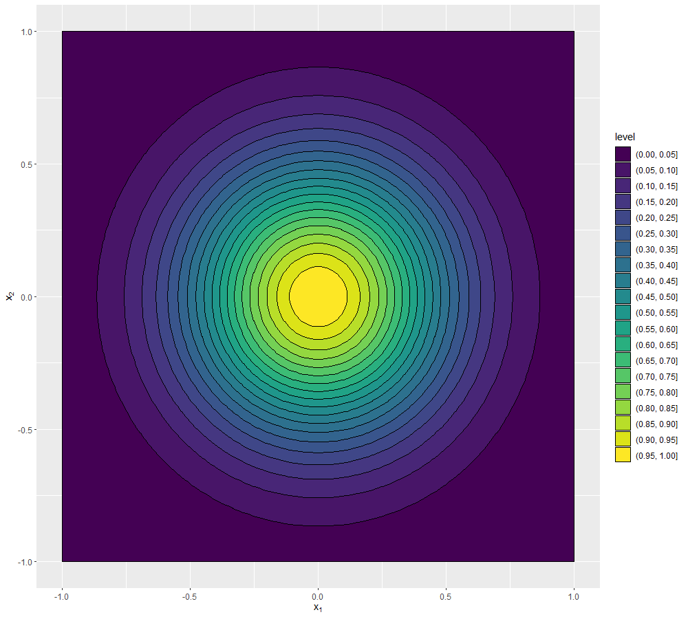

--- 
title: "Tutorial 2: An introduction to the main functionalities of the hmer package"
author: "Danny Scarponi, Andy Iskauskas"
site: bookdown::bookdown_site
output:
    bookdown::pdf_book:
        includes:
            in_header: header.tex
    bookdown::gitbook:
        config:
            sharing: null
        css: 'style.css'
        highlight: tango
        includes:
            in_header: _toggle.html
        keep_md: TRUE
linkcolor: blue
documentclass: book
link-citations: yes
description: "An easy guide to the main functionalities of the hmer package"
---

```{r, child = "_setup.Rmd", include = F, purl = F, cache = T}
```

```{r setup, include = TRUE}
knitr::opts_chunk$set(
  collapse = TRUE,
  comment = "#>",
  fig.width = 12,
  fig.height = 8,
  cache = T
)
set.seed(123456)
## getOutputs takes a data.frame of parameter sets 'points' and a list of times 'times' and runs the model under consideration at each parameter seet. It then creates a data.frame with a row for each element in 'points' and where columns contain the number of infectious people and the ensemble variability at each time in 'times'. 
getOutputs <- function(points, times, ev = TRUE) {
  out_df <- data.frame()
  for (i in 1:length(points[,1])) {
    model <- mparse(compartments = compartments, transitions = transitions, u0 = u0, tspan = 1:max(times), gdata = points[i,])
    res <- run(model)
    traj <- trajectory(res)
    trajI <- tidyr::spread(traj[,c('node','time','I')], node, I)
    Iattimes <- trajI[seq_along(trajI[,1])%in%times,]
    aggs <- data.frame(cbind(Iattimes$time, apply(Iattimes[,-1], 1, mean), apply(Iattimes[,-1], 1, function(x) sd(x)/sqrt(nreps)+0.03*(max(x)-min(x))))) %>% setNames(c('time', 'mu', 'sd'))
    if (ev)
      shaped <- c(aggs$mu, aggs$sd) %>% setNames(c(paste0('I', aggs$time, sep = ""), paste0('EV', aggs$time, sep = "")))
    else
      shaped <- c(aggs$mu) %>% setNames(paste0('I', aggs$time, sep = ""))
    if (i == 1) {
      out_df <- t(data.frame(shaped))
      rownames(out_df) <- NULL
    }
    else
      out_df <- rbind(out_df, shaped)
  }
  rownames(out_df) <- NULL
  return(out_df)
}
```

``` {r echo = FALSE, message = FALSE, cache=F}
library(hmer)
library(purrr)
library(SimInf)
library(lhs)
library(knitr)
library(ggplot2)
library(latex2exp)
```


# Introduction to the model {#intro}

This tutorial presents the main functionalities of the 
[hmer](https://cran.r-project.org/web/packages/hmer/index.html) package, using a synthetic example of an epidemiological model. Although self-contained, this tutorial is the natural continuation of [Tutorial 1](https://github.com/Danny-sc/Tutorial_1), which gives an overview of the history matching with emulation process and shows how it works through a simple one-dimensional example. Readers who are not familiar with history matching and emulation will find Tutorial 1 particularly helpful.

The model that we chose for demonstration purposes is a stochastic <span class="abbr" title="A model consisting of four compartments 

- $S$: Susceptible individuals,
- $E$: Exposed individuals (i.e. people that are infected but not infectious yet), 
- $I$: Infectious individuals,  
- $R$: Recovered individuals, 

and four possible transitions

- $S \rightarrow E$, when a susceptible individual becomes infected, 
- $E \rightarrow I$, when an infected individual becomes infectious,
- $I \rightarrow R$, when an infectious individual recovers,
- $R \rightarrow S$, when a recovered individual becomes susceptible again.

SEIRS models are used to study those infectious diseases that do not confer permanent immunity."><abbr title="A model consisting of four compartments 

- S: Susceptible individuals,
- E: Exposed individuals (i.e. people that are infected but not infectious yet), 
- I: Infectious individuals,  
- R: Recovered individuals, 

and four possible transitions

- S to E, when a susceptible individual becomes infected, 
- E to I, when an infected individual becomes infectious,
- I to R, when an infectious individual recovers,
- R to S, when a recovered individual becomes susceptible again.

SEIRS models are suitable to study those infectious diseases that have an incubation period and do not confer permanent immunity.">
SEIRS</abbr></span>
model, with four parameters: rate of transmission between each infectious person and each susceptible person $\beta_M$; transition rate from exposed to infectious $\gamma_M$; recovery rate from infectious to recovered $\delta_M$; and a 'loss of immunity' rate from recovered to susceptible $\mu_M$.

``` {r, echo = FALSE, fig.cap='SEIRS Diagram'}
knitr::include_graphics('SEIRSdiagram.png')
```

Expressed in terms of differential equations, the transitions are
\begin{align}
\frac{dS}{dt} &= -\frac{\beta_M S I}{N} + \mu_M R  \\ \\
\frac{dE}{dt} &= -\gamma_M E + \frac{\beta_M S I}{N} \\ \\
\frac{dI}{dt} &= -\delta_M I + \gamma_M E \\ \\
\frac{dR}{dt} &= -\mu_M R + \delta_M I
\end{align}
where $N$ represents the total population, $N=S+E+I+R$. For simplicity, we consider a closed population, so that $N$ is constant.

To generate runs from this model, we use [SimInf](https://cran.r-project.org/web/packages/SimInf/index.html), a package that provides a framework to conduct data-driven epidemiological modelling in realistic large scale disease spread simulations. Note that the <em>hmer</em> package is code-agnostic: although we chose SimInf for this case study, <em>hmer</em> can be used to calibrate models written in any package or programming language. SimInf requires us to define the transitions, the compartments, and the initial population. If
we want multiple repetitions for each choice of parameters, we create a data.frame with identical rows, each of which has the same initial population. Here we will choose $50$ repetitions per choice of parameters and consider an initial population of $1000$ of who $50$ are infected. Note that if we were to start 
with one infectious individual, some runs of the model are likely not show an epidemic (since it could happen that the only infectious person recovers before infecting other people). Choosing a relatively high number of initial infectious people helps us circumvent any problems that would come from bimodality and keep the tutorial simple. Bimodality will be dealt in the more advanced case studies (see [Stochastic Workshop](https://danny-sc.github.io/stoch_workshop/index.html). 

``` {r, echo= -c(1)}
## Defines the compartments of the model, the transitions between them, the number of repetitions per parameter set and the initial value of each compartment.
compartments <- c("S","E","I","R")
transitions <- c(
  "S -> beta*I*S/(S+I+E+R) -> E",
  "E -> gamma*E -> I",
  "I -> delta*I -> R",
  "R -> mu*R -> S"
)
nreps <- 50
u0 <- data.frame(
  S = rep(950, nreps),
  E = rep(0, nreps),
  I = rep(50, nreps),
  R = rep(0, nreps)
)
```

We select parameter values and parse the model using the function `mparse`, which takes transitions, compartments, initial values of each compartment, parameter values and the time span to simulate a trajectory. We then run the model and plot the trajectories of interest.

``` {r, echo=-c(1,5)}
## Selects parameter values of interest, parses the model through the function mparse and runs it. 
params <- c(beta = 0.5, gamma = 0.5, delta = 0.1, mu = 0.1)
model <- mparse(transitions = transitions, compartments = compartments, u0 = u0, gdata = params, tspan = 1:60)
result = run(model)
## Plots the trajectories of exposed, infectious and recovered people.
plot(result)
```

In order to extract the relevant information from the data provided by the SimInf run, a helper function `getOutputs` has been included in this document. It takes a data.frame of parameter sets and a list of times, and returns a data.frame of the results. We then create a data.frame `outputs` by binding the parameter values and the results obtained.

``` {r, echo=-c(1,4)}
## Creates a data.frame 'points' with all combinations of the given parameters. Each of the four parameter has two values, so 'points' will contain 2^4 combinations.
points <- expand.grid(list(beta = c(0.4, 0.6),
                           gamma = c(0.4, 0.6),
                           delta = c(0.05, 0.15),
                           mu = c(0.05, 0.15)
))
results <- getOutputs(points, seq(10,30,by=5))
## 'outputs' is 'results' binded with 'points', so that it is clear to which combination of parameters each row corresponds to.
outputs <- data.frame(cbind(points, results))
head(outputs)
```

Each row of `outputs` corresponds to a parameter set and contains information regarding the number of infectious individuals $I$ for that set. Each row of column $I10$ (resp. $I15, I20, I25, I30$) contains the mean value of $I$ at time $10$ (resp. $15, 20, 25, 30$) for the $50$ runs of the relative parameter set. Similarly, columns $EV10, EV15, EV20, EV25, EV30$ provide a measure of the 
<span class="abbr" title="Running a stochastic model at a given set of parameters produces different results each time. We refer to this form of uncertainty as Ensemble Variability"><abbr title="Running a stochastic model at a given set of parameters produces different results each time. We refer to this form of uncertainty as Ensemble Variability.">
ensemble variability</abbr></span>
for each parameter set, at each desired time: this is defined here as the standard deviation of the $50$ runs, plus $3\%$ of the range of the runs. The trained emulators outputs will be estimates of the means, while the ensemble variability will be used to quantify the uncertainty of such estimates.

Before we tackle the emulation, we need a set of `wave0` data. For this, we define a set of ranges for the parameters, and generate parameter sets using a [Latin Hypercube](https://en.wikipedia.org/wiki/Latin_hypercube_sampling) design (see fig. \@ref(fig:figlhs) for a Latin Hypercube example in two dimensions). We will run the model over $80$ parameter sets; $40$ of these will be used for training while the other $40$ will form the validation set for the emulators.

``` {r, figlhs, echo = FALSE, out.width = "60%", fig.cap='An example of Latin hypercube in two dimensions: there is only one sample point in each row and each column.'}
knitr::include_graphics('LHS.png')
```

Through the function `maxminLHS` we create two hypercube designs with 40 parameter sets each: one to train emulators and one to validate them. 

``` {r, echo=-c(1,3)}
## 'ranges' contains the ranges for each of the possible parameters 
ranges <- list(
  beta = c(0.2, 0.8),
  gamma = c(0.2, 1),
  delta = c(0.1, 0.5),
  mu = c(0.1, 0.5)
)
## The maximinLHS function creates two sets of 40 combinations of points in [0,1]^4 each. These are then recentered and rescaled to fit into the ranges given for each parameter.
pts_train <- 2*(maximinLHS(40, 4)-1/2)
pts_valid <- 2*(maximinLHS(40, 4)-1/2)
r_centers <- map_dbl(ranges, ~(.[2]+.[1])/2)
r_scales <- map_dbl(ranges, ~(.[2]-.[1])/2)
pts_train <- data.frame(t(apply(pts_train, 1, function(x) x*r_scales + r_centers)))
pts_valid <- data.frame(t(apply(pts_valid, 1, function(x) x*r_scales + r_centers)))
pts <- rbind(pts_train, pts_valid)
head(pts)
```

Note that the first time we create `pts_train` (or `pts_valid`), we get $40$ parameter sets where each parameter value is distributed on $[-1,1]$. This is not exactly what we need, since each parameter has a different range. We therefore define `r_centers` (resp. `r_scales`) which contains the midpoint (resp. the size) of the range of each parameter. Using these two pieces of information, we re-center and re-scale `pts_train` and `pts_valid`. 

We obtain the model runs for the parameter sets in `pts` through the `getOutputs` function. We bind the parameter sets in `pts` to the model runs and save everything in the data.frame `wave0`. 

```{r, echo=-1}
## 'getOutput' is run at 'pts' and for the times 10, 15, 20, 25, 30. The results are then binded to 'pts' to obtain 'wave0'
wave0 <- data.frame(cbind(pts,getOutputs(pts, seq(10,30,by=5)))) %>% 
setNames(c(names(ranges), paste0("I",seq(10,30,by=5)),paste0('EV',seq(10,30,by=5))))
head(wave0)
```

Finally, we split `wave0` into two parts: the training set, on which we will train the emulators, and a validation set, which will be used to do diagnostics of the emulators. 

``` {r, echo=-1}
##'wave0' is split into training set, on which the emulators will be trained, and a validation set, that will be used to evaluate the performance of the emulators.
train0 <- wave0[1:40,1:9]
valid0 <- wave0[41:80,1:9]
```

# Perfoming a full wave of emulation and history matching

In this section we show a simple and direct way of performing a full wave of emulation and history matching (the first wave). This is done by using the function 
`full_wave`, which needs the following information:

- A dataset that will be split by the function into training data and test data;

- A list of ranges for the parameters;

- The targets: for each of the model outputs to emulate, we need a pair (val, sigma) that we will use to evaluate implausibility. The 'val' component represents the mean value of the output and 'sigma' represents our uncertainty about it: a pair (val,sigma) corresponds to the acceptable interval (val - 3* sigma, val + 3*sigma);

We already have almost all of these pieces. We only need to define the targets:

```{r, echo=-1}
## A list 'targets' is defined. For each output to emulate, it contains the mean value and the uncertainty that will be used to evaluate implausibility.
targets = list(
  I10 = list(val = 240, sigma = 12.64),
  I15 = list(val = 396, sigma = 20.49),
  I20 = list(val = 453, sigma = 23.24),
  I25 = list(val = 428, sigma = 21.99),
  I30 = list(val = 392, sigma = 20.15)
)
```

```{info, title = "More on how targets were set"}
As our dataset is synthetic, we couldn’t rely on observed data to define our targets. Instead, we ran the model from a chosen parameter set, with a large number of repetitions. The means from the various runs provided the mean values (val), while the sigmas were defined as the sum of the ensemble variability and a term simulating the observational error. The ensemble variability was estimated as the standard deviation of the various runs, plus  3% of the range of the runs. Note that if the dataset weren't synthetic, we could also choose to add model discrepancy, to attempt to account to some degree for the fact that no model perfectly represents reality.
``` 
  
Before performing a full wave of history matching with emulation we use the `simulator_plot` function to plot runs from parameter sets in `wave0` and compare them to our targets. Note the in graph titles we will refer to parameter sets in a given wave as "wave points" for the sake of shortness. 

``` {r, echo=-c(1,3), fig.height=8, fig.width=10}
## 'wave1' is created by binding 'next_wave' to 'new_points' and a list 'all_points' is defined, with points from both 'wave0' and 'wave1'.
all_points <- list(wave0[1:9])
## 'simulator_plot' compares the performance of parameter sets in 'wave0' and parameter sets in 'wave1'.
simulator_plot(all_points, targets, palette="goldenrod1")
```

We then perform the first wave of history matching through the function `full_wave`:

``` {r, echo=-1}
## The function 'full_wave' performs a full wave of history matching and emulation. We pass to it validation data, ranges for the parameters, names of the model outputs to emulate, targets, number of parameter sets to generate for the next wave and sampling method to use.
test_full_wave <- full_wave(wave0[,1:9], ranges, targets)
```

The `full_wave` function does the following for us:

- takes all the data (`wave0[,1:9]`) and splits it into a training set and a validation set. The default proportion of data used to train the emulators is 70%;

- creates initial emulators: these are a preliminary version of the emulators necessary to set our priors for the Bayes Linear method; 

- creates the `emulators`: these are obtained by adjusting the base emulators through the Bayes Linear update formulae;

- provides us with `points`, the new sample parameter sets where the model will be run to build the next wave emulators. 

To see how the parameter space has changed after the first wave of the process, we use the function `wave_points`, which plots the old and the new set of parameters on the same pair of axis:

``` {r, echo=-1, fig.width=10, fig.height=10}
## `wave_points` plots the old and the new set of parameters on the same pair of axis.
wave_points(list(wave0, test_full_wave$points), names(ranges))
```

Here `wave0` parameter sets are in yellow and the new sets are in purple. The plots in the main diagonal show the distribution of points in the two sets. In each plot the parameters that are not shown are fixed at the mid-range value. Let us take a look at the yellow and purple distributions for the delta parameter. While the distribution of points in `wave0` is rather uniform, the distribution of the new wave peaks at low values of delta and decreases to zero for large values of delta.  Similarly, if we look at the beta-gamma plot, the yellow points are uniformly distributed, while the purple points are concentrated in the upper right region: this suggests that parameter sets with low values of beta and low values of mu are unlikely to give a good fit for the model.

The next plot shows that parameter sets in `points` (in orange) perform considerably better than parameter sets in `wave0` (in yellow). To create the plot we bind the parameter sets in  `points` with the relative model runs, that we obtain through the `getOutputs` function.

```{r, echo=-c(1,3,6), fig.height=8, fig.width=10}
## 'next_sample' is passed to 'getOutputs' to obtain the model outputs for those points.
next_wave <- getOutputs(test_full_wave$points, seq(10,30,by=5))
## 'wave1' is created by binding 'next_wave' to 'new_points' and a list 'all_points' is defined, with points from both 'wave0' and 'wave1'.
wave1 <- data.frame(cbind(test_full_wave$points,next_wave))%>%   
  setNames(c(names(ranges),paste0("I",seq(10,30,by=5)),   paste0("EV",seq(10,30,by=5))))
all_points <- list(wave0[1:9], wave1[1:9])
## 'simulator_plot' compares the performance of parameter sets in 'wave0' and parameter sets in 'wave1'.
simulator_plot(all_points, targets, palette=c("goldenrod1", "red"))
```

In the following sections we will explain step by step what `full_wave` does behind the scenes. This will not only enhance the reader's overall understanding, but will also provide them with the necessary tools to have more control over the process and customise it through their judgement.

# The structure of an emulator

The first task that the `full_wave` function accomplishes, is to build the emulators based on the training data. In this section we discuss the structure of the emulators that we want to construct. We then show how to build emulators step by step in the next section. 

An [emulator](https://en.wikipedia.org/wiki/Emulator) is a way of representing our 
<span class="abbr" title=""><abbr title="In Bayesian statistics, probability expresses a degree of belief in an event. Such belief can be based either on prior knowledge or on personal beliefs about the event. 
">beliefs</abbr></span>
about the behaviour of an unknown function. In our example we have a stochastic model and we choose the unknown function to be the mean of each of the model outputs over multiple runs. Given a training dataset, i.e. a set of model runs, we can train an emulator and use it to get expectation and variance for a model output at any parameter set, without the need to run the model at the chosen set. We think of the expectation as the prediction provided by the emulator at the chosen parameter set, and we think of the variance as the uncertainty associated to that prediction. Critically an emulator is extremely fast to evaluate (compared to the model it mimics) and hence can be used to explore the input space more fully. It is worth noting that more sophisticated approaches are possible when working with stochastic models: apart from the mean of outputs, other features, such as the variance, can be approximated through emulators. We will show how to work with these in more advanced case studies.
In this tutorial, we will construct an emulator for each of the model outputs separately (more complex techniques that combine outputs are available and will be described in more advanced case studies). 

The general structure of a univariate emulator is as follows:
$$f(x) = g(x)^T \beta + u(x),$$
where $g(x)^T \beta$ is a regression term and $u(x)$ is a weakly stationary process with mean zero. The role of the regression term is to mimic the global behaviour of the model output, while $u(x)$ represents localised deviations of the output from this global behaviour near to $x$.  

## The global behaviour of the output

The regression term is specified by:

- a vector of deterministic functions of the parameters $g(x)$ which determine the shape and complexity of the regression hypersurface we fit to the training data. For example, if $x$ is one dimensional, setting $g(x)=(1,x)$ (resp. $g(x)=(1,x,x^2,...,x^n)$) corresponds to fitting a straight line (resp. a degree $n$ polynomial curve) to the training data. If $x$ is two dimensional, say $x=(x_1,x_2)$, then setting $g(x)=(1,x_1,x_2)$ (resp. $g(x)=(1,x_1, x_2,x_1^2,x_2^2,x_1x_2)$) corresponds to fitting a hyperplane (resp. a quadratic hypersurface) to the training data;

- a vector of regression coefficients $\beta$. In the one dimensional case for example, if we set $g(x)=(1,x)$, then $\beta=(\beta_0,\beta_1)$, where $\beta_0$ is the $y$-intercept and $\beta_1$ is the gradient of the straight line fitted to the training data. 

Common choices for $g(x)$ are polynomials of low degree, such as degree zero, one or two. Once a choice for $g(x)$ is made, the vector $\beta$ can be determined as described in Appendix \@ref(emulstr). As we will see in the next section, the function `emulator_from_data` does this for us: it assumes a quadratic structure for the regression term and then determines the vector $\beta$.  

## The local deviations from the global behaviour

In general, and especially when dealing with complex models, we cannot expect the regression hypersurface to perfectly explain the behaviour of the output. For this reason it is fundamental to account for the local deviations of the output from the regression hypersurface. Since these local deviations, also referred to as residuals, are unknown, we treat them as random variables: for each parameter $x$, we then have a random variable $u(x)$ representing the residual at $x$. Furthermore, we expect the residuals $u(x)$ and $u(x')$ at two parameter sets $x$ and $x'$ that are close to each other to be correlated. In particular, the smoother is the model output (as a function of the parameters), the more correlated $u(x)$ and $u(x')$ will be. This collection of random variables, one for each point in the parameter space, is what is referred to as a [stochastic process](https://en.wikipedia.org/wiki/Stochastic_process), and is denoted by $\{u(x)\}_{x\in X}$, where $X$ is the parameter space, or, a bit improperly, simply by $u(x)$. Clearly, there exists a large variety of stochastic processes, depending on the distribution of each of the $u(x)$ and on how each pair $(u(x),u(x'))$ interacts. 
In the hmer package by default we assume $u(x)$ to be a weakly stationary process such that:

-  $u(x)$ has mean zero for each parameter set $x$. Note that the mean is assumed to be zero, since, even if we expect to see local deviations, we do not expect the output to be systematically above (or below) the regression hypersurface;

- given any finite number of parameter sets $(x^1,...,x^n)$, the vector $(u(x^1),u(x^2),...,u(x^n))$ is a multivariate variable with mean $(0,...,0)$. Remember that the covariance matrix of $(u(x^1),u(x^2),...,u(x^n))$ is by definition the $n\times n$ matrix $\Sigma$  such that 

$$\Sigma_{i,j} := \text{Cov}(u(x^i),u(x^j)).$$
The higher the value of $\Sigma_{i,j}$, the more correlated we expect the residuals at $x_i$ and $x_j$ to be. Similarly, the higher the value of 
 $\Sigma_{i,i} := \text{Cov}(u(x^i),u(x^i))= \text{Var}(u(x^i))$, the larger we expect the residual at $x^i$ to be.
In order to fully specify the process $u(x)$, we need to know its covariance structure, i.e. $\text{Cov}(u(x),u(x'))$ for all possible pairs of parameter sets $(x,x')$.

A very commonly used covariance structure, and the default option in the hmer package, is given by 

$$\text{Cov}(u(x), u(x'))= \sigma^2 \left[(1-\delta) c(x,x^{\prime}) + \delta I_{\{x=x^\prime\}}\right]$$
where $I_{\{x=x^\prime\}}$ is $1$ if $x=x^\prime$ and $0$ otherwise, while  $c$ is the square-exponential correlation function

$$c(x,x^{\prime}) :=  \exp \left(\frac{-||x-x'||^2}{\theta^2}\right) = \exp\left(\frac{-\sum\limits_{i}(x_{i}-x_{i}^{\prime})^2}{\theta^2}\right)$$

where $||x-x'||$ is the euclidean distance of $x$ and $x'$, and $x_i$ is the ith-component of the parameter set $x.$ Note that $c(x,x^{\prime})$, and therefore $\text{Cov}(u(x), u(x'))$, only depend on the distance  $||x-x'||$ between $x$ and $x'$.

Let us comment on the various terms in this covariance structure:

- $\sigma^2$ is the variance of $u(x)$: $$\text{Var}(u(x))=\text{Cov}(u(x), u(x))=  \sigma^2 \left[(1-\delta) c(x,x) + \delta I_{\{x=x\}}\right]= \sigma^2 [(1-\delta)\exp(0) + \delta]=\sigma^2.$$ Note that this is independent of the chosen parameter set $x$, i.e. all variables $u(x)$ have not only the same mean zero, but also the same variance $\sigma^2$. The larger the value of $\sigma$, the larger will be the variations of $u(x)$ around its mean zero. 

- The so-called 'nugget' term $\delta I_{\{x=x^{\prime}\}}$  ensures that the covariance matrix of $u(x)$ is not ill-conditioned, making the computation of its inverse possible (a key operation in the training of emulators, see Appendix \@ref(bayes)). This term does not contribute to the covariance of residuals at different points, but only to the variance of each residual. In the case of a stochastic model, as in this tutorial, it can be interpreted as the proportion of the overall variance due to the ensemble variability. 

- $\theta$ is the correlation length of the process. For a given pair $(x,x')$, the larger $\theta$ is, the larger is the value of $c(x,x')$ and therefore that of the covariance between $u(x)$ and $u(x')$. This means that the size of $\theta$ determines how close two parameter sets must be in order for the corresponding residuals to be well correlated.  Informally, we can think of $\theta$ in the following way: if the distance of two parameters sets is no more than $\theta$, then their residuals will be well correlated. In particular, a larger $\theta$ results in a smoother  (less wiggly) emulator. Note that more complex approaches are possible, for example by assuming different correlation lengths for different parameters:  $c(x,x^{\prime}) = \exp\left(-\sum\limits_{i}\frac{(x_{i}-x_{i}^{\prime})^2}{\theta_i^2}\right).$ In this more general setting, a smaller $\theta_i$ value means that we believe that the output is less smooth with respect to parameter $i$, and thus that the values for the corresponding parameters $x_i$ and $x_i^{\prime}$ must be closer in order to be well
correlated.  

To enhance our understanding of the role played by $\sigma$ and $\theta$, let us investigate how the covariance structure varies for different values of $\sigma$ and $\theta$, assuming $u$ is a Gaussian process, i.e. that $u(x)$ is normally distributed for all $x$. For simplicity,  let's assume that we have just one parameter and that $\delta$ is zero. Since our covariance is translation invariant, i.e. depends only on the distance between $x$ and $x'$, we can fix one of them, say $x'$ to zero, and plot 
$$\text{Cov}(u(x), u(0))=\sigma^2  \exp \left(\frac{-|x|^2}{\theta^2}\right)$$ as a function of $x$. We plot $\text{Cov}(u(x), u(0))$ for four different pairs $(\sigma,\theta)$:

- $(\sigma,\theta)=(1,1)$ in green,

- $(\sigma,\theta)=(1,0.5)$ in blue,

- $(\sigma,\theta)=(1,0.1)$ in black,

- $(\sigma,\theta)=(0.5,0.5)$ in red.

```{r, echo=F}
test_seq <- seq(-1, 1, length.out = 1000)
e_s_test <- function(theta, sigma) {
  out <- rep(0,length(test_seq))
  for (i in 1:length(test_seq)){
      out[i] <- sigma^2 * exp_sq(data.frame(0),data.frame(test_seq[i]),list(theta=theta))[1,1]
  }
  return(out)
}
plot(test_seq, e_s_test(0.1, 1), type = 'l', xlab="x", ylab=expression(Cov(u(x), u(0))))
lines(test_seq, e_s_test(0.5, 1), col = 'blue')
lines(test_seq, e_s_test(1, 1), col = 'green')
lines(test_seq, e_s_test(0.5, 0.5), col = 'red')
```

We can note a few things here. First of all, the value of $\sigma$ regulates the height of the peak at zero, i.e. the value of the variance of the residuals. Second, for a fixed value of $\sigma$, smaller values of $\theta$ correspond to narrower curves. For example, if we look at $x=0.5$, the green curve gives a value around $0.8$, while the black curve gives a value around zero. This tells us that the residual at $x=0.5$ is 

- very well correlated with the residual at $x=0$ if $\theta=1$, and 

- almost not correlated with the residual at $x=0$ if $\theta=0.1$.

This is in perfect agreement with the informal interpretation of $\theta$ given above: "if the distance of two parameters sets is no more than $\theta$, then their residuals will be well correlated". In fact, when $\theta=1$ the point $0.5$ has distance from zero well below $\theta$, while when $\theta=0.1$, the point $0.5$ has distance from zero well above $\theta$. 

For each of the four covariance structures plotted above, we can plot a few realisations of the corresponding Gaussian process $u(x)$. By a realisation of the process $u(x)$ we mean any function $t$ of $x$ where $t(x)$ is sampled from a normal distribution with mean zero and variance $\sigma^2$, and where values of $t$ at different points are in accordance with the covariance structure of $u(x)$. An easy way of producing realisations of a given process is the following:

- create a sequence of points along the x-axis (since here we are still working with a 1-dimensional parameter space for simplicity)

- calculate the covariance matrix for these points, using the formula $\text{Cov}(u(x), u(x'))=\sigma^2  \exp \left(\frac{-|x-x'|^2}{\theta^2}\right)$
 
- use the function `rmvnorm` from the `mvtnorm` package to generate a sample from a multivariate normal distribution with mean vector of zeroes and covariance matrix as found in the previous step.

The code below uses the method just described and plots a realisation of the Gaussian process $u(x)$ for $(\sigma,\theta)=(1,1)$:

```{r}
x = seq(-5,5,by=0.01)
d = abs(outer(x,x,"-")) # compute distance matrix, d_{ij} = |x_i - x_j|
s = 1
l = 1 
Sigma_SE = s^2 * exp(-d^2/(l^2)) # squared exponential kernel
y = mvtnorm::rmvnorm(1,sigma=Sigma_SE)
plot(x,y, type="l")
```

Note that we set `type="l"` in order to plot a continuous line connecting all the values in the vector $y$.

To compare realisations produced by different pairs $(\sigma,\theta)$, we create a $4\times 4$ grid where each column contains four realisations from one of the four pairs $(\sigma, \theta)$. The realisations are coloured according to the colours assigned in the covariance structure plot. We set `ylim=c(-3,3)`  in all plots, to make the comparison between columns easier.

```{r}
par(mfcol=c(4,4),mar=c(1.5,1.5,1.5,1.5), oma=c(8,8,0,0))
for(i in 1:4){
    x = seq(-5,5,by=0.01)
    d = abs(outer(x,x,"-")) # compute distance matrix, d_{ij} = |x_i - x_j|
    s = 1
    l = 1 
    Sigma_SE = s^2 * exp(-d^2/(l^2)) # squared exponential kernel
    y = mvtnorm::rmvnorm(1,sigma=Sigma_SE)
    plot(x,y, type="l", col="green", ylim=c(-3,3))
    mtext("Guassian process realisation", line=2, side=2, outer=T)
    mtext("x", side=1, line=2, outer=T)
} 
for(i in 1:4){
    x = seq(-5,5,by=0.01)
    d = abs(outer(x,x,"-")) # compute distance matrix, d_{ij} = |x_i - x_j|
    s = 1
    l = 0.5 
    Sigma_SE = s^2 * exp(-d^2/(l^2)) # squared exponential kernel
    y = mvtnorm::rmvnorm(1,sigma=Sigma_SE)
    plot(x,y, type="l", col="blue", ylim=c(-3,3))
} 
for(i in 1:4){
    x = seq(-5,5,by=0.01)
    d = abs(outer(x,x,"-")) # compute distance matrix, d_{ij} = |x_i - x_j|
    s = 1
    l = 0.1 
    Sigma_SE = s^2 * exp(-d^2/(l^2)) # squared exponential kernel
    y = mvtnorm::rmvnorm(1,sigma=Sigma_SE)
    plot(x,y, type="l", ylim=c(-3,3))
} 
for(i in 1:4){
    x = seq(-5,5,by=0.01)
    d = abs(outer(x,x,"-")) # compute distance matrix, d_{ij} = |x_i - x_j|
    s = 0.5
    l = 0.5
    Sigma_SE = s^2 * exp(-d^2/(l^2)) # squared exponential kernel
    y = mvtnorm::rmvnorm(1,sigma=Sigma_SE)
    plot(x,y, type="l", col="red", ylim=c(-3,3))
}
```

First of all we can see that the residuals in the fourth column, generated with a smaller $\sigma$, tend to show smaller oscillations then the other columns. If we then compare the first three columns, which correspond to the same $\sigma$, we see that black lines are more wiggly than blue lines, which in turn are more wiggly than the green lines. This is what we expected: smaller values of $\theta$ produce less smooth residuals. Finally it is interesting to compare the red and the blue lines: they show the same level of smoothness, since they have the same $\theta$, but they size of the oscillations tends to be smaller in the red lines, which have a smaller $\sigma$.

From these plots it is clear that choosing values for $\sigma$ and $\theta$ corresponds to making a judgment about how far we expect the output to be from the regression hypersurface ($\sigma$) and about its smoothness ($\theta$). In this tutorial we entirely rely on the hmer package, and in particular the function `emulator_from_data`, which selects values of $\sigma$, $\theta$ and $\delta$ for us, based on the provided training data. In later tutorials, we will discuss how we can intervene to customise the choice of these hyperparameters. 

We conclude this section by showing how to visualise the covariance structure when the parameter space is not one-dimensional. As before we can fix $x'$ to be the origin for example, but now $x$ has several coordinates. For example say that we have two parameters, so that $x=(x_1,x_2)$ and for simplicity let us assume again that $\delta$ is zero. Now for every pair $(x_1,x_2)$ we have a covariance value of $\text{Cov}(u((x_1,x_2)), u(0))=\sigma^2  \exp \left(\frac{-x_1^2-x_2^2}{\theta^2}\right)$. A way of visualising such a function is through a contour plot:


- $(\sigma,\theta)=(1,1)$
``` {r, echo = FALSE, out.width = "100%"}
knitr::include_graphics('contour11.png')
```

- $(\sigma,\theta)=(1,0.5)$
``` {r, echo = FALSE, out.width = "100%"}

```

- $(\sigma,\theta)=(1,0.1)$ 
``` {r, echo = FALSE, out.width = "100%"}
knitr::include_graphics('contour10.1.png')
```

- $(\sigma,\theta)=(0.5,0.5)$
``` {r, echo = FALSE, out.width = "100%"}
knitr::include_graphics('contour0.50.5.png')
```


We can see that the first three plots, having $\sigma=1$, all reach the value $1$ at the origin (the point we chose as reference), while in the last plot, where $\sigma=0.5$, the highest values are around $0.25$, which is in fact $\sigma^2$. Comparing the first three plots, we see that the lower the value of $\theta$, the darker the plot, i.e. the less correlated points are with the origin. For example, if $\theta=1$ we see that points with a distance of a unit from the origin are still correlated with it (with a value $0.3647-0.417$), while if $\theta=0.5$ points with a distance of a unit from the origin are basically uncorrelated with it (with a value $0-0.05$). When $\theta=0.1$, it is enough to be at a distance of $0.25$ from the origin to be uncorrelated  with it (with a value $0-0.05$).

```{info, title = "Dealing with high dimensions"}
Since in this tutorial we are working with a low-dimensional input space, we chose a relatively basic structure for our emulator. Note that more complex structures may be needed when dealing with higher dimensional problems, since the complexity of the emulation process increases significantly with dimensionality. There are several ways of tackling high dimensional problems. One of these consists in reducing the number of dimensions by selecting  the variables that explain the data the most.  More info on active variables can be found in Appendix \@ref(emulstr).
```

We would like to advise the reader that several emulator structures and  correlation functions are available.  Alternatives choices to the ones made above are discussed in Appendix \@ref(emulstr). 


# Constructing the emulators
To construct the emulators, we use the function `emulator_from_data`, which requires at least the training data, the name of the model outputs to emulate and the list of parameter ranges. In this case study we also use the optional argument `ev` to pass our estimates of the ensemble variability. We first define the model output names and we calculate the ensemble variability `evs` taking the mean of the column $EV$ in `wave0`:

``` {r, echo=-1}
## Names of the model outputs to emulate are set and the ensemble variability calculated
output_names <- paste0("I", seq(10,30, by=5))
evs <- apply(wave0[10:ncol(wave0)], 2, mean)
``` 

The function `emulator_from_data` uses `evs` to estimate the delta parameter, i.e. the proportion of the overall variance due to the ensemble variability.

``` {r, echo=-1}
## 'emulator_from_data' takes training data, names of the outputs to emulate, parameter ranges, ensemble variability and generates priors emulators based on fitted values.
ems0 <- emulator_from_data(train0, output_names, ranges, ev=evs)
ems0[[1]]
```


```{info, title = "More details about the emulator\\_from\\_data and its output"}
The `emulator_from_data` buils emulators in two distinct steps. It first creates a set of 'initial' emulators by fitting a regression surface to `train0`. Both the regression parameters and the active parameters for each of the indicated model outputs are found: model selection is performed through [stepwise addition or deletion](https://en.wikipedia.org/wiki/Stepwise_regression) (as appropriate), using the [AIC criterion](https://en.wikipedia.org/wiki/Akaike_information_criterion) to find the minimal best fit. The default behaviour of `emulator_from_data` is to fit a quadratic regression surface: if we want instead a linear regression surface, we just need to set `quadratic=FALSE`.  We note that in principle we can insert basis functions of any form for the regression surface.


The 'initial' emulators, which provide not only estimates for the regression surface parameters, but also estimates for the correlation specifications, are then adjusted to the training data through the Bayes Linear update formulae.

The print statement 'ems0[[1]]' provides an overview of the emulator specifications and correlation structure, including 

- Basis Functions: here we have the four parameters beta, gamma, delta, mu and some products of them, since we chose quadratic regression. Note that beta:mu and all pure quadratic terms (such as beta:beta) are not listed: this means that stepwise addition and deletion led to discarding them,
 
- Active variables,

- first and second order specifications for $\beta$ and $u(x)$. Note that  by default `emulator_from_data` assumes that $\text{Var}[\beta]=0$: the regression surface is known and coefficients are fixed. This explains why Beta Variance and Mixed Covariance (which shows the covariance of $\beta$ and $u(x)$) are both zero. One can set beta.var=TRUE in order to consider the beta parameters as random variables. 
```

We can plot the emulators to see how they represent the output space: the `emulator_plot` function does this for emulator expectation, variance, standard deviation, and implausibility (more on which later). Note that all functions in the <em>hmer</em> package that produce plots have a colorblind-friendly option: it is sufficient to specify `cb=TRUE`. 

``` {r, echo=-1}
## The 'emulator_plot' function plots the emulator expectation.
for (i in 1:length(ems0)) ems0[[i]]$output_name <- output_names[i]
names(ems0) <- output_names
emulator_plot(ems0, cb=TRUE)
```

The emulator expectation plots show the structure of the regression surface, which is at most quadratic in its parameters, through a 2D slice of the input space. Here parameters $\beta$ and $\gamma$ are selected and we get a plot for each model output. For each pair $(\bar \beta,\bar \gamma)$ the plot shows the expected value produced by the relative emulator at the point $(\bar \beta,\bar \gamma, \delta_{\text{mid-range}}, \mu_{\text{mid-range}})$, where $\delta_{\text{mid-range}}$ indicates the mid-range value of $\delta$ and similarly for $\mu_{\text{mid-range}}$.

To plot the emulators standard deviation we just use `emulator_plot` passing 'sd' as second argument:

``` {r, echo=-1}
## 'Emulator_plot' is called with the option 'sd' to plot the standard deviation of the emulators.
emulator_plot(ems0, 'sd', cb=TRUE)
```


We can see that the emulators reasonably show the structure of the model: the closer the evaluation point is to a training point, the lower the variance (as it 'knows' the value at this point). In fact, evaluating these emulators at parameter sets in the training data demonstrates this fact:

```{r, echo=-1}
## The performance of the adjusted emulators is evaluated at parameter sets in the training data.
em_evals <- ems0$I10$get_exp(train0[,names(ranges)])
all(abs(em_evals - train0$I10) < 10^(-12))
```

In the next section we will define the implausibility measure while in section \@ref(diagnostics) we will explain how to assess whether the emulators we trained are performing as we would expect them to.


# History matching using implausibility {#implau}

In this section we give more details about implausibility and its role in the history matching process. Once emulators are built, we want to use them to systematically explore the input space. For any chosen parameter set, the emulator provides us with an approximation of the corresponding model output. This value is what we need to assess the implausibility of the parameter set in question.

## The implausibility measure

For a given model output and a given target, the implausibility is defined as the difference between the emulator output and the target, taking into account all sources of uncertainty. For a parameter set $x$, the schematic form for the implausibility $I(x)$ is

$$I(x) = \frac{|f(x)-z|}{\sqrt{V_0 + V_c(x)+V_s+V_m}},$$

where $f(x)$ is the emulator output, $z$ the target, and the terms in the denominator refer to various forms of uncertainty. In particular

- $V_0$ is the variance associated with the observation uncertainty;
- $V_c(x)$ refers to the uncertainty one introduces when using the emulator output instead of the model output itself. Note that this term depends on $x$, since the emulator is more/less certain about its predictions based on how close/far $x$ is from points in the training set;
- $V_s$ is the ensemble variability and represents the stochastic nature of the model (this term is not present if the model is deterministic);
- $V_m$ is the model discrepancy, accounting for possible mismatches between the model and reality.

A very large value of $I(x)$ means that the parameter set $x$ does not provide a good match to the observed data, even factoring in the additional uncertainty that comes with the use of emulators. When $I(x)$ is not too large, then we know that $x$ might be a point of good fit, so we keep $x$ in the subsequent wave.

In this case study the uncertainty that goes into the denominator of the emulator implausibility comprises the sigma values in the `targets` list, accounting for ensemble variability and observational error, and the emulator variance at the given parameter set. Note that if our targets were not synthetic, we could also choose to include the model discrepancy, to help account for the fact that no model perfectly represents reality.

An important aspect to consider is the choice of cut-off for the implausibility measure. The implausibility is a metric for evaluating how far out from being a good fit any parameter set is: there is no hard-and-fast rule for deciding at what point a parameter set is too implausible. A rule of thumb follows Pukelsheim's $3\sigma$ rule, a very general result which states that for any continuous unimodal distribution $95\%$ of the probability lies within $3$ sigma of the mean, regardless of asymmetry (or skewness etc). This is only the case for a single such distribution; for multiple univariate emulators it is slightly more involved. However a rough starting cut-off $m$, for $(1-\alpha)-$interval  and $N$ emulators, would be
$$m = \Phi^{-1}\left(\frac{1+(1-\alpha^{1/N})}{2}\right)$$
where $\Phi^{-1}$ is the inverse of the normal distribution CDF.

## Combining outputs together

Given multiple emulators, how do we measure overall implausibility? We want a single measure for the implausibility at a given parameter set, but for each emulator we obtain an individual value for $I$. The simplest way to combine them is to consider maximum implausibility at each parameter set:
$$I_M(x) = \max_{i=1,\dots,N}I_{i}(x),$$ where $I_i(x)$ is the implausibility at $x$ coming from the $i$th emulator. For large collections of emulators, it may be useful to instead consider the second-, or third-maximum implausibility, which also provides robustness to the failure of one or two of the emulators. Where some model outputs are deemed more important than others (for instance, putting greater weight on emulation of the peak of an epidemic), we may instead take a weighted average across the implausibity measures.

## Implausibility visualisations 

To calculate the implausibility we will use the `targets` list, which represents our observations.

The default behaviour of the diagnostics and plots we will see here is to take a cut-off of $3$ (following Pukelsheim's $3\sigma$ rule), and take maximum implausibility across the emulated outputs. For instance, to find the emulator implausibility for the first output we use the `emulator_plot` function specifying 'imp' for implausibility and passing it the target for the first output:

```{r, echo=-1, fig.width=10, fig.height=9}
## 'Emulator_plot' is called specifying 'imp' for the implausibility and passing it the target for the emulator of the first ouptut.
emulator_plot(ems0[[1]], 'imp', targets = targets[[1]], cb=TRUE)
```

This is a 2D slice through the input space: for a chosen pair $(\bar\beta,\bar\gamma)$, the plot shows the implausibility of the parameter set $(\bar\beta, \bar\gamma, \delta_{\text{mid-range}}, \mu_{\text{mid-range}})$, where $\delta_{\text{mid-range}}$ denotes the mid-range value of the delta parameter and similarly for $\mu_{\text{mid-range}}$. Parameter sets with a high implausibility (darker region) are highly unlikely to give a good fit and will be discarded when forming the parameters sets for the next wave.

Another way of visualising implausibility is through a plot lattice (image shown below). While `emulator_plot` provides us with a 2D slice through the input space, plot lattices are 2D plots which are projections of the full space: each pixel represents the whole of the behaviour in the non-plotted parameters. More in detail,  the upper diagonal is minimum-max implausibility: implausibility is evaluated across the whole space, and for each point in the projection the minimum of these max-implausibilities is plotted. Consider as an example the beta-mu plot (upper right corner): for each pixel in it, i.e. for each pair $(\bar \beta, \bar \mu)$, the implausibility is evaluated at $(\bar \beta, \gamma, \delta, \bar \mu, )$ for all possible values of $\gamma$ and $\delta$ and the minimum of these max-implausibilities is plotted. The lower diagonal is optical depth: this is a measure of how many points have maximum implausibility below our cutoff (in this case, 3). The lighter the colour, the higher proportion of points are acceptable. The diagonal is optical depth but for single parameters at a time. For example, the lower right corner shows that around $7.5\%$ of all parameter sets that have mu equal to $0.3$ are non-implausible.

``` {r, echo = FALSE, out.width = "100%", fig.cap='Plot lattice for first wave'}

```

# Emulator diagnostics {#diagnostics}

For a given set of emulators, we want to assess how accurately they reflect the model outputs over the input space. In this section three standard emulator diagnostics are introduced together with functions that help us visualise them. We then analyse parameter sets that fail diagnostics.

## The three main diagnostics 

The first three diagnostics are relatively straightforward, and can be presented together. For a given validation set, we can ask the following questions:

- Within uncertainties, does the emulator output accurately represent the equivalent model output?

- What are the standardised errors of the emulator outputs in light of the model outputs?

- Does the emulator adequately classify parameter sets as implausible or non-implausible?

These are encapsulated in the `validation_diagnostics` function.

``` {r, echo = -1, fig.width=10, fig.height=10}
## The 'validation_diagnostics' functions takes the adjusted emulators, the validation data, the names of the output to emulate and the target for each output. It then performs three diagnostics.
which_invalid <- validation_diagnostics(ems0, valid0, targets = targets, plt = TRUE)
```
The first column of plots gives an indication of the emulator outputs against the model outputs: emulator outputs are plotted against model outputs with a $3\sigma$ interval overlaid $\text{E}(f(x)) \pm 3 \sqrt{ \text{Var}(f(x))}$. An 'ideal' emulator would exactly reproduce the model results: this behaviour is represented by the green line $f(x)=E[f(x)]$. Any parameter set whose emulated prediction lies more than $3\sigma$ away from the model output is highlighted in red. 

The second column compares the emulator implausibility to the equivalent model implausibility (i.e. the implausibility calculated replacing the emulator output with the model output). There are three cases to consider:

- The emulator and model both classify a set as implausible/non-implausible: this is fine. Both are giving the same classification for the parameter set.

- The emulator classifies a set as non-implausible, while the model rules it out: this is also fine. The emulator should not be expected to shrink the parameter space as much as the model does, at least not on a single wave. Parameter sets classified in this way will survive this wave, but may be removed on subsequent waves as the emulators grow more accurate on a reduced parameter space.

- The emulator rules out a set, but the model does not: these are the problem sets, suggesting that the emulator is ruling out parts of the parameter space that it should not be ruling out.

Finally, the third column gives the standard errors normalised by the standard deviation. We want most of these to be within $\pm 3$.

The function `validation_diagnostic`, along with producing the plots, also returns a data.frame consisting of those parameters sets which failed one or more diagnostic tests. 

``` {r, echo=-1}
## The function `validation_diagnostic` also returns a data.frame consisting of those parameters sets which failed one or more diagnostic tests.
which_invalid
``` 

It is often worth considering these parameter sets, particularly if they lie close to the boundary of the space: having a few parameter sets which fail diagnostics is not the end of the world, but we should at least consider whether the emulator is failing in parts of the space we would want it to be performing well on.

## Parameter sets failing diagnostics

### Visualisation

A helper for visualising problematic parameter sets is provided in the function `validation_pairs`: this gives pairs plots of the parameter sets in the validation data, colouring them by their diagnostic success (bottom left) and predicted implausibility (top right). The diagnostics part gives the maximum standardised error at each point: the standardised error is $$\frac{|\text{emulator expectation}-\text{model value}|}{\sqrt{\text{emulator variance}}}$$ for each emulated output and we maximise over the outputs. 

``` {r, echo=-1, fig.width=10, fig.height=9}
## 'validation_pairs' gives pair plots of the parameter sets in the validation data, colouring them by their diagnostic success (bottom left) and predicted implausibility (top right).
validation_pairs(ems0, valid0, targets, cb=TRUE)
```

```{info, title = "More options for the validation\\_pairs function"}
Where we are emulating multiple outputs, emulator functions make a call to `nth_implausible` with default $n=1$. This can be modified in any function call that uses it. For instance, the above diagnostic plot will consider minimum implausibility in its upper plots if we set $n$ to be the number of emulators:

``{r, echo=-1}
## 'validation_pairs is called with n specified to be the number of the emulators: the diagnostic plot will consider the minimum implausibility (rather than the maximum implausibility).
validation_pairs(ems0, valid0, targets, n=length(ems0), cb=TRUE)
``

```

### Space removed function 

One way we can get a feel for what cut-off value is reasonable is via the `space_removed` function, which for a given set of emulators will determine how much of the input space will be removed by a particular implausibility cut-off.  By default, `space_removed`  shows the percentage of space that is removed by a specific wave when:

- the sigma values in `targets` are exactly the values provided by the modeller,

- the sigma values in `targets` are $80\%$ (resp. $90\%, 110\%, 120\%$) of the values provided by the modeller. 

``` {r, echo=-1, fig.width=10, fig.height=8}
## For a given set of emulators, 'space_removed' will determine how much of the space will be removed by a particular implausibility cut-off.
space_removed(ems0, targets) + geom_vline(xintercept = 3, lty = 2) + geom_text(aes(x=3, label="x=3",y=0.33), colour="black", angle=90, vjust = 1.2, text=element_text(size=11))
```

A cut-off of $3$ here, using maximum implausibility, would be sufficient to remove around $95\%$ of the current parameter space. This is a reasonable level of removal for a first wave: however, if the expected amount of removal was much lower we could consider whether it is sensible to reduce the cut-off.

The diagnostics here give an indication of the suitability of the emulators in emulating the outputs at this wave. If there are particular model outputs for which the emulators do not give a good fit, then we can modify the specifications for that emulator directly (for example, modifying the correlation length, the variance, or the regression surface) and re-train; if the emulator simply cannot provide a good fit to a model output, we can choose not to emulate this output for the wave in question: this is one of the benefits of the history matching approach in that we can use subsets of the outputs at each wave. 

# Constructing the next wave of the history match: point generation {#newpoints}

Having generated emulators based on `wave0` data, evaluated their suitability, and considered a means by which to rule out parameter sets, we can now produce a new set of parameter sets to pass to the model. 

This section is divided in two parts:

1) We first see how to generate new sets of parameters (which will be used to train wave 1 emulators);

2) We then compare the performance of the initial parameter sets with the new parameter sets. In other words, we ask: do the model outputs at the new parameter sets match the observations better than the model outputs at the initial parameter sets?

## Generating sets of parameters for the next wave

The function `generate_new_runs` is designed to generate new sets of parameters; its default behaviour is as follows.

- If  prior parameter sets are provided, step 1 is skipped, otherwise a set is generated using a [Latin Hypercube Design](https://en.wikipedia.org/wiki/Latin_hypercube_sampling), rejecting implausible parameter sets. 
- Pairs of parameter sets are selected at random and more sets are sampled from lines connecting them, with particular importance given to those that are close to the non-implausible boundary;
- Using these as seeding points, more parameter sets are generated using [importance sampling](https://en.wikipedia.org/wiki/Importance_sampling) to attempt to fully cover the non-implausible region.

All of these steps can be overridden or modified, but the default behaviour allows for a good rudimentary search of the non-implausible space.

```{r, echo=-1, fig.height=10, fig.width=10}
## 'generate_new_runs' generates a new set of parameters for the next wave of the history matching process. The argument 'n_points' specifies how many points are to be generated.
points_1 <- generate_new_runs(ems0, 120, targets, measure.method = 'maximin')
plot(points_1, pch = 16, cex = 0.5)
```

We can start to see the structure of the non-implausible region, here. The `wave_points` function provides a better indication of the difference between the two sets of wave data.

``` {r, echo=-1, fig.height=10, fig.width=10}
## The 'wave_points' function provides an indication of the difference between points from the current wave (plotted in yellow) and points generated for the next wave (plotted in purple).
wave_points(list(wave0, points_1), names(ranges))
```

Here `wave0` parameter sets are in yellow and `points_1` (i.e. new parameter sets) are in purple. The plots in the main diagonal show the distribution of parameter sets in `wave0` and that of `points_1`. 

## Comparing new and old parameter sets

Now we can put `points_1` into the model and obtain the model outputs:

```{r, echo=-1}
## 'points_1' is passed to 'getOutputs' to obtain the model outputs for those points.
points_1_outputs <- getOutputs(points_1, seq(10,30,by=5))
```

Binding together `points_1` and `points_1_outputs` we obtain `wave1`, the full data for the next wave.

We can see how much better the `wave1` parameter sets perform compared to the original `wave0` parameter sets using `simulator_plot`.

``` {r, echo=-c(1,4), fig.height=8, fig.width=10}
## 'wave1' is created by binding 'points_1_outputs' to 'points_1' and a list 'all_points' is defined, with points from both 'wave0' and 'wave1'.
wave1 <- data.frame(cbind(points_1,points_1_outputs))%>%   
  setNames(c(names(ranges),paste0("I",seq(10,30,by=5)),   paste0("EV",seq(10,30,by=5))))
all_points <- list(wave0[1:9], wave1[1:9])
## 'simulator_plot' compares the performance of parameter sets in 'wave0' and parameter sets in 'wave1'.
simulator_plot(all_points, targets, palette=c("goldenrod1", "red"))
```

We can see that, compared to the space-filling random parameter sets used to train the first emulators, the new parameter sets are in closer agreement with our targets. Subsequent waves, trained on these new parameter sets, will be more confident in the new non-implausible region and will therefore refine the region in light of the greater certainty.


# Further waves

We follow the same procedure for subsequent waves, with a couple of caveats.

## Next wave: wave 1 {#wave1}

### Training wave 1 emulators 

First of all we train a new set of emulators, in the same way we did for `ems0`:

``` {r, echo=-c(1,5,7)}
## First, training data and validation data are defined splitting 'wave1' in two parts.
sampling <- sample(nrow(wave1), 40)
train1 <- wave1[sampling,1:9]
valid1 <- wave1[!seq_along(wave1[,1])%in%sampling,1:9]
## Ranges for the parameter sets in 'wave1' are calculated
new_ranges <- map(names(ranges), ~c(min(wave1[,.]), max(wave1[,.]))) %>% setNames(names(ranges))
## Prior emulators are calculated, passing them our estimate for the ensemble variability.
evs <- apply(wave1[10:ncol(wave0)], 2, mean)
ems1 <- emulator_from_data(train1, output_names, ranges, ev=evs)
names(ems1) <- output_names
```

### Evaluating implausibility across all waves

We can apply diagnostics to this as before, using `valid1` as the validation set. Assuming the diagnostics are acceptable, we  then proceed to consider implausibility - however, we need the implausibility over the whole input space, and the new emulators have only been trained on a subset thereof. We must therefore consider implausibility across all waves, rather than just the wave under consideration at the time.

``` {r, echo=-1, fig.height=9, fig.width=10}
## 'emulator_plot' is used to plot the maximum implausibility across all waves calculated so far: 'wave0' and 'wave1'.
all_waves <- c(ems0, ems1)
all_targets <- c(targets, targets)
emulator_plot(all_waves, plot_type = 'nimp', targets = all_targets, cb=TRUE)
```

This may seem an unwieldy way to approach this (and it is, at present); however, it is important to remember that the number of emulators at each wave may not be the same; for example, if we have had to remove a model output at wave 1, then the targets would be accordingly changed. In this illustration case, we did not have to worry about doing so since we have assumed that all targets can be emulated.

If we compare the implausibility plot we just obtained with the implausibility plot from the previous wave, we see that the red area has increased significantly: this shows that wave 1 is shrinking down the non-implausible space, exactly as we expected.

The remainder of the analysis proceeds much as in the first wave. In generating new parameter sets, we would of course provide all_waves to the point generation function.

```{r, echo=-1, fig.height=10, fig.width=10}
## It generates points for the next wave and plots them
points_2 <- generate_new_runs(all_waves, 120, all_targets, measure.method = 'maximin')
plot(points_2, pch = 16, cex = 0.5)
```

We can compare the distribution of parameter sets at the end of `wave0` with that of parameter sets at the end of `wave1`:

```{r, echo=-1, fig.height=10, fig.width=10}
## 'wave_points compares the distribution of parameter sets at the end of 'wave0' with that of parameter set at the end of 'wave1'.
wave_points(list(wave1, points_2), names(ranges))
```

The last step is to create `wave2`, that will be used to train
`wave2` emulators.

```{r, echo=-1}
## The 'getOutputs' function is evaluated on the new set of parameters and 'wave2' data is created.
points_2_outputs <- getOutputs(points_2, seq(10,30,by=5))
wave2 <- data.frame(cbind(points_2,points_2_outputs))%>%   
  setNames(c(names(ranges),paste0("I",seq(10,30,by=5)),   paste0("EV",seq(10,30,by=5))))
```

Through the `simulator_plot` function we see how much better the `wave2` parameter sets perform compared to  `wave1` and `wave0` parameter sets.

```{r, echo=-1, fig.height=8, fig.width=10}
## The 'simulator_plot' functions compares the performance of 'wave2', 'wave1' and 'wave0' parameter sets.
all_points <- list(wave1[1:9], wave2[1:9])
simulator_plot(all_points, targets, zero_in = FALSE, palette=c("yellow", "red"))  + ylim(c(0, 600))
```

Next waves of the process can be produced simply repeating all the steps in section \@ref(wave1).

## Next wave: wave 2

### Training wave 2 emulators 

``` {r}
sampling <- sample(nrow(wave2), 40)
train2 <- wave2[sampling,1:9]
valid2 <- wave2[!seq_along(wave2[,1])%in%sampling,1:9]
new_new_ranges <- map(names(ranges), ~c(min(wave2[,.]), max(wave2[,.]))) %>% setNames(names(ranges))
evs <- apply(wave2[10:ncol(wave0)], 2, mean)
ems2 <- emulator_from_data(train2, output_names, ranges, ev=evs)
names(ems2) <- output_names
```

### Evaluating implausibility across all waves

As before, we need to consider implausibility across all waves, rather than just the wave under consideration at the time.

``` {r, fig.height=9, fig.width=10}
all_waves <- c(ems0, ems1, ems2)
all_targets <- c(targets, targets, targets)
emulator_plot(all_waves, plot_type = 'nimp', targets = all_targets, cb=TRUE)
```

To generate new parameter sets:

```{r, fig.height=10, fig.width=10}
points_3 <- generate_new_runs(all_waves, 120, all_targets, measure.method = 'maximin')
plot(points_3, pch = 16, cex = 0.5)
```

We now create `wave3`:

```{r}
points_3_outputs <- getOutputs(points_3, seq(10,30,by=5))
wave3 <- data.frame(cbind(points_3,points_3_outputs))%>%   
  setNames(c(names(ranges),paste0("I",seq(10,30,by=5)),   paste0("EV",seq(10,30,by=5))))
```

Through the `simulator_plot` function we check how much better the `wave3` parameter sets perform compared to the original `wave2` parameter sets.

```{r, fig.height=8, fig.width=10}
all_points <- list(wave1[1:9],wave2[1:9], wave3[1:9])
simulator_plot(all_points, targets, wave_numbers=c(2,3), zero_in=FALSE, palette=c("gold", "yellow", "darkorange2")) + ylim(c(0, 600))
```

Let us now take a look at the plot lattice from the first wave

``` {r, echo = FALSE, out.width = "100%", fig.cap='Plot lattice for first wave'}

```

and the plot lattice from the last wave

``` {r, echo = FALSE, out.width = "100%", fig.cap='Plot lattice for third wave'}
knitr::include_graphics('LatticePlotWave3CB.png')
```

The optical depth plots (lower diagonal) shows that the proportion of acceptable points for the  third wave is considerably smaller than that for the first wave.

## Next wave: wave 3

### Training wave 3 emulators 

``` {r}
sampling <- sample(nrow(wave3), 40)
train3 <- wave3[sampling,1:9]
valid3 <- wave3[!seq_along(wave3[,1])%in%sampling,1:9]
new_new_new_ranges <- map(names(ranges), ~c(min(wave3[,.]), max(wave3[,.]))) %>% setNames(names(ranges))
evs <- apply(wave3[10:ncol(wave0)], 2, mean)
ems3 <- emulator_from_data(train3, output_names, ranges, ev=evs)
names(ems3) <- output_names
```

### Evaluating implausibility across all waves {#stoprule}

As before, we need to consider implausibility across all waves, rather than just the wave under consideration at the time.

``` {r, fig.height=9, fig.width=10}
all_waves <- c(ems0, ems1, ems2, ems3)
all_targets <- c(targets, targets, targets, targets)
emulator_plot(all_waves, plot_type = 'nimp', targets = all_targets, cb=TRUE)
```

To generate new parameter sets:

```{r, fig.height=10, fig.width=10}
points_4 <- generate_new_runs(all_waves, 120, all_targets, measure.method = 'maximin')
plot(points_4, pch = 16, cex = 0.5)
```

We now create `wave3`:

```{r}
points_4_outputs <- getOutputs(points_4, seq(10,30,by=5))
wave4 <- data.frame(cbind(points_4,points_4_outputs))%>%   
  setNames(c(names(ranges),paste0("I",seq(10,30,by=5)),   paste0("EV",seq(10,30,by=5))))
```

Through the `simulator_plot` function we check how much better the `wave3` parameter sets perform compared to the original `wave2` parameter sets.

```{r, fig.height=8, fig.width=10}
all_points <- list(wave1[1:9], wave2[1:9], wave3[1:9], wave4[1:9])
simulator_plot(all_points, targets, wave_numbers=c(3,4), zero_in=FALSE, palette=c("white","white","yellow", "red")) + ylim(c(0, 600))
```

We see that all `wave4` parameter sets match our targets. Since all model runs at the non-implausible space in `wave4` are accurate enough (i.e. are inside the bounds for each target) we can conclude here the iterating process. It is also informative to compare the variability of the model outputs we are emulating with the emulators uncertainty. Below we show the ensemble variability and the uncertainty for `ems0` and `ems3` for each of the emulated outputs.

```{r, echo=-1}
## We compare the variability of the model outputs hat we are emulating with the emulators uncertainty.
targets$I10$sigma
targets$I15$sigma
targets$I20$sigma
targets$I25$sigma
targets$I30$sigma
sigmas0 <- map_dbl(ems0, ~.$u_sigma)
sigmas0
sigmas3 <- map_dbl(ems3, ~.$u_sigma)
sigmas3
```

We see that while `ems0` uncertainties (`sigmas0`) are sometimes larger than the ensemble variabilities, all `ems3` uncertainties (`sigmas3`) are smaller than the ensemble variabilities. Since the emulators variance is smaller than the uncertainty inherent to the model, the non-implausible space is unlikely to
decrease in size in the next iteration. This gives us another reason for stopping the history matching process here.

In general, another stopping criterion consists in having all the input space deemed implausible at the end of the current wave. In this situation, one deduces that there are no parameter sets that give an acceptable match with the data: in particular, this raises doubts about the adequacy of the chosen model.
Finally, we can stop the history matching process if sufficient model runs at the non-implausible space of the current wave are accurate enough, i.e. if they are close enough to the targets.


# Glossary

**Beliefs**: In Bayesian statistics, probability expresses a degree of belief in an event. Such belief can be based either on prior knowledge or on personal beliefs about the event. 

**Correlation lengths**: The correlation lengths are hyperparameters that appear in the structure of the emulators. They determine how close two parameter sets must be in order for the corresponding residual values to be highly correlated. Large values for the correlation lenghts are chosen if the model is believed to be a smooth function of the parameters.

**Emulator output**: The data produced by executing an emulator. In each wave of the history matching process, a subset of the model outputs is selected to be emulated. 

**Ensemble variability**: The variability resulting from the stochasticity of the  model. 

**Implausibility**: A measure which evaluates the distance between the targets and the model output/emulator output at any given parameter set.

**Input space**: The set of all possible combinations of parameters.

**Model output**: Any data produced by executing a model. An example of model output in this case study is the number of infectious individuals at time $10$ (or $15, 20, 25, 30$). 

**Observed data**: The data we fit our model to, which usually comes from empirical observations. Since in this case study we work with a synthetic dataset, we prefer to use the word 'targets' rather than 'observed data'. 

**Parameter set**: An element of the input space.

**Points**: Another word for 'parameter set'.

**SEIRS model**: A model consisting of four compartments: Susceptible individuals (S), Exposed individuals (E) i.e. people that are infected but not infectious yet, Infectious individuals (I) and Recovered individuals (R). In the model four transitions are allowed:
S to E, when a susceptible individual becomes infected, 
E to I, when an infected individual becomes infectious,
I to R, when an infectious individual recovers,
and R to S, when a recovered individual becomes susceptible again.  

**Targets**: A list of  pairs of the form (val, sigma), one per emulated output, used to evaluate implausibility. The 'val' component represents the mean value of the output and 'sigma' represents our uncertainty about it.

**Training data**: The data used to train the emulators. It is obtained by running the model at a given number of parameter sets. 

**Validation data**: The data used to validate the emulators. It is obtained by running the model at a given number of parameter sets (different from those used for the training data).

**Wave**: An iteration of the history matching process.


# (APPENDIX) Appendix {-} 

# Bayes Linear Emulation {#bayes}

In the [hmer](https://cran.r-project.org/web/packages/hmer/index.html) package we adopt a [Bayes Linear](https://en.wikipedia.org/wiki/Bayes_linear_statistics) approach to build emulators. While a full Bayesian analysis requires specification of a full joint prior probability
distribution to reflect beliefs about uncertain quantities, in the Bayes linear approach expectations are taken as a primitive and only first and second order specifications are needed when defining the prior. Operationally, this means that one just sets prior  mean vectors and covariance matrices for the uncertain quantities,  without having to decide exactly which distribution is responsible for the chosen mean and covariance. A Bayes Linear analysis may therefore be viewed as a pragmatic approach to a full Bayesian analysis, where the task of specifying beliefs has been simplified. As in any Bayesian approach, our priors (mean vectors and covariance matrices) are then adjusted by the observed data.

The Bayes linear approach to statistical inference takes expectation
as primitive. Suppose that there are two collections of random quantities, $B = (B_1,\dots,B_r)$ and 
$D =(1,D_1, \dots D_s)$. Bayes linear analysis involves updating subjective beliefs about $B$
given observation of $D$. In order to do so, prior mean vectors and covariance matrices
for $B$ and $D$ (that is $E[B], E[D], Var[B]$ and $Var[D]$), along with a covariance matrix
between $B$ and $D$ (that is $Cov[B,D]$), must be specified. 

The Bayes linear update formulae for a vector B given a vector D are:
\begin{align}
E_D[B] &= E[B] + Cov[B,D]Var[D]^{-1}(D - E[D]) \\
Var_D[B] &= Var[B] - Cov[B,D]Var[D]^{-1}Cov[D,B] \\
Cov_D[B_1,B_2] &= Cov[B_1,B_2] - Cov[B_1,D]Var[D]^{-1}Cov[D,B_2].
\end{align}
$E_D[B]$ and $Var_D[B]$ are termed the adjusted expectation and variance of $B$ given $D$. $Cov_D[B_1,B_2]$ is termed the adjusted covariance of $B_1$ and $B_2$ given $D$,
where $B_1$ and $B_2$ are subcollections of $B$.
The formula given for $E_D(B)$ represents
the best linear fit for $B$ given $D$ in terms of minimising the expected squared loss
functions $E[(B_k-a_k^TD)^2]$ over choices of $a_k$ for each quantity in $B; k = 1,\dots,r$, that
is, the linear combination of $D$ most informative for $B$. 

# Further issues in emulator structure {#emulstr}

The general structure of a univariate emulator is as follows:
$$f(x) = g(x)^T \beta + u(x),$$
where $g(x)^T \beta$ is the mean function and $u(x)$, with mean zero,  is a [Gaussian process](https://en.wikipedia.org/wiki/Gaussian_process) or a weakly second order stationary process. For a general introduction to univariate emulators we refer to the reader to the article [Bayesian History Matching of Complex Infectious Disease Models Using Emulation: A Tutorial and a Case Study on HIV in Uganda](https://journals.plos.org/ploscompbiol/article?id=10.1371/journal.pcbi.1003968).

In this appendix we briefly discuss some of the choices that can be made in terms of regression functions and of correlation functions. 

## Regression structure
As already seen, in this tutorial we chose to emulate the mean of the process and this is expressed as a linear combination of the regression functions. The simplest possible choice for the regression functions is that of a constant mean: $g(x)=1$ and $\beta$ just a scalar. 
A less trivial structure is given by a polynomial regression. When the input space is one dimensional, this corresponds to $g(x)^T=(1,x,x^2,...,x^p)$ for $p$ a natural number. For example if $p=1$, we are trying to fit a hyperplane, if $p=2$ we fit a quadratic surface. 

The default behaviour of the `emulator_from_data` function in <em>hmer</em> is quadratic, while by setting `quadratic=FALSE` one can choose to fit a hyperplane. Here we highlight the method implemented by the `emulator_from_data` function in its default setting (quadratic surface). We will deal with general basis functions in more advances case studies.

### Active variables identification and benefits

The first step is the identification of the active variables, i.e. those variables that have the most explanatory power relative to our data. Restricting our attention to active variables we reduce the dimension of the input space and therefore the complexity of our model. 
Given the data, we start by fitting a model consisting of linear terms and pure quadratic terms, without considering possible interaction terms between parameters. We then perform [stepwise deletion](https://en.wikipedia.org/wiki/Stepwise_regression) on the obtained model, using the [Bayes Information Criterion](https://en.wikipedia.org/wiki/Bayesian_information_criterion) (BIC). This process is repeated till no further deletion can improve the BIC. At this point, any parameters that have either their linear or quadratic term left in the model are designated active variables for the surface.

### Building the model

We now build a new model including all linear, quadratic, and interaction terms in the active variables only. As before, stepwise deletion is used to prune the model. Note that when there are fewer data points than there are terms in the model, stepwise addition is used instead, starting from a purely linear model.

While the first step allowed us to identify the active variables, this final model determines the basis functions and coefficients of the regression surface. The residuals of the final model are computed and used to estimate the correlation length and variance $\sigma^2$ for the correlation structure.

## Correlation structure 

Once the regression functions are chosen, we need to specify the correlation between $u(x)$ and $u(x^\prime)$ for all possible values of $x$ and $x^\prime$. This is a key step, since it will determine how the response $f(x)$ at one parameter set $x$ is affected by the response at any other parameter set $x^\prime$.

A common assumption for the correlation structure is that the variance of $u(x)$ is independent of $x$. If its constant value is denoted by $\sigma^2$, we can then write the correlation of $u(x)$ and $u(x^\prime)$ in the form
$$\sigma^2  c(x,x^{\prime})$$
where $c$, which satisfies $c(x,x)=1$, is the correlation function, or kernel. In our tutorial we also introduced a nugget term $\delta I_{\{x=x^\prime\}}$
that operates on all variables:
$$(1-\delta) c(x,x^{\prime}) + \delta I_{\{x=x^\prime\}}.$$
This term represents the proportion of the overall variance due to the ensemble variability and ensures that the covariance matrix of $u(x)$ is not ill-conditioned, making the computation of its inverse possible. 

The choice of the function $c$ reflects fundamental characteristics of the process $u(x)$, such as stationarity, isotropy and smoothness. For example, $u(x)$ is 
<span class="abbr" title="A Gaussian process u(x) is stationary if 
- for any x and x', the mean of u(x) is the same as the mean of u(x'); 
- the covariance between u(x) and u(x') only depends on the difference x-x'."><abbr title="A Gaussian process u(x) is stationary if 
- for any x and x', the mean of u(x) is the same as the mean of u(x'); 
- the covariance between u(x) and u(x') only depends on the difference x-x'.">
stationary</abbr></span>
if 
$c(x,x^{\prime})$ depends only on $x-x^{\prime}$. In this overview we will always assume stationarity, but non-stationary approaches are also possible. 

From now on we will add a subscript $A$ whenever referring to input points: this indicates that we are operating only on the active parameters for the emulator: that is, parameters that contribute to the regression surface. 

An example of a stationary kernel is the
squared-exponential correlation function, used in this tutorial:
$$c_{\text{SE}}(x,x^{\prime}) = \exp\left(-\sum\limits_{i}\frac{(x_{i,A}-x_{i,A}^{\prime})^2}{\theta_i^2}\right).$$
This function, also called Gaussian correlation function, has the mathematical advantage of being differentiable infinitely many times. In particular, this implies that observing a small continuous fraction of the input space is sufficient to recover the whole process. Such a strong property is not always suitable, since it might be unrealistic to assume that information from a small portion of the input space allows to infer the behaviour of the process everywhere else. 

In such cases, it might be preferable to use the Matérn correlation functions, a family of parametric stationary kernels. The Matérn kernel of order $\nu$ is defined as
$$c_\nu(x,x^{\prime}) = \prod\limits_{i}\frac{(|x_{i,A}-x_{i,A}^{\prime}|/\theta_i)^\nu K_\nu(|x_{i,A}-x_{i,A}^{\prime}|/\theta_i)}{2^{\nu -1}\Gamma(\nu)},$$
where $K_\nu$ is the [modified Bessel function](https://en.wikipedia.org/wiki/Bessel_function#Modified_Bessel_functions:_I%CE%B1,_K%CE%B1) of the second kind and order  $\nu$. Compared to the Gaussian kernel, which is differentiable infinitely many times, $c_\nu$ is 'less smooth', being differentiable only 
$(\left \lceil{\nu}\right \rceil -1)$ times (here $\left \lceil{\nu}\right \rceil$ denotes the ceiling function). The Matérn kernels can be thought as a generalisation of the Gaussian kernel: when $\nu \rightarrow \infty$, the kernel $c_\nu$ converges to $c_{\text{SE}}$. 

When $\nu=1/2$, the kernel $c_{1/2}$ coincides with the so called exponential kernel:
$$c_{\text{exp}}(x,x^{\prime}) = \exp\left(-\sum\limits_{i}\frac{|x_{i,A}-x_{i,A}^{\prime}|}{\theta_i}\right).$$
Note that the sample paths with the exponential kernel are not smooth. 

A third example of stationarity is the rational quadratic kernel, defined by
$$c_{\text{RQ}}(x,x^{\prime}) = \prod\limits_{i}\frac{1}{1+(x_{i,A}-x_{i,A}^{\prime})^2/\theta_i^2} .$$
This correlation function is differentiable infinitely many times, as the Gaussian kernel.

Another key property of kernels is isotropy. A stationary kernel is said to be isotropic (or homogeneous) when it depends only on the distance of $x$ and $x^\prime$, rather than on the full vector $x-x^\prime$. In other words, an isotropic kernel depends on the length of $x-x^\prime$, but not on its direction.
All the stationary kernels mentioned above are isotropic if and only if $\theta_i=\theta_j$ for all $i,j$.

We conclude by recalling the role of the hyperparameters $\theta_i$, which are called correlation lengths. As just seen, when  $\theta_i=\theta$ for all $i$, the kernel is isotropic and therefore has rotational symmetry. In this case, the value $\theta$ has the following interpretation: the larger $\theta$ is, the smoother the local variations of the emulators will be. In the non-isotropic case, $\theta_i<\theta_j$ means that we believe the function to be less smooth with respect to parameter $i$ than parameter $j$.
<!--
# TJ material
```{r, child = "_setup.Rmd", include = F, purl = F, cache = T}
```

```
rmd_files:
    html: ['index.Rmd', 'ch1.Rmd']
    latex: ['index.Rmd', 'ch1.Rmd', 'ch_appendix.Rmd']
output_dir: "docs"
```

```{r, include = F}
library(tidyverse)
```
-->