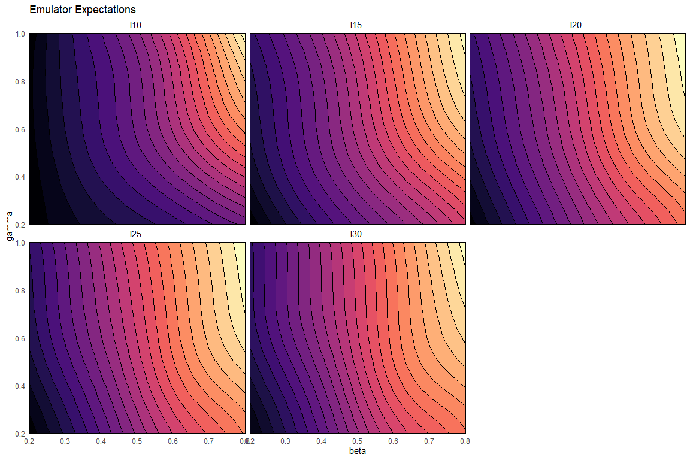
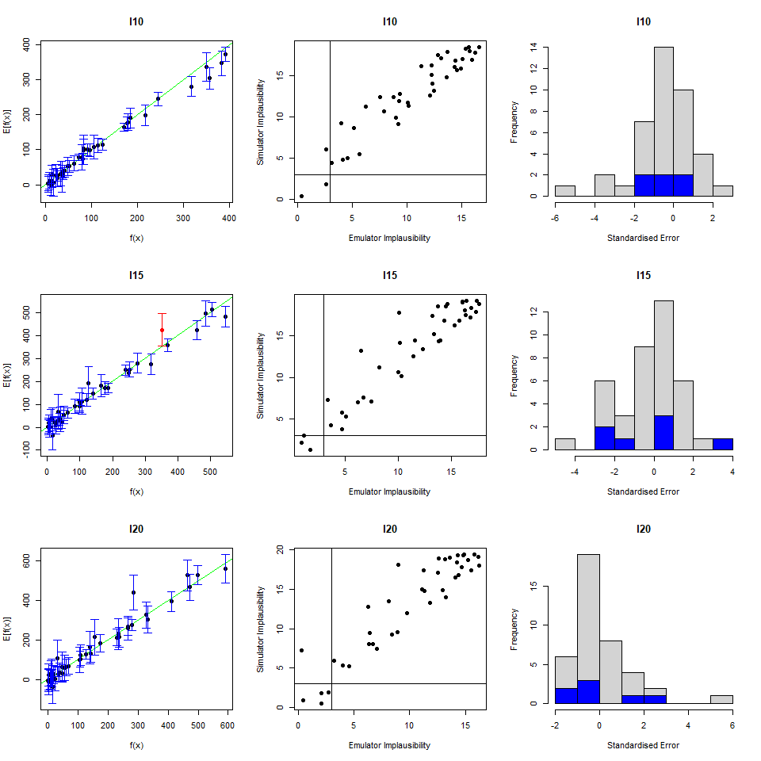
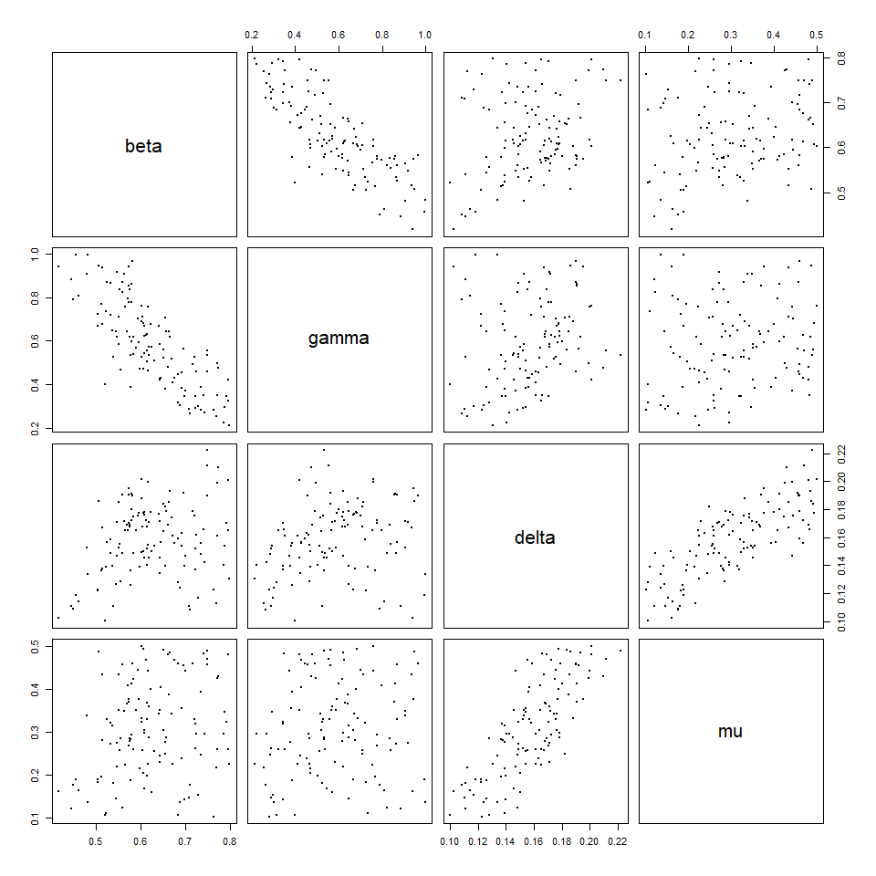

--- 
title: "Case Study -1: An introduction to the Emulatorr package"
author: "Danny Scarponi"
site: bookdown::bookdown_site
output:
    bookdown::pdf_book:
        includes:
            in_header: header.tex
    bookdown::gitbook:
        config:
            sharing: null
        css: 'style.css'
        highlight: tango
        includes:
            in_header: _toggle.html
        keep_md: TRUE
linkcolor: blue
documentclass: book
link-citations: yes
description: "An easy guide to the main functionalities of the Emulatorr package"
---


# Introduction

This tutorial is an introduction to the main functionality of the [emulatorr](https://github.com/Tandethsquire/emulatorr) package, using a synthetic example of an epidemiological model. We start by briefly highligthing what history matching with emulation is and how it works.

Computer models, otherwise known as simulators, have been widely used in almost all fields in science and technology. 
A computer model is usually represented as a set of differential equations, which reflect the  fundamental dynamics of a system. Due to the complexity of the interactions within a system, computer models frequently contain large numbers of parameters. 

Before using a model (e.g. for prediction or planning) it is fundamental to explore plausible values for its parameters, calibrating the model to empirical data. This poses a considerable problem, considering that it may take several minutes or even hours for the evaluation of a single scenario of a complex model. This difficulty is compounded for stochastic models, when hundreds or thousands of realisations are required for each scenario.  As a consequence, comprehensive analysis of the entire input space, requiring vast numbers of model evaluations, is often unfeasible. Bayes linear emulation, combined with history matching, allows us to overcome this issue.

## History Matching

History matching concerns the problem of identifying the set of inputs that would give rise to acceptable matches between the model outputs and the observed data. This part of the input space is referred to as non-implausible, while its complement is known as implausible. History matching proceeds as a series of iterations, or waves, where implausible inputs are identified and discarded. Each wave focuses the search for implausible space in the space that was characterized as non-implausible in all previous waves: thus the non-implausible space shrinks with each iteration. To decide whether an input $x$ is implausible we introduce the implausibility measure, which evaluates the distance between the observed data and the model’s output at $x$. If such measure is too high, the input is discarded in the next wave of the process. 

Note that history matching as just described still relies on the evaluation of the model at a large number of inputs, which is often unfeasible. Here is where emulators play a crucial role.

## Emulators   

A long established method for handling computationally expensive models is to first construct an emulator: a fast statistical approximation of the model that can be used as a surrogate. In other words, we can think of an emulator as a way of representing our 
<span class="abbr" title="In Bayesian statistics, probability expresses a degree of belief in an event. Such belief can be based either on prior knowledge or on personal beliefs about the event. Note that this approach differs from the frequentist interpretation, that defines the probability of an event as the limit of its relative frequence in many trials."><abbr title="In Bayesian statistics, probability expresses a degree of belief in an event. Such belief can be based either on prior knowledge or on personal beliefs about the event. Note that this approach differs from the frequentist interpretation, that defines the probability of an event as the limit of its relative frequence in many trials.">beliefs</abbr></span> about the behaviour of a complex model. 

The model is first run at a manageable number of parameter sets, to provide training data to build the emulator. The trained emulator will then provide an expected value of the model output at any input $x$, along with a corresponding uncertainty estimate reflecting our beliefs about the uncertainty in the approximation. In the [emulatorr](https://github.com/Tandethsquire/emulatorr) package we adopt a [Bayes Linear](https://en.wikipedia.org/wiki/Bayes_linear_statistics) approach to build emulators. While a full Bayesian analysis requires specification of a full joint prior probability
distribution to reflect beliefs about uncertain quantities, in the Bayes linear approach expectations are taken as a primitive and only first and second order specifications are needed when defining the prior. Operationally, this means that one just sets prior  mean vectors and covariance matrices for the uncertain quantities,  without having to decide exactly which distribution is responsible for the chosen mean and covariance. A Bayes Linear analysis may therefore be viewed as a pragmatic approach to a full Bayesian analysis, where the task of specifying beliefs has been simplified. As in any Bayesian approach, our priors (mean vectors and covariance matrices) are then adjusted to the observed data.


<button id="displayTextunnamed-chunk-4" onclick="javascript:toggle('unnamed-chunk-4');">Show more on Bayes Linear method</button>

<div id="toggleTextunnamed-chunk-4" style="display: none"><div class="panel panel-default"><div class="panel-heading panel-heading1"> more on Bayes Linear method </div><div class="panel-body">
The Bayes linear approach to statistical inference takes expectation
as primitive. Suppose that there are two collections of random quantities, $B = (B_1,\dots,B_r)$ and 
$D =(1,D_1, \dots D_s)$. Bayes linear analysis involves updating subjective beliefs about $B$
given observation of $D$. In order to do so, prior mean vectors and covariance matrices
for $B$ and $D$ (that is $E[B], E[D], Var[B]$ and $Var[D]$), along with a covariance matrix
between $B$ and $D$ (that is $Cov[B,D]$), must be specified. 

The Bayes linear update formulae for a vector B given a vector D are:
\begin{align}
E_D[B] &= E[B] + Cov[B,D]Var[D]^{-1}(D - E[D]) \\
Var_D[B] &= Var[B] - Cov[B,D]Var[D]^{-1}Cov[D,B] \\
Cov_D[B_1,B_2] &= Cov[B_1,B_2] - Cov[B_1,D]Var[D]^{-1}Cov[D,B_2].
\end{align}
$E_D[B]$ and $Var_D[B]$ are termed the adjusted expectation and variance of $B$ given $D$. $Cov_D[B_1,B_2]$ is termed the adjusted covariance of $B_1$ and $B_2$ given $D$,
where $B_1$ and $B_2$ are subcollections of $B$.
The formula given for $E_D(B)$ represents
the best linear fit for $B$ given $D$ in terms of minimising the expected squared loss
functions $E[(B_k-a_k^TD)^2]$ over choices of $a_k$ for each quantity in $B; k = 1,\dots,r$, that
is, the linear combination of $D$ most informative for $B$. </div></div></div>
\
Emulators have two advantages. First, they are computationally efficient - typically orders of magnitude faster than the computer models they approximate. Second, they allow for the uncertainty in their approximations to be taken into account. These two properties mean that emulators can be used to make inferences as a surrogate for the model itself. In particular, when going through the history matching process, it is possible to evaluate the implausibility measure at any given parameter set by comparing the observed data to the emulator’s output, rather than the model’s output. This speeds up the process and allows for a comprehensive exploration of the input space.

# Introduction to the model

The model in question is a stochastic  SEIRS model, with four parameters: rate of transmission between each infectious person and each susceptible person $\beta_M$; transition rate from exposed to infectious $\gamma_M$; recovery rate from infectious to recovered $\delta_M$; and a 'reinfection' rate from recovered to susceptible $\mu_M$.

<div class="figure" style="text-align: center">

<p class="caption">(\#fig:unnamed-chunk-5)SEIRS Diagram</p>
</div>

Expressed in terms of differential equations, the transitions are
\begin{align}
\frac{dS}{dt} &= -\frac{\beta_M S I}{N} + \mu_M R \\
\frac{dE}{dt} &= -\gamma_M E + \frac{\beta_M I}{N} \\
\frac{dI}{dt} &= -\delta_M I + \gamma_M E \\
\frac{dR}{dt} &= -\mu_M R + \delta_M I
\end{align}
where $N$ represents the total population, $N=S+E+I+R$. For simplicity, we consider a closed population, so that $N$ is constant.

To generate runs from this model, we use [SimInf](https://cran.r-project.org/web/packages/SimInf/index.html), a package that provides a framework to conduct data-driven epidemiological modelling in realistic large scale disease spread simulations. This requires us to define the transitions, the compartments, and the initial population. If
we want multiple repetitions for each choice of parameters, we create a data.frame with identical rows, each of which has the same initial population. Here we will choose $50$ repetitions per choice of parameters and consider an initial population of $1000$ of who $50$ are infected. Note that if we were to start 
with one infectious individual, there would a be a significant probability that some runs of the model would not show an epidemic (since it could happen that the only infectious person recovers before infecting other people). Choosing a relatively high number of initial infectious people helps us circumvent any problems that would come from bimodality and keep the tutorial simple. Bimodality is dealt in the more advanced case studies. 


```r
transitions <- c(
  "S -> beta*I*S/(S+I+E+R) -> E",
  "E -> gamma*E -> I",
  "I -> delta*I -> R",
  "R -> mu*R -> S"
)
compartments <- c("S","E","I","R")
nreps <- 50
u0 <- data.frame(
  S = rep(950, nreps),
  E = rep(0, nreps),
  I = rep(50, nreps),
  R = rep(0, nreps)
)
```

We select parameter values and parse the model using the function `mparse`, which takes transitions, compartments, initial data, parameter values and the time span to simulate a trajectory. We then run the model and plot the trajectories of interest.


```r
params <- c(beta = 0.5, gamma = 0.5, delta = 0.1, mu = 0.1)
model <- mparse(transitions = transitions, compartments = compartments,
                u0 = u0, gdata = params, tspan = 1:60)
result = run(model)
plot(result, compartments = c("E","I","R"), col=c("#07AF3F", "#FAAE48","#48E2FA"))
```


In order to extract the relevant information from the data provided by the SimInf run, a helper function `getOutputs` has been included in this document. It takes a data.frame of parameter sets, and a list of times, and returns a data.frame of the results. We then create a data.frame `outputs` by binding the parameter values and the results obtained.


```r
points <- expand.grid(list(beta = c(0.4, 0.6),
                           gamma = c(0.4, 0.6),
                           delta = c(0.05, 0.15),
                           mu = c(0.05, 0.15)
))
results <- getOutputs(points, seq(10,30,by=5))
outputs <- data.frame(cbind(points, results))
head(outputs)
#>   beta gamma delta   mu    I10    I15    I20    I25    I30     EV10     EV15
#> 1  0.4   0.4  0.05 0.05 215.50 396.98 542.00 574.52 546.36 5.258158 7.709474
#> 2  0.6   0.4  0.05 0.05 363.04 590.78 626.98 573.78 514.00 7.771784 5.396176
#> 3  0.4   0.6  0.05 0.05 274.94 484.84 591.14 580.04 533.64 9.024302 8.759843
#> 4  0.6   0.6  0.05 0.05 465.08 660.82 631.24 561.88 514.08 7.399687 5.428873
#> 5  0.4   0.4  0.15 0.05 109.00 161.74 206.82 221.50 212.54 4.452561 5.538387
#> 6  0.6   0.4  0.15 0.05 191.50 295.58 312.10 268.90 214.06 6.075497 5.376017
#>       EV20     EV25     EV30
#> 1 6.341308 5.515830 5.381474
#> 2 5.105180 4.071243 4.446290
#> 3 5.450726 4.860454 4.398943
#> 4 4.265616 4.739088 3.583558
#> 5 6.993931 5.403629 4.061191
#> 6 4.488396 4.138197 5.069623
```

Each row of `outputs` corresponds to a parameter set and contains information regarding the number of infectious individuals $I$ for that set. Each row of column $I10$ (resp. $I15, I20, I25, I30$) contains the mean value of $I$ at time $10$ (resp. $15, 20, 25, 30$) for the $50$ runs of the relative parameter set. Similarly, columns $EV10, EV15, EV20, EV25, EV30$ provide a measure of the 
<span class="abbr" title="Running a stochastic model at a given set of parameters produces different results each time. We refer to this form of uncertainty as Ensemble Variability"><abbr title="Running a stochastic model at a given set of parameters produces different results each time. We refer to this form of uncertainty as Ensemble Variability.">
ensemble variability</abbr></span>
for each parameter set, at each desidered time: this is defined here as the standard deviation of the $50$ runs, plus $3\%$ of the range of the runs. The trained emulators outputs will be estimates of the means, while the ensemble variability will be used to quantify the uncertainty of such estimates.

Before we actually tackle the emulation, we need a set of `wave0` data. For this, we define a set of ranges for the parameters, and generate parameter sets using a [Latin Hypercube](https://en.wikipedia.org/wiki/Latin_hypercube_sampling) design. We will run the model over $80$ parameter sets; $40$ of these will be used for training while the other $40$ will form the validation set for the emulators.


```r
ranges <- list(
  beta = c(0.2, 0.8),
  gamma = c(0.2, 1),
  delta = c(0.1, 0.5),
  mu = c(0.1, 0.5)
)
pts <- 2*(maximinLHS(80, 4)-1/2)
r_centers <- map_dbl(ranges, ~(.[2]+.[1])/2)
r_scales <- map_dbl(ranges, ~(.[2]-.[1])/2)
pts <- data.frame(t(apply(pts, 1, function(x) x*r_scales + r_centers)))
head(pts)
#>        beta     gamma     delta        mu
#> 1 0.4722596 0.5065206 0.2109966 0.2302821
#> 2 0.6695106 0.7461251 0.4244475 0.4043467
#> 3 0.6782483 0.8215380 0.2988149 0.1662161
#> 4 0.5040921 0.4402073 0.3765790 0.3339568
#> 5 0.6595974 0.6816483 0.1633500 0.2398984
#> 6 0.7018773 0.7616248 0.2693328 0.3034066
```

Note that the first time we create `pts`, we get $80$ parameter sets where each parameter value is distributed on $[-1,1]$. This is not exactly what we need, since each parameter has a different range. We therefore define `r_centers` (resp. `r_scales`) which contains the midpoint (resp. the size) of the range of each parameter. Using these two pieces of information, we re-center and re-scale `pts`. 

We obtain the model runs for the parameter sets in `pts` through the `getOutputs` function. We bind the parameter sets in `pts` to the model runs and save everything in the data.frame `wave0`. 


```r
wave0 <- data.frame(cbind(pts,getOutputs(pts, seq(10,30,by=5)))) %>% 
  setNames(c(names(ranges), paste0("I",seq(10,30,by=5)),paste0('EV',seq(10,30,by=5))))
head(wave0)
#>        beta     gamma     delta        mu    I10    I15    I20    I25    I30
#> 1 0.4722596 0.5065206 0.2109966 0.2302821 109.18 162.10 208.64 231.36 238.62
#> 2 0.6695106 0.7461251 0.4244475 0.4043467  73.70  95.60 115.86 128.32 136.96
#> 3 0.6782483 0.8215380 0.2988149 0.1662161 173.28 208.54 197.90 180.58 173.78
#> 4 0.5040921 0.4402073 0.3765790 0.3339568  41.58  46.74  53.94  59.14  64.98
#> 5 0.6595974 0.6816483 0.1633500 0.2398984 304.78 414.74 415.94 398.50 393.82
#> 6 0.7018773 0.7616248 0.2693328 0.3034066 213.34 281.18 286.44 280.40 276.96
#>       EV10     EV15     EV20     EV25     EV30
#> 1 6.295766 6.714768 6.233370 5.135637 5.291699
#> 2 4.105439 4.915240 6.099573 4.981953 4.611736
#> 3 6.043500 5.443354 5.163750 4.159341 4.321689
#> 4 3.564083 3.557626 3.004995 3.675507 4.404652
#> 5 7.835108 5.082501 5.248709 4.866771 5.713337
#> 6 6.675898 5.252673 5.061117 4.635021 5.947779
```

Finally, we split `wave0` into two parts: a training set, on which we will train the emulators, and a validation set, which will be used to do diagnostics of the emulators. 


```r
samples <- sample(nrow(wave0), 40)
train0 <- wave0[samples,1:9]
valid0 <- wave0[!seq_along(wave0[,1])%in%samples,1:9]
```

# Perfoming a full wave of emulation and history matching

In this section we show a simple and direct way of performing a full wave of emulation and history matching (the first one). This is done by using the function 
`full_wave`, which needs the following information:

- A set of training points;

- A set of validation points;

- A list of ranges for the parameters;

- A list with the names of the outputs to emulate;

- The observations: for each of the outputs we want to emulate, we need to specify its value and standard deviation; 

- The number of points to generate for the next wave;

- The sampling method we want to use.

We already have almost all of these pieces. We just need to define the output names


```r
output_names <- paste0("I", seq(10,30, by=5))
```

and the observations. As our dataset is synthetic, we will take as our observations the model runs from a chosen parameter set, with a large number of repetitions; the means will provide the values of the outputs and the standard deviations at each parameter set will give the 'ensemble variability' representing the stochastic nature of the model.


```r
targets = list(
  I10 = list(val = 240, sigma = 25.27),
  I15 = list(val = 396, sigma = 40.99),
  I20 = list(val = 453, sigma = 46.48),
  I25 = list(val = 428, sigma = 43.98),
  I30 = list(val = 392, sigma = 40.30)
)
```

We are now ready to perform the first wave of the process:


```r
test_full_wave <- full_wave(train0, valid0, ranges, output_names, targets, 120, sample_method = 'importance')
#> Running diagnostics...
#> Generating new sample points...
#> 497 non-implausible points generated. Applying V-optimality...
#> 
```

Note that here we specified that we want to use importance sampling for example. The `full_wave` function does the following for us:

- creates `base_emulators`: these are a premilinary version of the emulators necessary to set our priors for the Bayes Linear method; 

- creates the `emulators`: these are obtained by adjusting the base emulators through the Bayes Linear update formulae;

- provides us with `new_ranges`, the parameter ranges for the next wave,

- provides us with `next_sample`, the new sample parameter sets, where the model will be run to build the next wave emulators. 

To see how the parameter space has changed after the first wave of the process, we use the function `wave_points`, which plots the old and the new set of parameters on the same pair of axis:


```r
wave_points(list(wave0, test_full_wave$next_sample), names(ranges))
```


Here `wave0` parameter sets are in yellow and the new sets are in purple. The plots in the main diagonal show the distribution of points in the two sets. As an example, let us look at the delta parameter: while the distribution of points in `wave0` is rather uniform, that of the new wave picks at low values of delta and clearly excludes large values of delta. Similarly, if we look at the delta-mu plot, the yellow points are uniformly distributed, while the purple points are concentrated in the upper left region: this suggests that parameter sets with high values of delta and low values of mu are unlikely to give a good fit for the model.

In the following sections we will explain step by step what `full_wave` does behind the scenes. This will not only enhance the reader's overall understanding, but will also provide them with the necessary tools to have more control over the process and customise it through their judgement.

# Constructing the emulators

The first task that the `full_wave` function accomplishes, is to build the emulators based on the given data. We start this section by establishing the structure of the emulators that we want to construct. We then show how to build emulators step by step. 

## Background: the structure of an emulator 
An [emulator](https://en.wikipedia.org/wiki/Emulator) is a way of representing our beliefs about the behaviour of an unknown function. In our case, where the model is stochastic, the unknown function is taken to be the mean of each of the model outputs over multiple runs. Given a set of model runs and an estimate of the parameters, we use the emulator to get a probability distribution for the mean of a model's output at any input parameter set, without the need to run the model at the chosen input.

In this tutorial, we will construct an emulator for each of the model outputs separately. The general structure of a univariate emulator is as follows:
$$f(x) = g(x) \beta + u(x),$$
where $g(x)$ are the regression functions, $\beta$ the regression parameters, and $u(x)$ is the correlation structure. We split the correlation structure further into two pieces - for two parameter sets $x$ and $x^{\prime}$, the structure is:
$$u(x) = \sigma^2 (1-\delta) c(x,x^{\prime}) + \delta I_{\{x=x^\prime\}}.$$
Here $\sigma^2$ is the (prior) emulator variance and $c(x,x^{\prime})$ is a correlation function; the simplest such function is squared-exponential
$$c(x,x^{\prime}) = \exp\left(-\frac{\sum\limits_{i}(x_{i,A}-x_{i,A}^{\prime})^2}{\theta_i^2}\right).$$
The subscript $A$ indicates that the correlation function operates only on the active inputs for the emulator: that is, inputs that contribute to the regression surface. To ensure the correlation structure is well-defined, the 'nugget' term $\delta I_{\{x=x^{\prime}\}}$ is included: this operates on all the parameters in the input space and represents the proportion of the overall variance due to the ensemble variability. The $\theta_i$ hyperparameters are the correlation lengths for the emulator. The size of the correlation lengths determine how close two points must be in order for the corresponding
residual values to be highly correlated. A smaller $\theta_i$ value means that we believe
that the function is less smooth with respect to input $i$, and thus that the values
for the corresponding inputs $x_i$ and $x_i^{\prime}$ must be closer together in order to be highly
correlated. The simplifying assumption that all the correlation length parameters
are the same, that is $\theta_i = \theta$ for all $i£, is commonly made. In this case, the larger $\theta$ is, the smoother the local variations of the emulators will be.

## Constructing the emulators step by step
To construct the emulators, three steps are required:

1) We create a set of 'initial' emulators `ems0` by fitting a regression surface to `train0` and setting $\delta$ to zero. These simple emulators will provide us with estimates for the regression surface parameters and the basic correlation specifications;

2) The ensemble variability in `train0` is compared to the variance of the 'initial' emulators, and their ratio is used as an estimate for $\delta$. We then train the 'initial' emulators again with the estimated value for $\delta$;

3) The new emulators `ems0` constitute our prior which we adjust to the data through the Bayes Linear update formulae. In this way we obtain the final version of our first wave emulators: `ems0_adjusted`.

Let us now go through each step in detail.

### Step 1

The function `emulator_from_data` creates the initial emulators for us. We pass `emulator_from_data` the training data, the name of the outputs we want to emulate and the list of parameter ranges. We also specify that we want to fit a quadratic surface, rather than a hyperplane (which is the default setting). Taken this information, `emulator_from_data` finds both the regression parameters and the active inputs for each of the indicated outputs. Model selection is performed using [stepwise addition or deletion](https://en.wikipedia.org/wiki/Stepwise_regression) (as appropriate), using the [AIC criterion](https://en.wikipedia.org/wiki/Akaike_information_criterion) to find the minimal best fit. 


```r
ems0 <- emulator_from_data(train0, output_names, ranges, quadratic=TRUE)
```

### Step 2

Now that we have our simple `ems0`, we can find an approximation for the value of the deltas in our model. As recalled in the background section above, the delta parameter represents the proportion of the total variance due to the ensemble variability. The ensemble variability for a given output is just the mean of the relative column $EV$ in `wave0`. The overall variance $\sigma$ is estimated through the standard error of the relative emulator in `ems0`.  Once their ratio is taken, we are ready to create a new set of emulators, which we still call `ems0`,  using the estimated deltas:


```r
delts <- apply(wave0[10:ncol(wave0)], 2, mean)/map_dbl(ems0, ~.$u_sigma)
ems0 <- emulator_from_data(train0, output_names, ranges, quadratic = TRUE, deltas = delts)
ems0[[1]]
#> Parameters and ranges:  beta: c(0.2, 0.8); gamma: c(0.2, 1); delta: c(0.1, 0.5); mu: c(0.1, 0.5) 
#> Specifications: 
#> 	 Basis Functions:  (Intercept); beta; gamma; delta; mu; beta:gamma; beta:delta; beta:mu; gamma:delta; gamma:mu 
#> 	 Active variables:  beta; gamma; delta; mu 
#> 	 Beta Expectation:  102.3855; 89.9622; 42.2846; -114.7645; 0.9227; 55.277; -113.746; 26.1949; -51.3971; 22.7118 
#> 	 Beta Variance (eigenvalues):  0; 0; 0; 0; 0; 0; 0; 0; 0; 0 
#> Correlation Structure: 
#> 	 Variance:  626.4714 
#> 	 Expectation:  0 
#> 	 Correlation length:  0.6250149 
#> 	 Nugget term:  0.1708911 
#> Mixed covariance:  0 0 0 0 0 0 0 0 0 0
```


<button id="displayTextunnamed-chunk-19" onclick="javascript:toggle('unnamed-chunk-19');">Show more details about the ems0 objects</button>

<div id="toggleTextunnamed-chunk-19" style="display: none"><div class="panel panel-default"><div class="panel-heading panel-heading1"> more details about the ems0 objects </div><div class="panel-body">
The print statement provides an overview of the emulator specifications and correlation structure, including 

- Basis Functions (here we have the four parameters beta, gamma, delta, mu and products of them, since we chose quadratic regression),

- Active variables,

- first and second order specifications for $\beta$ and $u(x)$. Note that  by default `emulator_from_data` assumes that $\text{Var}[\beta]=0$: the regression surface is known and coefficients are fixed. This explains why Beta Variance and Mixed Covariance (which shows the covariance of $\beta$ and $u(x)$) are both zero. One can set beta.var=TRUE in order to consider the beta parameters as random variables. </div></div></div>

We can plot the emulators to see how they represent the output space: the `emulator_plot` function does this for emulator expectation, variance, standard deviation, and implausibility (more on which later).


```r
for (i in 1:length(ems0)) ems0[[i]]$output_name <- output_names[i]
names(ems0) <- output_names
emulator_plot(ems0)
```


The emulator expectation plots show the structure of the regression surface, which is at most quadratic in its parameters, through a 2D slice of the input space. In particular the two parameters $\beta$ and $\gamma$ are selected and the plot shows the expected value of each output for all possible pairs $(\beta,\gamma)$.

To plot the emulators standard deviation we just use `emulator_plot` passing 'sd' as second argument:


```r
emulator_plot(ems0, 'sd')
```


Here we immediately see that the emulator variance (or equivalently, standard deviation) is simply constant across the parameter space for each output. This is not what we want though, since one would expect emulators to be less uncertain around training points, where the model was evaluated. This will be taken care of in the next step.

### Step 3

We now use the `adjust` method on our emulators to obtain the final Bayes Linear version of our `wave0` emulators:


```r
ems0_adjusted <- map(seq_along(ems0), ~ems0[[.]]$adjust(train0, output_names[[.]]))
```

Note that the `adjust` method works with the data in `train0` exactly as the function `emulator_from_data` did: it performs Bayes Linear adjustment, given the data. This function creates a new emulator object with the adjusted expectation and variance of beta as the primitive specifications, and supplies the data for the new emulator to compute the adjusted expectation and variance of $u(x)$, and the adjusted $Cov[\beta, u(x)]$. Due to the update formulae, the correlation structure isn't stationary anymore: the value of $\sigma^2$ is now $x$-dependent. 


```r
names(ems0_adjusted) <- output_names
emulator_plot(ems0_adjusted)
```


```r
emulator_plot(ems0_adjusted, var = 'sd')
```


We can see that the adjusted emulators more reasonably show the structure of the model. The variance has been updated: the closer the evaluation point is to a training point, the lower the variance (as it 'knows' the value at this point). In fact, evaluating these emulators at the training points demonstrates this fact:


```r
em_evals <- ems0_adjusted$I10$get_exp(train0[,names(ranges)])
all(abs(em_evals - train0$I10) < 10^(-12))
#> [1] TRUE
all(ems0_adjusted$I10$get_cov(train0[,names(ranges)]) < 10^(-12))
#> [1] TRUE
```
Note the comparative speeds of evaluation, here. The initial $80$ parameter sets we generated from the model took around 45 seconds on a relatively powerful laptop; evaluating the emulator expectation over a $40\times40$ grid takes less than 5 seconds; evaluating the emulator variance over the same grid takes 30 seconds.

This is all fine, but we need to consider whether these emulators are actually performing as we would expect them to. For this, we need to consider emulator diagnostics.

# Emulator diagnostics

For a given set of emulators, we want to assess how accurately they reflect the model's outputs over the space. To do so, we can consider a number of diagnostic tests. 

This section is divided in four parts:

1) First we introduce the concept of implausibility;

2) We show how to visualise the emulator's implausibility for a given output;

3) Three standard emulator diagnostics are introduced together with functions that help us visualise them;

4) We then conclude by analysing parameter sets that fail diagnostics.

## Background: the implausibility measure

For a given output, and an observed value, the implausibility is defined as the difference between the predicted output and the actual observation, taking into account all sources of uncertainty; for input values $x$ the schematic form for the implausibility $I(x)$ is

$$I(x) = \frac{|f(x)-z|}{\sqrt{\sum \sigma^2}},$$

where $f(x)$ is the predicted output, $z$ the observation, and the $\sigma$ terms represent uncertainties. 

The uncertainties that go into the denominator of the emulator implausibility are the ensemble variability defined, and the emulator variance at the given parameter set. Note that if our data were not synthetic, we would also include the observation uncertainty, to represent the finite accuracy with which real data is observed, and the model discrepancy, accounting for the fact that no model perfectly represents reality.

An important aspect to consider is the choice of cut-off for the implausibility measure. The implausibility is a metric for evaluating how far out from being a good fit any input parameter set is: there is no hard-and-fast rule for deciding at what point a parameter set is too implausible. Indeed, there are two things to consider when we have multiple univariate emulators.

First of all: what cut-off should we impose? A rough rule of thumb loosely follows Pukelsheim's $3\sigma$ rule, which states that any unimodal distribution can be treated normally, in the sense that a $5\%$ confidence interval corresponds to $3\sigma$ around the mean. This is only the case for a single such distribution; for multiple univariate emulators it is slightly more involved. However a rough starting cut-off $m$, for confidence interval $1-\alpha$ and $N$ emulators, would be
$$m = \Phi^{-1}\left(\frac{1+(1-\alpha^{1/N})}{2}\right)$$
where $\Phi^{-1}$ is the inverse of the normal distribution CDF.

Second: given multiple emulators, how do we measure overall implausibility? We want a single measure for the implausibility at a given parameter set, but for each emulator we obtain an individual value for $I$. The simplest way to combine them is to consider maximum implausibility at each parameter set:
$$I_M(x) = \max_{i=1,\dots,N}I_{i}(x),$$
where $I_i(x)$ is the implausibility at $x$ coming from the $i$th emulator. For large collections of emulators, it may be useful to instead consider the second-, or third-maximum implausibility. Where some outputs are deemed more important than others (for instance, putting greater weight on emulation of the peak of an epidemic), we may instead take a weighted average across the implausibity measures.

## Implausibility visualisations

To calculate the implausibility we will use list `targets`, which represents our observations.

The default behaviour of the diagnostics and plots we will see here is to take a cut-off of $3$ (following Pukelsheim's $3\sigma$ rule), and take maximum implausibility across the outputs. For instance, to find the emulator implausibility for the first output we use the `emulator_plot` function specifying 'imp' for implausibility and passing it the target for the first output:


```r
emulator_plot(ems0_adjusted[[1]], 'imp', targets = targets[[1]])
```


This is a 2D slice through the input space: chosen a pair $(\bar\beta,\bar\gamma)$, the plot shows the implausibility of the input parameter set $(\bar\beta, \bar\gamma, \delta_M, \mu_M)$, where $\delta_M$ denotes the mid-range value of the delta parameter and similarly for $\mu_M$. Parameter sets with a high implausibility (orange region) are highly unlikely to give a good fit and will be discarded when forming the parameters sets for the next wave.

## Three emulator diagnostics

The first three diagnostics are relatively straightforward, and can be presented together. For a given validation set, we can consider the following:

- Within uncertainties, does the emulator output accurately represent the equivalent model output?

- What are the standard errors of the emulator outputs in light of the model outputs?

- Does the emulator adequately classify parameter sets as implausible or non-implausible?

These are encapsulated in the `validation_diagnostics` function.


```r
which_invalid <- validation_diagnostics(ems0_adjusted, valid0, output_names, targets = targets)
```


The first column of plots gives an indication of the emulator outputs against the model outputs: the emulator outputs are plotted against the model outputs with a $3\sigma$ confidence interval overlaid. An 'ideal' emulator would exactly reproduce the model results: this behaviour is represented by the green line $f(x)=E[f(x)]$. Any parameter set whose emulated prediction lies more than $3\sigma$ away from the simulated output is highlighted in red. 

The second column gives the standard errors: generally we would like the standard errors to be within $-2$ and $2$. 

Finally, the third column compares the emulator implausibility at the parameter sets to the equivalent model implausibility. There are three cases to consider:

- The emulator and model both classify a set as implausible/non-implausible: this is fine. Both are giving the same classification for the set of points.

- The emulator classifies a set as non-implausible, while the model rules it out: this is also fine. The emulator should not be expected to shrink the parameter space as much as the model does, at least not on a single wave. Points classified in this way will survive this wave, but may be removed on subsequent waves as the emulators grow more accurate on a reduced parameter space.

- The emulator rules out a set, but the model does not: these are the problem sets, suggesting that the emulator is ruling out parts of the parameter space that it should not be ruling out.

The function `validation_diagnostic`, along with producing the plots, also returns a data.frame consisting of those parameters sets which failed one or more diagnostic tests. 


```r
which_invalid
#>         beta     gamma     delta        mu
#> 59 0.7830258 0.2534491 0.4573816 0.2839310
#> 60 0.3691619 0.7308761 0.1072148 0.1069617
#> 65 0.5387941 0.2755354 0.4964976 0.4515998
#> 75 0.7464346 0.5595566 0.4305315 0.4907506
```

It is often worth considering these points, particularly if they lie close to the boundary of the space: having a few parameter sets which fail diagnostics is not the end of the world, but we should at least consider whether the emulator is failing in parts of the space we would want it to be performing well on.

## Parameter sets failing diagnostics

### Visualisation

A helper for visualising problematic parameter sets is provided in the function `validation_pairs`: this gives pairs plots of the validation points for each parameter pair, colouring the points by their diagnostic success (bottom left) and predicted implausibility (top right). The diagnostics part gives the maximum standard error at each point: the standard error is $$\frac{|\text{emulator value}-\text{model value}|}{\sqrt{\text{emulator variance}}}$$ for each output and we maximise over the outputs. 


```r
vp <- validation_pairs(ems0_adjusted, valid0, targets)
```


We can see that the points that are struggling with diagnostics are indeed on the boundaries of the space, particularly on the boundary of the $(\delta,\mu)$ space. Examination of the upper half of this plot shows that a large proportion of the points are due to be ruled out as non-implausible, so they lie in parts of the parameter space that will have no impact on the overall history matching process.

A box "Show more options for the validation_pairs function" should appear here, with the following content: 

Where multiple outputs are concerned, emulator functions make a call to `nth_implausible` with default $n=1$. This can be modified in any function call that uses it. For instance, the above diagnostic plot will consider minimum implausibility in its upper plots if we set $n$ to be the number of emulators:


```r
vp2 <- validation_pairs(ems0_adjusted, valid0, targets, n=length(ems0))
```



End of the box.

### Space removed function 

One way we can get a feel for what cut-off value is reasonable is via the `space_removed` function, which for a given set of emulators will determine how much of the space will be removed by a particular implausibility cut-off.  By default, `space_removed`  considers varying the structural discrepancy, and does so in steps of $10\%$ around $100\%$. Being our data synthetic, the `space_removed` function will vary the ensemble variability, which we can consider as a form of internal discrepancy.


```r
sp1 <- space_removed(ems0_adjusted, valid0, targets)
```


A cut-off of $3$ here, using maximum implausibility, would be sufficient to remove around $75\%$ of the current parameter space. This is a reasonable level of removal for a first wave: however, if the expected amount of removal was much lower we could consider whether it is sensible to reduce the cut-off (a companion plot that shows how many diagnostic failures would result from a particular cutoff value is in the pipeline).

A box "Show more options for the space_removed function" should appear here with the content:

We can also consider what would happen if we were to modify the emulator variances or the correlation lengths. To do this we set `modified ='var'` or `modified='corr'`. This evaluates over a fairly large set of parameter sets and has to retrain multiple sets of emulators, so does take a while to run. For the purposes of speed, here, we set `n_points` to $5$: this creates a set of $5^d$ points to evaluate over, where $d$ is the dimension of the input space. As before, the default behaviour considers steps of $10\%$ around $100\%$. Here we set the `u_mod` argument in the function call to choose different steps for the variance.


```r
sp2 <- space_removed(ems0_adjusted, valid0, targets, u_mod = c(0.75, 1, 1.25), modified = 'var', n_points = 5)
```


```r
sp3 <- space_removed(ems0_adjusted, valid0, targets, modified = 'corr', n_points = 5)
```


We can see that changing the correlation lengths has a minimal impact on the resultant space reduction: this should not be surprising in this case, as the linear part of the emulators (i.e. the $g(x)\beta$ term) is sufficient to capture much of the dynamics of the points:


```r
map_dbl(ems0, ~summary(.$model)$adj.r.squared)
#>       I10       I15       I20       I25       I30 
#> 0.9582686 0.9410490 0.9216215 0.9090185 0.8999996
```

The adjusted $R^2$ of the linear models are all high, so the correlation structure is having to do very little 'work' for the emulators to match the data. If we instead had a model where the linear part cannot accurately represent the output surface, the choice of correlation lengths would be a much more important choice, and the final plot above would be a much stronger indicator of suitability.

End of the box.

In any event, the diagnostics here give an indication of the suitability of the emulators in emulating the outputs at this wave. If there are particular outputs for which the emulators do not give a good fit, then we can modify the specifications for that emulator directly (for example, modifying the correlation length, the variance, or the regression surface) and re-train; if the emulator simply cannot provide a good fit to the output, we can choose not to emulate this output for the wave in question.

# Point Generation

Having generated emulators based on the first wave of data, evaluated their suitability, and considered a means by which to rule out parameter sets, we can now produce a new set of parameter sets to pass to the model. 

This section is divided in two parts:

1) We first see how to generate new sets of parameters (that will be used to train wave 1 emulators);

2) We then compare the performance of the initial parameter sets with the new parameter sets. In other words, we ask: do the simulator outputs at the new parameter sets match the observations better than the simulator outputs at the initial parameter sets?

## Generating sets of parameters for the next wave

The function `generate_new_runs` is designed to generate new sets of parameters; its default behaviour is as follows.

- If no prior parameter sets are provided, a set is generated using a [Latin Hypercube Design](https://en.wikipedia.org/wiki/Latin_hypercube_sampling), rejecting implausible points;
- Using these as seeding points, more parameter sets are generated using [importance sampling](https://en.wikipedia.org/wiki/Importance_sampling) to attempt to fully cover the non-implausible region;
- Finally, pairs of parameter sets are selected at random and more sets are sampled from lines connecting them, with particular importance given to those that are close to the non-implausible boundary.

All of these steps can be overridden or modified, but the default behaviour allows for a good rudimentary search of the non-implausible space.


```r
new_points <- generate_new_runs(ems0_adjusted, ranges, n_points = 120, z = targets)
#> 410 non-implausible points generated. Applying V-optimality...
#> 
plot(new_points, pch = 16, cex = 0.5)
```


We can start to see the structure of the non-implausible region, here. The `wave_points` function provides a better indication of the difference between the two sets of wave data.


```r
wave_points(list(wave0, new_points), in_names = names(ranges))
```



Here `wave0` points are in yellow and `new_points` are in purple. The plots in the main diagonal show the distribution of points in `wave0` and that of `new_points`. 

## Comparing next and old parameter sets

Now we can put `new_points` into the model and obtain the outputs:


```r
next_wave <- getOutputs(new_points, seq(10,30,by=5))
```

Binding together `new_points` and `next_wave` we obtain `wave1`, the full data for the next wave.

We can see how much better the `wave1` parameter sets perform compared to the original `wave0` parameter sets using `simulator_plot`.


```r
wave1 <- data.frame(cbind(new_points,next_wave))%>%   
  setNames(c(names(ranges),paste0("I",seq(10,30,by=5)),   paste0("EV",seq(10,30,by=5))))
all_points <- list(wave0[1:9], wave1[1:9])
simulator_plot(all_points, targets)
```


We can see that, compared to the space-filling random parameter sets used to train the first emulators, the new parameter sets are in much closer agreement with the data we wish to match to. Subsequent waves, trained on these new parameter sets, will be more confident in the new non-implausible region and will therefore refine the region in light of the greater certainty.


# Further waves

We follow the same procedure for subsequent waves, with a couple of caveats.

## Next wave: wave 1

### Training wave 1 emulators 

First of all we train a new set of emulators, in the same way we did for `ems0`:


```r
sampling <- sample(nrow(wave1), 40)
train1 <- wave1[sampling,1:9]
valid1 <- wave1[!seq_along(wave1[,1])%in%sampling,1:9]
new_ranges <- map(names(ranges), ~c(min(wave1[,.]), max(wave1[,.]))) %>% setNames(names(ranges))
ems1 <- emulator_from_data(train1, output_names, new_ranges, quadratic = T)
deltas <- apply(wave1[,10:14], 2, mean)/map_dbl(ems1, ~.$u_sigma)
ems1 <- emulator_from_data(train1, output_names, new_ranges, deltas = deltas, quadratic = TRUE)
for (i in 1:length(ems1)) ems1[[i]]$output_name <- output_names[i]
ems1_adjusted <- map(seq_along(ems1), ~ems1[[.]]$adjust(train1, output_names[[.]]))
names(ems1_adjusted) <- output_names
```

### Evaluating implausibility across all waves

We can apply diagnostics to this as before, using `valid1` as the validation set. Assuming the diagnostics are acceptable, we  then proceed to consider implausibility - however, we need the implausibility over the whole input space, and the new emulators have only been trained on a subset thereof. We must therefore consider implausibility across all waves, rather than just the wave under consideration at the time.


```r
all_waves <- c(ems0_adjusted, ems1_adjusted)
all_targets <- c(targets, targets)
emulator_plot(all_waves, var = 'maximp', targets = all_targets)
```


This may seem an unwieldy way to approach this (and it is, at present); however, it is important to remember that the number of emulators at each wave may not be the same; for example, if we have had to remove an output at wave 1, then the targets would be accordingly changed. In this illustration case, we did not have to worry about doing so since we have assumed that all targets can be emulated.

If we compare the implausibility plot we just obtained with the implausibility plot from the previous wave, we see that the red area has increased significantly: this shows that wave 1 is shrinking down the non-implausible space, exactly as we expected.

The remainder of the analysis proceeds much as in the first wave. In generating new parameter sets, we would of course provide all_waves to the point generation function.


```r
new_new_points <- generate_new_runs(all_waves, ranges, n_points = 120, z = all_targets)
#> 293 non-implausible points generated. Applying V-optimality...
#> 
plot(new_new_points, pch = 16, cex = 0.5)
```


We can compare the distribution of parameter sets at the end of `wave0` with that of parameter sets at the end of `wave1`:


```r
wave_points(list(wave1, new_new_points), in_names = names(ranges))
```


The last step is to create `wave2`, that will be used to train
`wave2` emulators.


```r
next_next_wave <- getOutputs(new_new_points, seq(10,30,by=5))
wave2 <- data.frame(cbind(new_new_points,next_next_wave))%>%   
  setNames(c(names(ranges),paste0("I",seq(10,30,by=5)),   paste0("EV",seq(10,30,by=5))))
```

Through the `simulator_plot` function we see how much better the `wave2` parameter sets perform compared to the original `wave1` parameter sets.


```r
all_points <- list(wave1[1:9], wave2[1:9])
simulator_plot(all_points, targets)
```


Next waves of the process can be produced simply repeating all the steps in this section.

## Next wave: wave 2

### Training wave 2 emulators 


```r
sampling <- sample(nrow(wave2), 40)
train2 <- wave2[sampling,1:9]
valid2 <- wave2[!seq_along(wave2[,1])%in%sampling,1:9]
new_new_ranges <- map(names(ranges), ~c(min(wave2[,.]), max(wave2[,.]))) %>% setNames(names(ranges))
ems2 <- emulator_from_data(train2, output_names, new_new_ranges, quadratic = T)
deltas <- apply(wave2[,10:14], 2, mean)/map_dbl(ems2, ~.$u_sigma)
ems2 <- emulator_from_data(train2, output_names, new_new_ranges, deltas = deltas, quadratic = TRUE)
for (i in 1:length(ems2)) ems2[[i]]$output_name <- output_names[i]
ems2_adjusted <- map(seq_along(ems2), ~ems2[[.]]$adjust(train2, output_names[[.]]))
names(ems2_adjusted) <- output_names
```

### Evaluating implausibility across all waves

As before, we need to consider implausibility across all waves, rather than just the wave under consideration at the time.


```r
all_waves <- c(ems0_adjusted, ems1_adjusted, ems2_adjusted)
all_targets <- c(targets, targets, targets)
emulator_plot(all_waves, var = 'maximp', targets = all_targets)
```


To generate new parameter sets:


```r
new_new_new_points <- generate_new_runs(all_waves, ranges, n_points = 120, z = all_targets)
#> 228 non-implausible points generated. Applying V-optimality...
#> 
plot(new_new_new_points, pch = 16, cex = 0.5)
```



We now create `wave3`:


```r
next_next_next_wave <- getOutputs(new_new_new_points, seq(10,30,by=5))
wave3 <- data.frame(cbind(new_new_new_points,next_next_next_wave))%>%   
  setNames(c(names(ranges),paste0("I",seq(10,30,by=5)),   paste0("EV",seq(10,30,by=5))))
```

Through the `simulator_plot` function we check how much better the `wave3` parameter sets perform compared to the original `wave2` parameter sets.


```r
all_points <- list(wave2[1:9], wave3[1:9])
simulator_plot(all_points, targets)
```


The graph does not show a clear improvement in the performance of `wave3` parameter sets compared to that of `wave2` parameter sets. To understand the reason behind this, let us compare the variability of the outputs we are emulating with the emulators uncertainty. Below we show the ensemble variability and the uncertainty for `ems0` and `ems2` for each of the outputs.


```r
targets$I10$sigma
#> [1] 25.27
targets$I15$sigma
#> [1] 40.99
targets$I20$sigma
#> [1] 46.48
targets$I25$sigma
#> [1] 43.98
targets$I30$sigma
#> [1] 40.3
sigmas0 <- map_dbl(ems0, ~.$u_sigma)
sigmas0
#>      I10      I15      I20      I25      I30 
#> 25.02941 39.90951 46.96881 50.12662 52.34127
sigmas2 <- map_dbl(ems2, ~.$u_sigma)
sigmas2
#>       I10       I15       I20       I25       I30 
#>  9.607539 16.217742 18.393964 16.282659 14.902990
```


We see that while `ems0` uncertainties (`sigmas0`) are similar or larger than the ensemble variabilities, `ems2` uncertainties (`sigmas2`) are smaller than the ensemble variabilities. Since the emulators variance is smaller than the uncertainty inherent to the model, the nonimplausible
space already contains acceptable matches and is unlikely to
decrease in size in the next iteration. 
For this reason, we conclude here the iterating process and therefore the tutorial. Note that if we could revise the uncertainties present in our model and decrease them, we would then be able to perform other waves of the history matching process and shrink the nonimplausible space down further. 

<!--
# TJ material


Basically a standard Bookdown template with a few tweaks. New chapters need to be in separate '.Rmd' files, where each file starts with a chapter heading as seen [here](https://bookdown.org/yihui/bookdown/usage.html). In order to use the task and solution blocks in \LaTeX, you must input the order of the files into the `_bookdown.yml` file, and the first file must be called `index.Rmd` e.g.

```
rmd_files:
    html: ['index.Rmd', 'ch1.Rmd']
    latex: ['index.Rmd', 'ch1.Rmd', 'ch_appendix.Rmd']
output_dir: "docs"
```

The `latex:` path above ***must*** have `'ch_appendix.Rmd'` as its last entry. This ensures that the appendix is properly formatted for the solutions to the problems.

You must have the following lines at the start of your `index.Rmd` file:

````
```{r, child = "_setup.Rmd", include = F, purl = F, cache = F}
```
````

There are a couple of useful special blocks. A `task` block, and a `solution` block. These can be used as e.g.

````
```{task}
Here is a task written in **markdown**.
```
````

which renders as:

<div class="panel panel-default"><div class="panel-heading"> Task </div><div class="panel-body"> 
Here is a task written in **markdown**. </div></div>

You can include chunks within the `task` chunk, but you need to use double backticks *within* the chunk, and leave carriage returns around the internal chunk e.g.

````

```{task}

``{r}
x <- 2 + 2
x
``

```

````

which renders as:

<div class="panel panel-default"><div class="panel-heading"> Task </div><div class="panel-body"> 

```r
x <- 2 + 2
x
#> [1] 4
```
 </div></div>

Be careful to have suitable carriage returns around e.g. `enumerate` or `itemize` environments inside the chunk also. For example:

````

```{task}
Here is a list:
1. item 1
2. item 2
```

```` 

will not render nicely. But

````

```{task}
Here is a list:

1. item 1
2. item 2

```

```` 

will:

<div class="panel panel-default"><div class="panel-heading"> Task </div><div class="panel-body"> 
Here is a list:

1. item 1
2. item 2
 </div></div>

The `solution` chunk works in the same way, and the numbers will follow the previous `task` chunk (so you can set tasks without solutions) e.g.

````

```{task}
Add 2 and 2 together
```

```{solution}

``{r}
2 + 2
``

```

````

gives:

<div class="panel panel-default"><div class="panel-heading"> Task </div><div class="panel-body"> 
Add 2 and 2 together </div></div>

<button id="displayTextunnamed-chunk-54" onclick="javascript:toggle('unnamed-chunk-54');">Show Solution</button>

<div id="toggleTextunnamed-chunk-54" style="display: none"><div class="panel panel-default"><div class="panel-heading panel-heading1"> Solution </div><div class="panel-body">

```r
2 + 2
#> [1] 4
```
</div></div></div>

## Additional extensions

### Different task and solution titles

Task and solution boxes can also be given different names using the `title` option e.g.

````

```{task, title = "Question"}
What is the meaning of life, the universe and everything?
```

```{solution, title = "Answer"}
Why 42 of course!
```

````

gives:

<div class="panel panel-default"><div class="panel-heading"> Question </div><div class="panel-body"> 
What is the meaning of life, the universe and everything? </div></div>

<button id="displayTextunnamed-chunk-56" onclick="javascript:toggle('unnamed-chunk-56');">Show Answer</button>

<div id="toggleTextunnamed-chunk-56" style="display: none"><div class="panel panel-default"><div class="panel-heading panel-heading1"> Answer </div><div class="panel-body">
Why 42 of course!</div></div></div>

### Turning tasks and solutions on and off

Sometimes you might want to hide task and/or solution boxes. This can be done with the `renderTask` and `renderSol` chunk options, which can be set globally or locally. For example:

````

```{task, title = "Question"}
Can I set a task and not show the answer?
```

```{solution, title = "Answer", renderSol = FALSE}
Indeed, though you won't see this answer unless `renderSol = TRUE`...
```

````

typesets as:

<div class="panel panel-default"><div class="panel-heading"> Question </div><div class="panel-body"> 
Can I set a task and not show the answer? </div></div>


### Tabbed boxed environments

Originally developed to put base R and `tidyverse` solutions side-by-side, using a `multCode = T` option to the solution box. Here the two tabs are separated by four consecutive hashes: `####`, and the `titles` option gives the tab titles (these can be set globally if preferred) e.g.


````

```{task}
Filter the `iris` data by `Species == "setosa"` and find the mean `Petal.Length`.
```

```{solution, multCode = T, titles = c("Base R", "tidyverse")}

``{r}
## base R solution
mean(iris$Petal.Length[
    iris$Species == "setosa"])
``

####

``{r}
## tidyverse solution
iris %>% 
    filter(Species == "setosa") %>%
    select(Petal.Length) %>%
    summarise(mean = mean(Petal.Length))
``
    
```

````

will typeset to:

<div class="panel panel-default"><div class="panel-heading"> Task </div><div class="panel-body"> 
Filter the `iris` data by `Species == "setosa"` and find the mean `Petal.Length`. </div></div>

<button id="displayTextunnamed-chunk-61" onclick="javascript:toggle('unnamed-chunk-61');">Show Solution</button>

<div id="toggleTextunnamed-chunk-61" style="display: none"><div class="panel panel-default"><div class="panel-heading panel-heading1"> Solution </div><div class="panel-body"><div class="tab"><button class="tablinksunnamed-chunk-61 active" onclick="javascript:openCode(event, 'option1unnamed-chunk-61', 'unnamed-chunk-61');">Base R</button><button class="tablinksunnamed-chunk-61" onclick="javascript:openCode(event, 'option2unnamed-chunk-61', 'unnamed-chunk-61');">tidyverse</button></div><div id="option1unnamed-chunk-61" class="tabcontentunnamed-chunk-61">

```r
## base R solution
mean(iris$Petal.Length[
    iris$Species == "setosa"])
#> [1] 1.462
```
</div><div id="option2unnamed-chunk-61" class="tabcontentunnamed-chunk-61">

```r
## tidyverse solution
iris %>% 
    filter(Species == "setosa") %>%
    select(Petal.Length) %>%
    summarise(mean = mean(Petal.Length))
#>    mean
#> 1 1.462
```
    
</div><script> javascript:hide('option2unnamed-chunk-61') </script></div></div></div>

Note that there is also a `multCode` chunk that does not link to task and solution boxes e.g.

````

```{multCode}

Two options: 

* Option 1

####

Two options:
    
* Option 2

```

````

will typeset to:

<div class="tab"><button class="tablinksunnamed-chunk-62 active" onclick="javascript:openCode(event, 'option1unnamed-chunk-62', 'unnamed-chunk-62');">Option 1</button><button class="tablinksunnamed-chunk-62" onclick="javascript:openCode(event, 'option2unnamed-chunk-62', 'unnamed-chunk-62');">Option 2</button></div><div id="option1unnamed-chunk-62" class="tabcontentunnamed-chunk-62">

Two options: 

* Option 1
</div><div id="option2unnamed-chunk-62" class="tabcontentunnamed-chunk-62">

Two options:
    
* Option 2
</div><script> javascript:hide('option2unnamed-chunk-62') </script>

The `titles` option can be set as before.
-->

<!--chapter:end:index.Rmd-->

